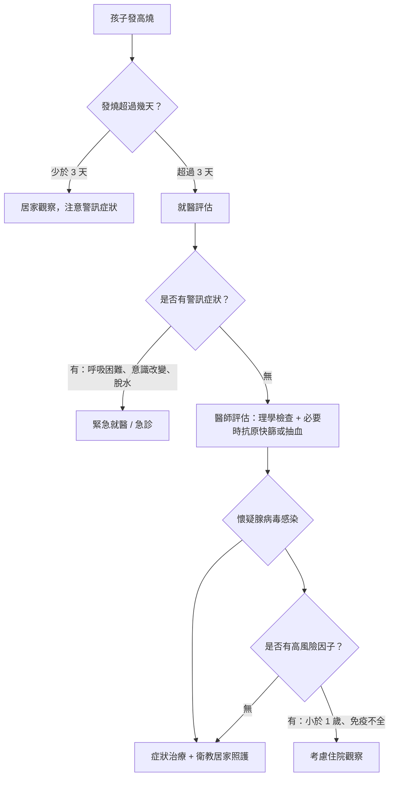
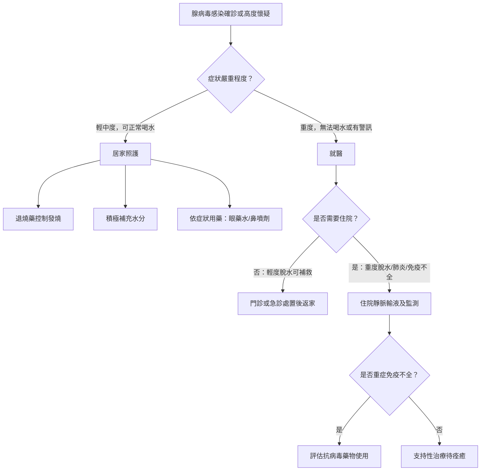

# 燒不停的「燒久姬」：腺病毒高燒怎麼辦？

## 簡單說重點 (Overview)

腺病毒（Adenovirus）是一種非常常見的病毒，就像感冒病毒有很多種一樣，腺病毒也有超過 50 種血清型。它最讓爸媽崩潰的特點，就是燒的又高又久——體溫常突破 39°C，而且一燒就是 5 到 10 天，這就是為什麼台灣家長給它取了個外號叫「燒久姬」。好消息是，對於免疫力正常的孩子，腺病毒感染通常可以靠自身免疫力度過，關鍵是正確的照護與即時辨識危險訊號。

<!-- IMAGE_PLACEHOLDER: 腺病毒結構示意圖，顯示病毒外殼與纖維蛋白突起 -->

## 症狀 (Symptoms)

腺病毒感染的症狀非常多樣，依感染的部位不同而有所差異：

**呼吸道症狀（最常見）：**
- 持續高燒，體溫常超過 39–40°C，且可能持續 5–10 天
- 喉嚨紅腫疼痛、扁桃腺發炎（有時可見白色膿點）
- 流鼻水、鼻塞、咳嗽
- 少數情況下會進展為肺炎或支氣管炎

**眼睛症狀：**
- 眼白充血、眼睛分泌物增加（俗稱「紅眼症」）
- 合併發燒與咽喉炎時，稱為「咽喉結膜熱（Pharyngoconjunctival Fever）」，是腺病毒的典型表現

**腸胃道症狀：**
- 噁心、嘔吐、腹痛、腹瀉
- 特別好發於 2 歲以下幼兒

**其他可能症狀：**
- 耳朵痛（中耳炎）
- 頸部淋巴結腫大
- 倦怠、食慾不振

> [!info] 小知識
> 腺病毒有一個讓人頭大的特性：即使退燒了，隔天還可能再燒起來，形成「反覆高燒」的模式。這是腺病毒的正常病程，並不代表病情惡化，但若發燒超過 5 天，仍建議帶孩子就醫評估。

## 醫師怎麼幫你檢查 (Diagnosis)

醫師會先透過詢問病史與理學檢查（用眼睛、觸診、聽診來評估身體狀況）來判斷：觀察喉嚨紅腫程度、扁桃腺是否化膿、眼睛是否充血，以及頸部淋巴結的狀況。

**輔助檢查工具：**
- **內視鏡檢查（鼻咽內視鏡）**：用一根細小、柔軟的鏡頭深入鼻腔，直接看到後咽部的狀況，評估腺樣體（增殖腺）是否腫大、後鼻腔分泌物的性質，比起單純目視更清楚，孩子不適感也低。
- **快速抗原檢測**：與流感快篩類似，利用鼻咽拭子（棉棒採樣）在診間快速檢測。
- **多重 PCR 病毒核酸檢測**：準確度最高，可同時排除流感、RSV 等其他病毒，通常用於病情較複雜的住院病童。
- **血液檢查**：透過白血球數值與 CRP（發炎指標）幫助判斷是否合併細菌感染。

## 治療方式 (Treatment)

### 1. 居家照護

退燒藥是目前最重要的武器，不只讓孩子舒服一點，也幫助維持正常的飲食與補充水分：

- **退燒藥**：依體重給予適當劑量的乙醯胺酚（Acetaminophen，如安佳熱）或布洛芬（Ibuprofen，如依普芬，需六個月以上才可使用）
- **補充水分**：高燒會加速水分流失，積極補充開水、電解質飲料（如運動飲料稀釋）
- **充分休息**：避免過度活動消耗體力
- **環境降溫**：穿著透氣衣物，室溫維持舒適，不需過度包裹

> [!recommend] 建議
> 退燒藥的目的是讓孩子舒服，不是強迫把體溫壓到 37°C 以下。孩子退燒後若精神良好、願意喝水、可以玩耍，通常不必過度緊張。反而要觀察的是退燒藥失效期間孩子的「精神狀態」，這比體溫數字更重要。

> [!caution] 注意
> **不可給孩子服用阿斯匹靈（Aspirin）**。孩子在病毒感染期間服用阿斯匹靈，可能引發罕見但嚴重的「雷氏症候群（Reye's Syndrome）」，影響肝臟與大腦。台灣兒科醫學會明確建議兒童退燒不使用阿斯匹靈。

### 2. 藥物治療

**目前腺病毒感染沒有特效藥。** 醫師會依症狀開立輔助藥物：

- **結膜炎（紅眼症）**：人工淚液、類固醇眼藥水（嚴重時）
- **鼻塞/流鼻水**：鼻腔生理食鹽水沖洗、抗組織胺
- **喉嚨腫痛**：類固醇口服藥（減輕嚴重發炎）
- **腸胃症狀**：電解質補充、止吐藥（必要時）
- **若合併細菌感染**：才需使用抗生素；若純粹是病毒感染，使用抗生素沒有效果

### 3. 進階治療（重症或免疫不全患者）

對於免疫功能正常的兒童，絕大多數無需住院，支持性照護即可痊癒。在極少數重症情況（如腺病毒肺炎、肝炎、腦炎）或免疫不全患者，醫師可能考慮：

- **靜脈輸液支持**：用於無法口服補水、明顯脫水的病童
- **西多福韋（Cidofovir）**：具有體外抗腺病毒活性，但有腎毒性，僅限免疫不全的重症患者，在嚴格監控下使用，一般兒童不適用

## 什麼時候該看醫生 (When to See a Doctor)

以下情況請**當天就醫**，不要等到隔天：

- 發燒**超過 40°C（104°F）**
- 發燒持續**超過 5 天**，尤其是嬰兒
- 退燒後孩子**精神仍很差**、異常嗜睡或難以喚醒
- **呼吸急促、呼吸困難**或呼吸時有喘鳴聲
- **明顯脫水**：哭泣無眼淚、嘴唇乾裂、超過 8 小時沒有尿液
- **持續嘔吐**，無法保留任何水分
- 出現**皮疹或疹子**伴隨高燒
- **頸部僵硬、頸部疼痛到無法低頭**（可能為腦膜炎）

以下情況請**立即前往急診**：

- **抽筋（熱痙攣）**：全身抽搐持續超過 5 分鐘，或反覆發生
- **嘴唇或指甲發紫**（缺氧）
- **意識不清、無法正常溝通**
- 任何讓你「直覺感覺不對勁」的嚴重異常

> [!danger] 警告
> 出現以下任何一種情況，請立即叫救護車或前往急診，不要等待：呼吸困難、嘴唇發紫、意識不清、抽搐超過 5 分鐘。這些是需要緊急處置的危急訊號。

## 常見問題 (FAQ)

### Q: 腺病毒會傳染嗎？傳染力強不強？

A: 腺病毒的傳染力相當強，主要透過三種途徑傳播：**飛沫傳染**（咳嗽、噴嚏）、**接觸傳染**（摸到被污染的表面再碰眼口鼻）、以及**糞口傳播**（腸胃型感染時）。感染腺病毒的人在症狀消失後仍可能持續排毒數週，因此托兒所、幼兒園是容易爆發群聚的場所。勤洗手是最有效的預防方式。

### Q: 怎麼判斷是腺病毒還是流感？

A: 兩者都會發高燒，但有幾個差別可以參考：腺病毒較常合併**結膜炎（紅眼症）**，且病程通常比流感更長。流感通常來得快、去得也快（約 5–7 天）；腺病毒可能燒超過一週。最準確的方式是就醫讓醫師評估，必要時進行快篩或核酸檢測來確認。

### Q: 腺病毒感染要不要用抗生素？

A: **不需要**。腺病毒是病毒感染，抗生素只對細菌有效，對病毒無用。除非醫師確認合併細菌感染（例如細菌性肺炎或中耳炎），否則服用抗生素只會讓腸道益菌遭殃，反而不利康復。

### Q: 孩子感染腺病毒後，要隔離多久？

A: 建議至少退燒 **24 小時後**，且症狀（特別是腹瀉、眼睛分泌物）明顯改善，再返回學校或托兒所。由於腺病毒可在症狀消失後仍繼續排毒，整個病程（通常 7–14 天）內都應特別注意衛生。

### Q: 得過腺病毒還會再得嗎？

A: 會。腺病毒有超過 50 種血清型，感染某一型後只對該型產生抗體，其他型別照樣可能再感染。這也是為什麼孩子在幼兒園時期可能反覆出現類似症狀。

## 最新治療趨勢 (Latest Updates)

根據 2024 年美國小兒科學會《Red Book》最新版本（2024–2027），腺病毒感染的治療仍以支持性照護為主，目前全球尚無針對腺病毒的核准抗病毒藥物。

近年針對嚴重腺病毒感染的研究方向主要集中在**免疫低下兒童**（如器官移植、化療後）的治療，包括西多福韋（Cidofovir）和布林西多福韋（Brincidofovir）的臨床應用研究，但這些藥物因副作用與毒性，不適用於一般健康兒童。

2023 年一篇發表於 PubMed 的系統性回顧研究指出，腺病毒肺炎在兒童中仍有一定的住院與重症風險，特別是 5 歲以下、有潛在疾病的幼童，強調早期辨識與積極支持性治療的重要性（Yang et al., 2023）。

> [!info] 小知識
> 目前唯一核准的腺病毒疫苗僅限於美國軍事人員使用，針對特定型別（4 型和 7 型），台灣一般民眾尚無可使用的腺病毒疫苗。

## 醫療免責聲明 (Disclaimer)

本文章內容僅供衛教參考，不構成專業醫療建議、診斷或治療。每個人的健康狀況不同，實際治療方式需由醫師根據個別情況評估。若你有任何健康疑慮或症狀，請務必諮詢合格醫療專業人員。本診所提供的資訊力求準確，但醫學知識持續更新，我們無法保證內容永久有效。文章中提及的治療方式或設備，其適用性與效果因人而異，需經醫師評估後方可進行。

## 參考資料 (References)

- [About Adenovirus](https://www.cdc.gov/adenovirus/about/index.html) — CDC (Centers for Disease Control and Prevention), 存取日期 2026-04-07
- [Clinical Overview of Adenovirus](https://www.cdc.gov/adenovirus/hcp/clinical-overview/index.html) — CDC, 存取日期 2026-04-07
- [Adenovirus: Symptoms, Causes & Treatment](https://my.clevelandclinic.org/health/diseases/23022-adenovirus) — Cleveland Clinic, 存取日期 2026-04-07
- [Adenovirus Infections](https://www.childrenshospital.org/conditions-treatments/adenovirus-infections) — Boston Children's Hospital, 存取日期 2026-04-07
- [Adenovirus Infections — Red Book 2024–2027](https://publications.aap.org/redbook/book/755/chapter/14075057/Adenovirus-Infections) — American Academy of Pediatrics (AAP), 存取日期 2026-04-07
- Yang X et al. "Pediatric adenovirus pneumonia: clinical practice and current treatment." *Front Pediatr.* 2023. PMID: 37476615
- [腺病毒衛教資訊](https://tpech.gov.taipei/mp109181/News_Content.aspx?n=80359412498D4193&sms=D6D8C221F7AECFEE&s=65083DA6484134CE) — 台北市立聯合醫院陽明院區, 存取日期 2026-04-07
- [腺病毒 衛教單張](https://wd.vghtpe.gov.tw/popd/files/PDF/%E8%85%BA%E7%97%85%E6%AF%92.pdf) — 台北榮民總醫院, 存取日期 2026-04-07
- [紅眼睛、喉嚨痛、發燒好幾天的腺病毒](https://www.careonline.com.tw/2017/10/adenovirus.html) — 照護線上, 存取日期 2026-04-07
- [腺病毒症狀？會傳染嗎？](https://www.commonhealth.com.tw/article/88285) — 康健雜誌, 存取日期 2026-04-07
