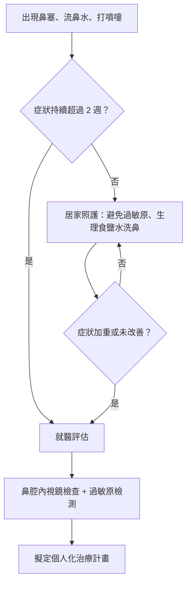
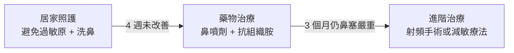
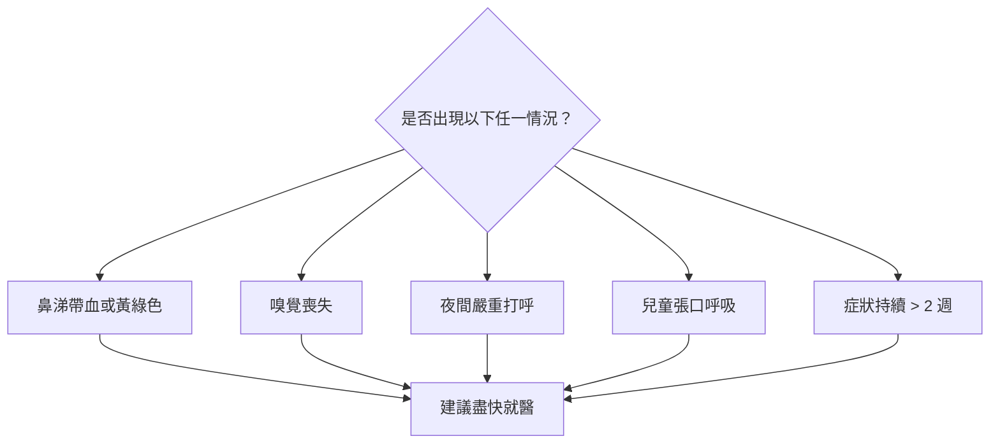

# 告別黑眼圈！搞懂過敏性鼻炎

## 簡單說重點 (Overview)

過敏性鼻炎是鼻黏膜對外來過敏原（如塵螨、花粉、黴菌）產生的免疫過度反應，就像你的免疫系統把無害的東西當成「入侵者」，於是不停地放警報。台灣因氣候潮濕，塵螨密度高，過敏性鼻炎盛行率超過 30%，是最常見的慢性鼻病之一。它不只讓你流鼻水、鼻塞，長期下來還會影響睡眠品質，甚至出現惱人的「過敏黑眼圈」（因鼻靜脈回流不順所致）。

## 症狀 (Symptoms)

- **持續打噴嚏**：一次連打好幾個，尤其早晨起床或接觸過敏原後特別明顯。
- **清水鼻涕**：鼻水清澈水狀，和感冒的黃綠膿鼻涕不同。
- **鼻塞**：兩側鼻腔輪流堵塞，平躺時更嚴重，影響睡眠。
- **鼻子、眼睛或上顎發癢**：過敏引發的搔癢感，有時讓人不自覺揉眼睛或擤鼻子。
- **眼睛紅腫、流眼淚**：常合併過敏性結膜炎（眼睛的過敏反應）。
- **過敏黑眼圈（Allergic Shiners）**：下眼瞼皮膚因鼻靜脈回流受阻而產生的青紫色陰影。
- **「過敏性皺紋」（Allergic Salute）**：小朋友習慣用手掌向上推鼻尖，久了鼻樑上出現橫向皺紋。
- **嗅覺下降**：長期鼻黏膜腫脹可能讓氣味變得模糊。
- **耳悶、頭痛**：鼻腔與耳咽管（連接鼻子與耳朵的通道）相通，鼻部腫脹會影響耳壓平衡。

## 醫師怎麼幫你檢查 (Diagnosis)

**病史詢問**：醫師會先詢問症狀出現的時間規律（常年性 vs. 季節性）、家族過敏史，以及常見觸發因子（寵物、棉被、空氣品質等）。

**鼻腔內視鏡檢查**（用一根細細的鏡頭直接看鼻腔內部）：能清楚觀察鼻黏膜是否水腫蒼白、下鼻甲（鼻腔內側的三層骨性結構）是否肥大、有無鼻息肉（鼻腔裡的良性軟組織突起）或結構性問題，讓診斷更為精確，也讓你了解自己鼻腔的實際狀況。這個檢查過程快速，通常幾分鐘內即可完成，不適感低。

**皮膚點刺試驗或抽血過敏原檢測**（測試你對哪些東西過敏）：找出特定的過敏原，是量身打造治療計畫的基礎。臨床常見的過敏原包括塵螨、德國蟑螂、貓狗皮屑及各類花粉。

## 治療方式 (Treatment)

### 1. 居家照護

- **移除過敏原**：使用防蟎寢具套、每週以 55°C 以上熱水洗滌枕套床單、保持室內相對濕度 50% 以下。
- **生理食鹽水洗鼻**（用食鹽水沖洗鼻腔）：稀釋並清除過敏原與分泌物，每天 1-2 次，是最簡單有效的輔助措施。
- **空氣清淨機**：選用附有 HEPA 濾網的機型，放置於臥室，可降低室內懸浮過敏原濃度。
- **出門戴口罩**：在花粉季或空氣品質不佳時（AQI 偏高），有效減少吸入過敏原。

> [!recommend] 最簡單有效的日常習慣
> 每天早晚用生理食鹽水洗鼻一次，是居家照護中 CP 值最高的動作。不需要藥物、不會產生依賴，能直接把過敏原和分泌物沖出鼻腔。

### 2. 藥物治療

- **鼻用類固醇噴劑**（在鼻腔噴藥，減少發炎腫脹）：目前治療過敏性鼻炎效果最佳的第一線藥物。需規律使用 1-2 週才能達到完整效果，局部副作用低，不必擔心全身性類固醇的副作用。
- **口服抗組織胺**（抑制引起過敏症狀的化學物質「組織胺」）：對流鼻水、噴嚏、眼睛癢有效，新一代藥物較不嗜睡。
- **白三烯素拮抗劑**（調節另一類過敏反應介質）：特別適合合併氣喘的患者。
- **減敏療法（免疫治療）**：針對特定過敏原（主要是塵螨）進行長達 3-5 年的漸進式脫敏，是目前唯一能改變過敏體質自然進程的治療方式，有皮下注射與舌下滴劑兩種方式。

> [!caution] 關於鼻用類固醇的常見誤解
> 很多人一聽到「類固醇」就擔心副作用。鼻用類固醇噴劑是**局部作用**，全身吸收量極微，和口服或注射類固醇完全不同。正確使用下長期使用是安全的，不會造成月亮臉、骨質疏鬆等全身性問題。

### 3. 進階治療：無線電射頻電燒微創手術

若你已規律用藥但鼻塞仍然嚴重影響生活，**下鼻甲射頻電燒術**（Radio Frequency Ablation，RFA）是很好的選擇。這是一種門診局部麻醉手術，利用射頻能量將肥大的下鼻甲（造成鼻塞的主要結構）體積縮小，傷口小、出血極少、術後幾乎不需休養，手術當天即可正常生活。研究顯示術後患者鼻通氣度可獲得顯著改善，且效果可維持 3 年以上。

<!-- IMAGE_PLACEHOLDER: 下鼻甲解剖位置示意圖，標示正常與肥大下鼻甲的差異 -->

## 什麼時候該看醫生 (When to See a Doctor)

以下情況請盡快就醫，不要再等：

- 鼻塞、流鼻水症狀**持續超過 2 週**，沒有改善跡象
- 鼻涕轉為**黃綠色或帶血**，懷疑合併鼻竇炎或其他問題
- **嗅覺明顯下降**或完全喪失
- 夜間因鼻塞**嚴重打呼**，白天精神不振、嗜睡
- 症狀影響工作、學習或睡眠，**生活品質明顯下降**
- 孩童因長期鼻塞**張口呼吸**、影響臉部骨骼發育
- 合併眼睛紅腫、氣喘發作或反覆中耳積水

> [!danger] 這些症狀請立即就醫
> 若出現**嚴重頭痛、發燒超過 38.5°C、眼睛周圍腫脹疼痛、視力改變**，可能是鼻竇炎併發症，須立即至急診評估，不可拖延。

> [!info] 過敏黑眼圈是怎麼來的？
> 「過敏黑眼圈（Allergic Shiners）」不是睡眠不足造成的，而是鼻腔長期充血導致靜脈回流不順，血液淤積在下眼瞼皮膚下方，形成青紫色陰影。控制好過敏症狀後，黑眼圈通常也會改善。

## 常見問題 (FAQ)

### Q: 過敏性鼻炎可以根治嗎？
A: 目前藥物治療的目標是控制症狀、改善生活品質，無法「根治」過敏體質。但長期執行的減敏療法（免疫治療）可讓部分患者的過敏反應顯著減輕，甚至達到長期緩解，是最接近「根本治療」的選擇。射頻手術能改善鼻塞結構問題，但無法改變過敏體質本身。

### Q: 小朋友長大後，過敏性鼻炎會自己好嗎？
A: 部分兒童青春期後症狀確實會有所改善，但也有不少人持續到成年。與其期待「自然轉好」，不如提早妥善治療，避免長期張口呼吸影響臉部發育與睡眠品質。

### Q: 每天洗鼻有沒有問題？
A: 用等滲透壓或輕度高滲透壓的洗鼻鹽洗鼻，每天 1-2 次，是安全且有益的習慣。長期使用不會讓鼻腔變得「依賴」，反而能有效清除過敏原、改善鼻黏膜健康。

### Q: 過敏性鼻炎跟鼻竇炎有什麼不同？
A: 過敏性鼻炎的鼻涕通常是清澈水狀；鼻竇炎（鼻腔周圍空腔的發炎）則常伴有濃稠黃綠色鼻涕、臉部脹痛感、頭重，有時還有發燒。兩者可以同時存在，內視鏡檢查能快速幫你分辨。

### Q: 鼻用類固醇噴劑用久了會不會有副作用？
A: 這是最常見的疑慮。鼻用類固醇是「局部作用」，全身吸收量極微，正確使用下長期使用是安全的。與口服類固醇相比，幾乎不會造成全身性副作用。少數人使用後鼻腔乾燥或少量鼻血，噴藥角度正確（對準鼻腔外側壁而非鼻中隔）即可避免。小技巧：右手噴左鼻口，左手噴右鼻孔，即可達到上述效果!

## 最新治療趨勢 (Latest Updates)

根據 2024-2025 年最新的 **ARIA-EAACI（過敏性鼻炎及其對氣喘之影響－歐洲過敏暨臨床免疫學會）指引**，治療過敏性鼻炎的策略持續進化：

**第一線推薦**仍是鼻用類固醇噴劑，對大多數患者效果最佳。對於中重度症狀，指引支持「固定搭配療法」（鼻噴劑 + 口服抗組織胺），並建議早期評估是否適合免疫治療，而非無止盡地依賴藥物控制。

**射頻消融技術**的應用也在持續精進。2024 年發表於 PubMed 的多中心前瞻性研究指出，後鼻神經的溫控射頻消融術（Temperature-Controlled RF Ablation）術後追蹤 2 年，患者慢性鼻炎症狀有顯著且持續的改善，顯示此技術的長期安全性與有效性。對於藥物治療反應不佳的患者，這是目前最微創且有效的手術選擇之一（PMID: 38266636）。

## 參考資料 (References)

- [Clinical practice guideline: Allergic rhinitis](https://pubmed.ncbi.nlm.nih.gov/25644617/) — AAO-HNSF (Otolaryngology–Head and Neck Surgery), 存取日期 2026-04-05
- [Allergic Rhinitis and Its Impact on Asthma (ARIA)-EAACI Guidelines-2024-2025 Revision: Part I](https://pubmed.ncbi.nlm.nih.gov/41324154/) — EAACI, 存取日期 2026-04-05
- [Allergic Rhinitis and Its Impact on Asthma (ARIA)-EAACI Guidelines-2024-2025 Revision: Part II](https://pubmed.ncbi.nlm.nih.gov/41877472/) — EAACI, 存取日期 2026-04-05
- [Allergic Rhinitis (Hay Fever): Symptoms & Treatment](https://my.clevelandclinic.org/health/diseases/8622-allergic-rhinitis-hay-fever) — Cleveland Clinic, 存取日期 2026-04-05
- [Rhinitis](https://www.hopkinsmedicine.org/health/conditions-and-diseases/rhinitis) — Johns Hopkins Medicine, 存取日期 2026-04-05
- [過敏性鼻炎照護須知](https://www.tygh.mohw.gov.tw/?aid=509&pid=74&page_name=detail&iid=940) — 衛生福利部桃園醫院, 存取日期 2026-04-05
- [過敏性鼻炎](https://health.ntuh.gov.tw/health/new/6317.html) — 臺大醫院健康教育中心, 存取日期 2026-04-05
- [過敏性鼻炎之照護](https://ihealth.vghtpe.gov.tw/media/756) — 臺北榮總護理部健康e點通, 存取日期 2026-04-05
- Temperature-controlled radiofrequency ablation for the treatment of chronic rhinitis: Two-year outcomes from a prospective multicenter trial. Otolaryngology 2024. [PMID: 38266636](https://pubmed.ncbi.nlm.nih.gov/38266636/)
- Long-term results of radiofrequency turbinoplasty for allergic rhinitis refractory to medical therapy. [PMID: 20644029](https://pubmed.ncbi.nlm.nih.gov/20644029/)
