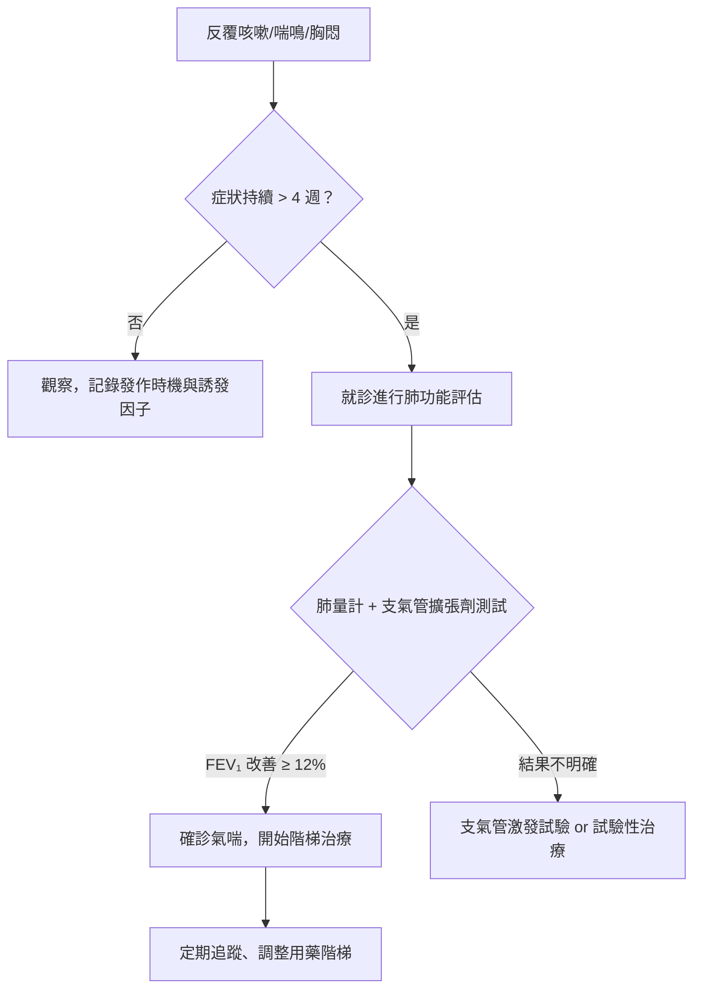
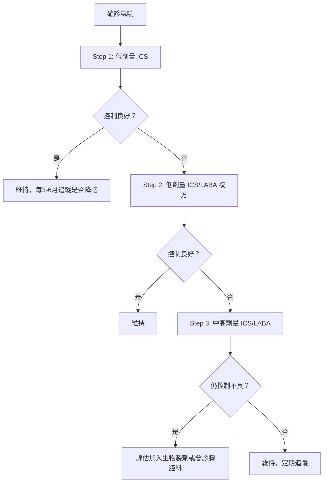

# 氣喘發作怎麼辦？吸入劑的使用誤區與居家環境控制

## 簡單說重點 (Overview)

氣喘是一種氣道長期發炎的慢性疾病，就像你的呼吸道隨時處在「過敏備戰狀態」，一遇到誘發因子就會腫脹、收縮，讓你喘不過氣。好消息是：氣喘是可以被良好控制的，關鍵在於正確使用吸入劑、辨認誘發因子、並讓居家環境盡量「友善呼吸道」。台灣約有 10% 的成人患有氣喘，許多人卻在不正確的自我管理下，讓病情反覆惡化。

<!-- IMAGE_PLACEHOLDER: 正常氣道與氣喘發作時氣道比較示意圖（剖面圖，顯示黏膜腫脹、平滑肌收縮、分泌物增加） -->

## 症狀 (Symptoms)

氣喘的症狀往往在夜間或清晨最為明顯，或是在接觸誘發因子後出現：

- **喘鳴音（wheezing）**：呼吸時聽到類似吹口哨的高頻聲音
- **咳嗽**：反覆乾咳，有時夜咳是唯一症狀（咳嗽變異型氣喘）
- **胸悶、胸口緊壓感**：好像有石頭壓在胸口
- **呼吸困難**：深呼吸感覺吸不飽，講話要斷句換氣
- **運動後症狀加重**：跑步後馬上開始咳嗽或喘

> [!info] 小知識
> 不是每個氣喘患者都會喘鳴。「咳嗽變異型氣喘（Cough-variant asthma）」唯一的症狀就是反覆乾咳，常被誤當感冒或逆流性咳嗽治療超過數月。如果慢性咳嗽超過 8 週且對症狀治療無效，需考慮氣喘的可能。

## 醫師怎麼幫你檢查 (Diagnosis)

確診氣喘需要結合病史、理學檢查與客觀肺功能測試，主要工具包括：

- **肺量計（Spirometry）**：吹氣測量 FEV₁（一秒內最大呼氣量），使用支氣管擴張劑後若改善 ≥ 12%，強烈支持氣喘診斷
- **呼氣峰流速（Peak Flow）**：可在家自行監測，日內變異超過 10% 為異常
- **支氣管激發試驗**：用組織胺或運動誘發氣道過度反應，確認氣道高敏感性
- **過敏原檢測（IgE 血液檢測或皮膚點刺）**：找出個人的誘發過敏原，如塵蟎、貓毛、蟑螂

> [!recommend] 建議
> 若你有慢性咳嗽或反覆喘鳴，建議完整的肺功能評估而非只靠症狀判斷。透過自費過敏原檢測，可以精準找出你的個人誘發因子，讓環境控制更有效率。

## 治療方式 (Treatment)

氣喘治療分為兩大支柱：**長期控制（預防發作）**與**急性緩解（停止發作）**。

### 1. 居家照護

- 每日監測峰流速：綠區（個人最佳值 80–100%）= 控制良好；黃區（50–80%）= 警告；紅區（< 50%）= 緊急
- 準備氣喘行動計畫（Asthma Action Plan）：依峰流速決定當下處置步驟
- 遠離已知誘發因子（見「居家環境控制」FAQ 段）

> [!caution] 注意
> **不要等到發作才用藥。** 控制型吸入劑（含吸入性類固醇，ICS）的目的是每天使用以壓制發炎，而非症狀出現才吸。許多患者因為「感覺沒事」而擅自停藥，導致氣道發炎持續累積，最終引發嚴重急性發作。

### 2. 藥物治療

氣喘用藥分兩類，務必區分清楚：

| 類型 | 代表藥物類型 | 何時使用 |
|------|------------|---------|
| **控制型（Controller）** | 吸入性類固醇（ICS）、ICS/LABA 複方 | 每天規律使用，無論有無症狀 |
| **急救型（Reliever）** | 短效β₂ 促進劑（SABA）、ICS/福莫特羅複方 | 急性症狀發作時使用 |

**GINA 2025 重要更新**：即使是輕度氣喘，也不建議單獨使用 SABA（單純急救吸入劑）作為唯一治療。長期僅依賴急救吸入劑會增加氣道過度反應，反而加速病情惡化。

#### 吸入劑的 5 大常見使用錯誤

研究顯示，超過 60% 的患者吸入劑操作有誤，直接導致藥物無法到達肺部深處：

| 錯誤 | 正確做法 |
|------|---------|
| ❌ 吸藥前沒先深呼吸吐氣 | 先完全吐氣，讓肺部「清空」準備接收藥物 |
| ❌ 按壓噴霧後馬上大口猛吸 | MDI 需緩慢深吸（3–5 秒），不可急 |
| ❌ 吸入後立刻呼出 | 吸入後閉氣 10 秒，讓藥物沉積在氣道 |
| ❌ 乾粉吸入劑（DPI）吸得太慢 | DPI 需**快速深力吸入**（與 MDI 相反！） |
| ❌ 用含類固醇吸入劑後沒漱口 | 每次使用後以清水漱口並吐掉，預防口腔念珠菌感染 |

> [!info] 小知識
> **MDI（定量噴霧吸入劑）vs DPI（乾粉吸入劑）操作邏輯完全相反**：MDI 要「慢吸」讓霧氣隨氣流帶入；DPI 要「快吸」靠氣流速度將粉末打散吸入。搞混就等於白吸。如果不確定自己的吸入劑是哪種，請帶吸入劑來診間讓我們示範確認。

### 3. 進階治療

- **生物製劑療法**：適用重度過敏型氣喘（高 IgE 或嗜酸性球過多），如 anti-IgE、anti-IL-5 類製劑，需由胸腔科或免疫科評估
- **過敏原免疫療法（減敏治療）**：針對特定過敏原（塵蟎、花粉）進行長期脫敏，可降低氣道過敏反應基值

## 什麼時候該看醫生 (When to See a Doctor)

以下情況需要**立即就醫或撥打 119**：

> [!danger] 警告
> - 使用急救吸入劑 2 次後症狀仍無改善
> - 說話困難，只能一字一字說
> - 嘴唇或指甲發紫、發灰（缺氧徵兆）
> - 頭暈、意識不清、冷汗
> - 喘鳴音突然消失（代表氣道幾乎完全阻塞，非改善！）
> - 峰流速低於個人最佳值的 50%

以下情況需要**近期就醫**（數天內）：

- 每週需使用急救吸入劑超過 2 次
- 夜間因氣喘症狀醒來
- 過去一年有因氣喘急診或住院
- 控制型吸入劑已用完但症狀持續
- 近期接觸新的潛在過敏原後症狀加重

## 常見問題 (FAQ)

### Q: 吸入性類固醇會讓我變胖或骨質疏鬆嗎？

A: 吸入性類固醇（ICS）的劑量遠低於口服類固醇，大多數研究顯示在標準劑量下，全身性副作用極少。最主要的局部副作用是聲音沙啞和口腔念珠菌，只要每次吸後漱口就能有效預防。請不要因為害怕類固醇而自行停藥。

### Q: 氣喘能根治嗎？兒童的氣喘長大後會好嗎？

A: 氣喘目前無法根治，但可以達到「完全控制」——即幾乎沒有症狀、不需急救吸入劑、不影響日常生活。約有 30–50% 的兒童氣喘患者青春期後症狀減輕甚至消失，但成年後復發的可能性仍存在，需持續定期追蹤。

### Q: 我的吸入劑快用完了，但感覺還噴得出來，還能繼續用嗎？

A: 不建議。MDI 的計數已用完後，即使仍能噴出推進劑（噴霧），藥物劑量已不足，你可能吸到的是幾乎沒有療效的氣體。請依計數器指示更換。

### Q: 居家養貓養狗的人可以控制好氣喘嗎？

A: 研究顯示，對寵物過敏的氣喘患者，最有效的方式是讓寵物移出臥室、裝設 HEPA 空氣清淨機，並定期幫寵物洗澡（每週一次）。若過敏原測試確認對寵物高度敏感且氣喘控制不良，醫師可能建議更積極的環境處置。

### Q: 我怎麼知道居家環境是否有誘發我氣喘的因子？

A: 最可靠的方式是透過過敏原檢測（血液 IgE 或皮膚點刺）確認你對哪些物質敏感，再針對性改善環境。常見居家誘發因子包括：塵蟎、蟑螂排泄物、黴菌、寵物皮屑、二手菸和清潔劑揮發物。

## 最新治療趨勢 (Latest Updates)

**GINA 2025 的最大更新**在於強調「不再單用 SABA 作為任何程度氣喘的唯一治療」。取而代之的是以低劑量 ICS-福莫特羅（budesonide-formoterol）複方作為輕度氣喘的「按需緩解」吸入劑，這種做法在每次急性症狀時同時給予抗炎藥物，可更有效預防急性惡化（*Clinical Advisor*, 2025）。

生物製劑療法（biologics）的適應症也逐步擴大。2025 年指引對於中重度嗜酸性球型氣喘，推薦更早評估使用 anti-IL-5 類製劑，不再等到所有傳統藥物都失敗才考慮（*GINA 2025 Strategy Report*）。

此外，針對居家過敏原的多管齊下介入（multi-faceted allergen reduction）被證明比單一措施更有效：同步使用防蟎寢具套、HEPA 清淨機、濕度控制，可使居家過敏原濃度下降 60% 以上（*PMC10587592, Environmental allergen reduction in asthma management*, 2023）。

## 醫療免責聲明 (Disclaimer)

本文章內容僅供衛教參考，不構成專業醫療建議、診斷或治療。每個人的健康狀況不同，實際治療方式需由醫師根據個別情況評估。若你有任何健康疑慮或症狀，請務必諮詢合格醫療專業人員。本診所提供的資訊力求準確，但醫學知識持續更新，我們無法保證內容永久有效。文章中提及的治療方式或設備，其適用性與效果因人而異，需經醫師評估後方可進行。

## 參考資料 (References)

- [2025 GINA Strategy Report](https://ginasthma.org/2025-gina-strategy-report/) — Global Initiative for Asthma (GINA), 存取日期 2026-04-22
- [Asthma Management, Adults and Adolescents: GINA 2025 Guideline Summary](https://reference.medscape.com/cc2/p10/guideline-essentials-2025-gina-recommendations-asthma-2025a1000hjj) — Medscape, 存取日期 2026-04-22
- [GINA 2025 Asthma Update: More on T2 Biomarkers, Young Children, Revised Charts](https://www.clinicaladvisor.com/features/gina-2025-asthma-update/) — Clinical Advisor, 2025
- [Environmental allergen reduction in asthma management: an overview](https://pmc.ncbi.nlm.nih.gov/articles/PMC10587592/) — PMC / NIH, 2023
- [Inhalation technique-related errors after education among asthma and COPD patients](https://www.nature.com/articles/s41533-025-00422-0) — npj Primary Care Respiratory Medicine, 2025
- [Systematic Review of Errors in Inhaler Use](https://journal.chestnet.org/article/S0012-3692(16)47571-9/fulltext) — CHEST Journal
- [Allergy-proof your home](https://www.mayoclinic.org/diseases-conditions/allergies/in-depth/allergy/art-20049365) — Mayo Clinic, 存取日期 2026-04-22
- [Allergic Asthma: Causes, Symptoms, Tests & Treatment](https://my.clevelandclinic.org/health/diseases/21461-allergic-asthma) — Cleveland Clinic, 存取日期 2026-04-22
- [What to Do When an Emergency Occurs | Asthma](https://www.cdc.gov/asthma/emergency/index.html) — CDC, 存取日期 2026-04-22
- [台灣成人氣喘臨床照護指引 2022](https://www.tspccm.org.tw/media/12960) — 台灣胸腔暨重症加護醫學會, 2022
- [你可以控制你的氣喘](https://www.mohw.gov.tw/cp-2627-19183-1.html) — 衛生福利部, 存取日期 2026-04-22
