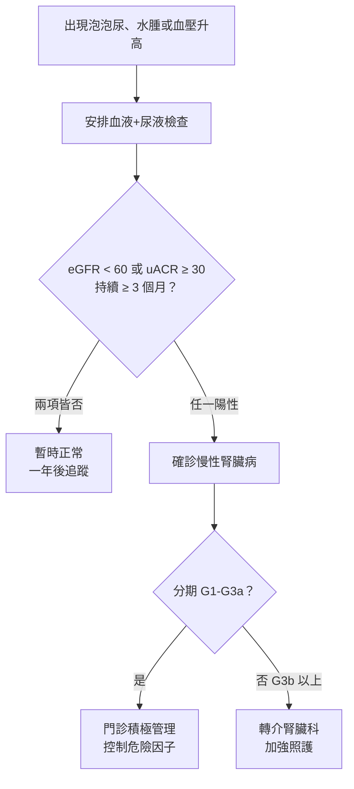
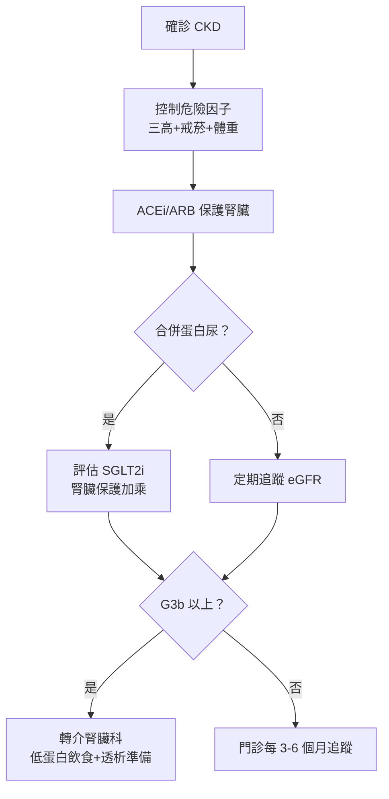

# 為什麼泡泡尿要看腎臟病？慢性腎臟病的前兆與早期介入

## 簡單說重點 (Overview)

慢性腎臟病（CKD）是指腎臟結構或功能異常超過三個月，台灣約有 12% 的成人受影響，是繼心臟病、糖尿病之後最常見的慢性病之一。腎臟像是人體的「過濾器」，一旦功能慢慢衰退，廢物和多餘水分便開始在體內堆積，最終可能需要洗腎（透析）或腎臟移植。

最關鍵的概念是：**早期 CKD 幾乎沒有感覺**，等到出現明顯不適，往往已是中後期。因此記住「泡、水、高、貧、倦」五字訣，定期追蹤腎功能指數（eGFR）和尿蛋白，是唯一可靠的早期發現方式。

<!-- IMAGE_PLACEHOLDER: 腎臟解剖示意圖，標示腎絲球過濾功能 -->

## 症狀 (Symptoms)

早期 CKD（第一至二期）通常完全無症狀，以下徵兆多出現在中期以後：

**五字訣警訊（由早到晚）：**
- **泡**：泡泡尿——尿液沖水後產生細密持久的泡沫，代表尿中含有蛋白質（蛋白尿），是腎臟最早發出的求救訊號
- **水**：水腫——早晨起床眼皮浮腫、下午腳踝或小腿按下去有凹痕，代表多餘水分無法排出
- **高**：高血壓——腎臟負責調節血壓，腎功能下降時血壓往往同步升高，形成惡性循環
- **貧**：貧血——腎臟製造「紅血球生成素」(Erythropoietin)，腎功能下降後此激素減少，導致疲勞、臉色蒼白
- **倦**：疲倦、食慾差——廢物堆積（尿毒素）影響全身，常伴隨噁心、頭暈、皮膚搔癢

> [!info] 小知識
> 正常尿液也會有少量泡沫，特別是排尿速度快時。判斷標準是：泡沫細密像鮮奶油、5 分鐘後仍不消散，才需要警覺。偶爾一次泡泡尿不必恐慌，若**持續出現一週以上**才需就醫檢查。

## 醫師怎麼幫你檢查 (Diagnosis)

腎臟功能評估主要靠**兩個數字**，不需要特殊儀器，一般診所抽血驗尿即可：

1. **eGFR（腎絲球過濾率估算值）**：透過血液中肌酸酐（Creatinine）數值，結合年齡、性別計算腎臟「每分鐘可清除多少毫升血液中的廢物」，正常值 ≥ 90 mL/min/1.73m²
2. **尿液白蛋白肌酸酐比值（uACR）**：晨起第一泡尿的試紙或定量檢查，正常值 < 30 mg/g；≥ 30 mg/g 持續三個月以上即符合 CKD 診斷條件

**CKD 分期（依 KDIGO 2024 指引）：**

| 分期 | eGFR (mL/min/1.73m²) | 說明 |
|------|----------------------|------|
| G1 | ≥ 90 | 腎功能正常，但有蛋白尿或腎臟結構異常 |
| G2 | 60–89 | 輕度下降 |
| G3a | 45–59 | 輕中度下降 |
| G3b | 30–44 | 中重度下降 |
| G4 | 15–29 | 重度下降 |
| G5 | < 15 | 末期腎臟病，需考慮透析或移植 |

> [!caution] 注意
> eGFR 隨年齡增長自然緩慢下降，70 歲以上長者 eGFR 在 55-60 之間不一定代表腎臟病，需搭配**是否有蛋白尿**、**是否持續惡化**綜合判斷，請讓醫師解讀而非自行對照數值恐慌。

若懷疑腎臟結構問題（如多囊腎、結石、腫瘤、阻塞），可安排**腎臟超音波**快速評估，無輻射、無侵入性，診間即可完成。

## 治療方式 (Treatment)

CKD 目前**無法完全逆轉**，但正確介入可以大幅減慢惡化速度，讓許多患者終生不需洗腎。

### 1. 居家照護

- **戒菸**：吸菸會加速腎功能惡化，效益不亞於任何藥物
- **控制體重**：BMI 維持在正常範圍，減輕腎臟過濾負擔
- **規律有氧運動**：每週 150 分鐘中等強度，改善胰島素敏感性和血壓
- **足量飲水**：每日 1,500–2,000 mL（除非有水腫或醫師限水）
- **避免亂服藥**：止痛藥（NSAIDs，如布洛芬、待克菲那）、中草藥偏方、顯影劑是傷腎三大元兇

> [!recommend] 建議
> 楊桃（carambola）對腎臟病患者有神經毒性風險，即使一小片也可能引發難治性呃逆甚至昏迷。CKD 患者請**完全避免食用楊桃及楊桃汁**，這是台灣腎臟醫學會特別警示的項目。

**飲食原則（依分期調整，需由營養師個別化）：**

| 分期 | 蛋白質 | 鈉 | 鉀 | 磷 |
|------|--------|----|----|-----|
| G1-G3 | 限制過量，避免 > 1.3g/kg/天 | 低鹽 < 2g/天 | 一般飲食 | 一般飲食 |
| G4-G5 | 低蛋白 0.6-0.8g/kg/天 | 低鹽 | 限高鉀食物 | 限高磷食物 |

### 2. 藥物治療

- **ACEi / ARB（血壓藥）**：不只降血壓，更能直接保護腎臟、減少蛋白尿，是 CKD 合併高血壓或蛋白尿的首選
- **血糖控制**：糖尿病是 CKD 最大元兇，將糖化血色素（HbA1c）控制在 7% 以下可顯著延緩惡化
- **血脂管理**：合併心血管風險時使用 statin 類藥物
- **磷結合劑、促紅血球生成素**：晚期腎臟病對症治療

### 3. 進階治療

**SGLT2 抑制劑（Sodium-Glucose Cotransporter-2 Inhibitor）** 是近年最重要的突破。原為糖尿病藥物，KDIGO 2024 指引已推薦用於 **合併蛋白尿的 CKD 患者（不論是否有糖尿病）**，可減少 CKD 進展風險約 30-40%。

**GLP-1 受體促效劑**（如 semaglutide）也顯示腎臟保護效益，尤其適合合併糖尿病和肥胖的 CKD 患者。

**跨專科整合照護**：慢性腎臟病需要醫師、藥師、護理師、**營養師**長期協作管理，定期追蹤腎功能、調整飲食計畫、預防並發症，是延緩進入透析的關鍵策略。

## 什麼時候該看醫生 (When to See a Doctor)

**以下情況請盡快就醫（不要等「下週再說」）：**

- 泡泡尿持續超過一週，洗完廁所後仍有密集細泡
- 尿液呈茶褐色、粉紅色或帶血
- 早晨起床眼皮或臉部明顯浮腫
- 雙腳踝或小腿有壓凹性水腫（按下去有坑洞）
- 血壓突然升高且難以控制
- 合併有糖尿病、高血壓、痛風或心臟病，但超過一年未檢查腎功能
- 正在長期服用止痛藥或中草藥，從未評估腎功能

> [!danger] 警告
> 若出現**極度疲勞、意識混亂、嚴重呼吸困難、尿量急劇減少**（可能是急性腎損傷），請立即前往急診，不要拖延。這些可能代表腎功能在短時間內急速惡化。

**高風險族群每年至少主動篩檢一次：**
糖尿病、高血壓、心臟病、腎臟病家族史、長期服用止痛藥、痛風患者、60 歲以上長者。

## 常見問題 (FAQ)

### Q: 有泡泡尿一定是腎臟病嗎？
A: 不一定。排尿速度很快、尿液濃縮（如喝水少）、發燒時也會出現泡泡尿。區分方式是觀察**泡沫是否細密持久（5 分鐘不散）且反覆出現**，若是才需要進一步檢查蛋白尿，一次偶發不用緊張。

### Q: 慢性腎臟病一定會洗腎嗎？
A: 不一定。早期發現（G1-G3）並積極控制危險因子的患者，很多人腎功能可以維持穩定數十年。台灣末期腎臟病（洗腎）發生率世界最高，但多數是因為晚期才發現或控制不良造成，及早介入可以大幅改變預後。

### Q: 低蛋白飲食是不是豆腐、蛋都不能吃？
A: 早期 CKD（G1-G3）不需要嚴格限蛋白，只要避免「過量」（如健身蛋白粉、大量補充品）。G4-G5 才需要在營養師指導下實施低蛋白飲食，且優先選擇**優質蛋白**（蛋、魚、肉），而不是全面禁止蛋白質，否則反而導致營養不良，反而加速惡化。

### Q: 市面上的腎臟保健品有用嗎？
A: 目前沒有任何保健品被證實可以改善腎功能。部分草藥（如馬兜鈴酸相關植物）反而有強烈腎毒性，是台灣腎臟病的重要原因之一。腎臟病患者在服用任何補充品前，**務必先告知醫師或藥師**。

### Q: 腎臟病可以運動嗎？
A: 可以，而且非常建議。規律有氧運動（散步、騎腳踏車、游泳）有助於控制血壓和血糖、減輕體重，對腎臟保護有實證。除非末期腎衰竭或嚴重心血管問題，一般 CKD 患者都應維持適度運動。

## 最新治療趨勢 (Latest Updates)

**KDIGO 2024 指引的重大更新**：最新版國際腎臟病指引將 SGLT2 抑制劑（如 dapagliflozin、empagliflozin）列為合併蛋白尿的 CKD 患者的**標準治療之一**，不再只限糖尿病患者使用。這類藥物可使 CKD 進展風險降低約 30-40%，腎臟科和內科醫師正逐步將其納入標準照護。（來源：KDIGO 2024 CKD 指引，PubMed PMID 38490803）

**非奈利酮（Finerenone）**：一種新型礦物皮質素受體拮抗劑，於 2025 年在台灣取得適應症，用於第二型糖尿病合併 CKD 患者，可在 ACEi/ARB 之外進一步減少尿蛋白和延緩腎衰竭。這代表 CKD 的藥物組合正從「單一柱」進化為「三重保護」機制。

**GLP-1 受體促效劑**（如 semaglutide）的大型腎臟試驗（FLOW trial, 2024）首次證實，此類藥物不只降血糖，更有獨立的腎臟保護效果，未來有望成為 CKD 合併糖尿病的第四條腎臟保護支柱。

## 醫療免責聲明 (Disclaimer)

本文章內容僅供衛教參考，不構成專業醫療建議、診斷或治療。每個人的健康狀況不同，實際治療方式需由醫師根據個別情況評估。若你有任何健康疑慮或症狀，請務必諮詢合格醫療專業人員。本診所提供的資訊力求準確，但醫學知識持續更新，我們無法保證內容永久有效。文章中提及的治療方式或設備，其適用性與效果因人而異，需經醫師評估後方可進行。

## 參考資料 (References)

- [KDIGO 2024 Clinical Practice Guideline for the Evaluation and Management of Chronic Kidney Disease](https://pubmed.ncbi.nlm.nih.gov/38490803/) — PubMed, PMID 38490803, 存取日期 2026-04-20
- [Chronic Kidney Disease (CKD) - Symptoms & Treatment](https://my.clevelandclinic.org/health/diseases/15096-chronic-kidney-disease) — Cleveland Clinic, 存取日期 2026-04-20
- [Chronic Kidney Disease - Symptoms and Causes](https://www.mayoclinic.org/diseases-conditions/chronic-kidney-disease/symptoms-causes/syc-20354521) — Mayo Clinic, 存取日期 2026-04-20
- [Estimated GFR (eGFR) and CKD Staging](https://www.kidney.org/kidney-failure-risk-factor-estimated-glomerular-filtration-rate-egfr) — National Kidney Foundation, 存取日期 2026-04-20
- [慢性腎臟病健康管理手冊](https://www.hpa.gov.tw/Pages/EBook.aspx?nodeid=1157) — 衛生福利部國民健康署, 存取日期 2026-04-20
- [慢性腎臟病之照護](https://ihealth.vghtpe.gov.tw/media/1067) — 臺北榮總護理部健康 e 點通, 存取日期 2026-04-20
- [慢性腎臟病照護指引](https://www1.cgmh.org.tw/intr/intr4/c81500/%E6%85%A2%E6%80%A7%E8%85%8E%E8%87%9F%E7%97%85%E7%85%A7%E8%AD%B7%E6%8C%87%E5%BC%95.pdf) — 長庚醫院, 存取日期 2026-04-20
- Kidney Disease: Improving Global Outcomes (KDIGO) CKD Work Group. "KDIGO 2024 Clinical Practice Guideline for the Evaluation and Management of CKD." *Kidney International* 2024; 105(4S): S117-S314. PMID 38490803
