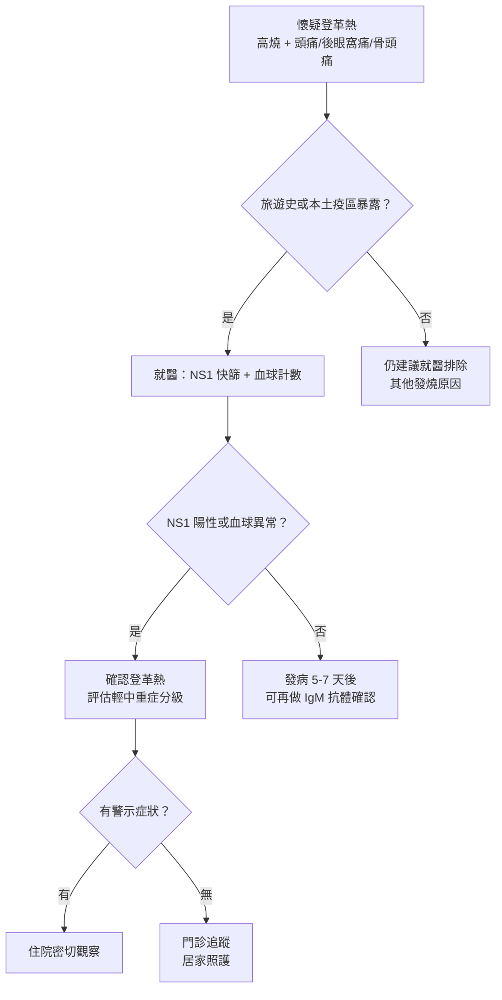
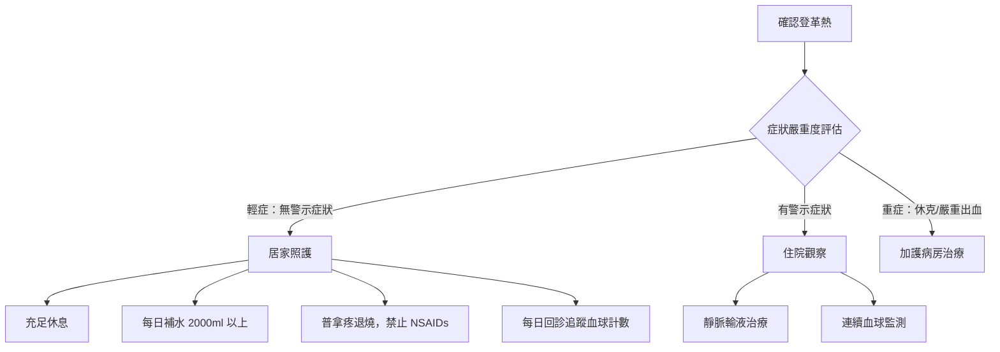

# 登革熱大流行：環境防蚊與警示症狀

## 簡單說重點 (Overview)

登革熱是由登革病毒（Dengue virus）引起的急性傳染病，靠埃及斑蚊（Aedes aegypti）和白線斑蚊叮咬傳播——不是人傳人，而是「人 → 蚊 → 人」的鏈條。台灣南部每年夏秋季都可能出現本土群聚疫情，北部則以境外移入為主。

目前沒有特效抗病毒藥物，治療以「支持性療法」為主。最危險的不是高燒那幾天，而是**退燒後的 24-48 小時**——這段時間才是病情可能急速惡化的關鍵窗口。

<!-- IMAGE_PLACEHOLDER: 埃及斑蚊與白線斑蚊的外觀對比圖，標示腳部白色斑紋特徵 -->

## 症狀 (Symptoms)

- **突然高燒（通常 ≥38.5°C）**：發病快，常在 24 小時內從正常體溫飆到高燒
- **嚴重頭痛**：前額部位最明顯
- **眼窩後方疼痛（後眼窩痛）**：眼球移動時特別明顯，是登革熱的特徵性症狀
- **全身肌肉、骨頭、關節痛**：舊稱「斷骨熱」（Breakbone fever），形容痛到像骨頭要裂開
- **出疹**：發燒第 2-5 天出現，皮膚泛紅，有時有白色小點（白色島嶼徵象）
- **噁心、嘔吐、食慾不振**
- **輕微出血**：牙齦出血、流鼻血，皮膚點狀出血（瘀點）

> [!info] 小知識
> 登革熱有四種血清型（DENV1-4），感染其中一種後對那型有終身免疫力，但對另外三型反而可能更危險。第二次感染不同型別時，重症風險大幅提高。

## 醫師怎麼幫你檢查 (Diagnosis)

**臨床判斷**：符合流行地區旅遊史 + 高燒 + 以上症狀，醫師會高度懷疑登革熱。

**實驗室檢查**：
- **NS1 抗原快速檢測**（發病 1-5 天最準確）：類似快篩，當天就有結果
- **IgM/IgG 血清抗體**（發病 5-7 天後）：確認感染狀態與型別
- **全血球計數（CBC）**：白血球下降（白血球低下症，leukopenia）和血小板下降（血小板低下症，thrombocytopenia）是典型表現，需連續追蹤

<!-- IMAGE_PLACEHOLDER: 登革熱病程三階段示意圖：發燒期→危險期→恢復期，標示各期天數與症狀 -->

## 治療方式 (Treatment)

### 1. 居家照護

- **多休息**：減少體力消耗，避免感染更多蚊子
- **補充水分**：每天喝 2,000 mL 以上，含電解質的飲料（運動飲料稀釋）優於純開水
- **退燒**：**只能用普拿疼（乙醯胺酚，Paracetamol/Acetaminophen）**
- **防蚊隔離**：住院或居家期間需使用蚊帳或防蚊噴劑，避免病毒透過蚊子傳給同住家人

> [!caution] 注意
> **絕對不能服用阿斯匹靈（Aspirin）、布洛芬（Ibuprofen）或其他 NSAIDs 類消炎藥。** 這類藥物會抑制血小板功能，大幅增加出血風險，是登革熱用藥最重要的禁忌。

### 2. 藥物治療

目前無特效抗病毒藥物。藥物治療以症狀控制為主：
- 退燒止痛：乙醯胺酚（限定此類，排除 NSAIDs）
- 止吐藥：嚴重嘔吐影響口服補水時
- 靜脈輸液：口服補水不足或進入危險期，需在醫院內進行

### 3. 住院照護（重症）

出現警示症狀時需住院，進行：
- 靜脈輸液精準補液（太多太少都危險）
- 血小板計數每日追蹤
- 必要時輸血或輸血小板

## 什麼時候該看醫生 (When to See a Doctor)

以下情況請**立即就醫或前往急診**，不要觀望：

- 退燒後（或用藥退燒後）**24-48 小時內再度出現腹部疼痛或壓痛**
- **持續嘔吐**（3 次以上/小時，或完全無法進食進水）
- **牙齦大量出血、吐血、血便或血尿**
- **皮膚出現大片瘀斑**（不是小瘀點）
- **四肢冰冷、皮膚濕冷、意識不清或極度疲憊**
- **呼吸困難、胸腹水徵象**（腹部膨脹感）
- 血小板連續下降至 10 萬/µL 以下

> [!danger] 警告
> **「退燒了就好了」是登革熱最危險的誤解。** 退燒後進入「危險期（Critical Phase）」，血漿滲漏、出血和器官損傷的風險在這時達到高峰。退燒後 24-48 小時仍需密切追蹤，不可掉以輕心。

## 預防：環境防蚊（最核心的策略）

登革熱沒有全面推廣的疫苗，預防的根本在於**消滅病媒蚊的孳生環境**。

> [!recommend] 建議：落實「巡、倒、清、刷」
> - **巡**：每週至少一次巡視家戶內外可能積水的容器
> - **倒**：將花盆底盤、鳥巢、雨天水桶等積水倒乾淨
> - **清**：清除不用的廢棄容器（寶特瓶、保麗龍盒）
> - **刷**：花瓶、水桶內壁用刷子刷洗，去除蚊卵
>
> 雨後 7 天是孳生高峰，豪雨過後務必立即巡查。

**個人防護措施：**
- 戶外活動穿**淺色長袖衣褲**（深色、花紋衣物對蚊子吸引力較高）
- 使用政府核可的防蚊成分：
  - **敵避（DEET）**：濃度 10-30%，最廣泛使用
  - **派卡瑞丁（Picaridin）**：不傷衣物，氣味較淡
  - **伊默克（IR-3535）**：較溫和，適合孕婦與小孩
- 安裝紗窗、使用蚊帳，室內使用電蚊香

<!-- IMAGE_PLACEHOLDER: 常見積水孳生源圖示：花盆底盤、廢棄輪胎、積水水桶、水生植物盆 -->

## 常見問題 (FAQ)

### Q: 登革熱會人傳人嗎？
A: 不會直接人傳人，一定要透過斑蚊叮咬才能傳播。但若病患被蚊子叮後，同一隻蚊子再叮其他人，就會傳染。因此患者在病毒血症期（發燒期）需做好防蚊措施，隔絕蚊子叮咬。

### Q: 得過登革熱就永久免疫嗎？
A: 只對**同一型**登革病毒終身免疫。第二次感染**不同型別**時，免疫系統的交叉反應反而可能導致更嚴重的「登革出血熱（DHF）」，重症和死亡風險明顯提高。

### Q: 血小板太低需要輸血小板嗎？
A: 大部分登革熱患者血小板雖然低，但只要沒有活動性大出血，通常不需要預防性輸血小板。醫師會根據臨床出血情況，而非單純數字，決定是否輸注。

### Q: 孕婦感染登革熱危險嗎？
A: 孕婦屬於高風險族群，感染後重症率和早產風險較高。孕期應特別加強防蚊措施，一旦出現疑似症狀應立即就醫。

### Q: 家裡有積水容器，一定要請人來噴藥嗎？
A: 噴藥（化學防治）只能消滅成蚊，無法殺死水中幼蟲（孑孓）。消滅孳生源——清除積水——才是根本解決辦法，噴藥是輔助手段，不是替代方案。

## 最新治療趨勢 (Latest Updates)

**登革熱疫苗（Qdenga，TAK-003）**：日本武田藥廠研發的四價活性減毒疫苗，針對四種登革病毒血清型。WHO 於 2024 年發布立場文件，建議在高度流行地區（尤其熱帶地區）對 **6-16 歲兒童**使用，兩劑間隔 3 個月，臨床試驗顯示對症狀性登革熱有約 **61% 保護力**、對住院化更達 **84%**。台灣目前尚未納入常規接種計畫，旅遊前往東南亞高流行地區者可諮詢旅遊醫學門診。（WHO 資訊, 2024；Lancet Infectious Diseases, 2025）

**WHO 2025 年新版指引**：WHO 於 2025 年 7 月發布最新的蟲媒病毒疾病（包含登革熱、屈公病、茲卡、黃熱病）臨床管理指引，強調社區、初級醫療到住院各層級的連續性照護，以及危險期的精準補液策略。

## 醫療免責聲明 (Disclaimer)

本文章內容僅供衛教參考，不構成專業醫療建議、診斷或治療。每個人的健康狀況不同，實際治療方式需由醫師根據個別情況評估。若你有任何健康疑慮或症狀，請務必諮詢合格醫療專業人員。本診所提供的資訊力求準確，但醫學知識持續更新，我們無法保證內容永久有效。文章中提及的治療方式或設備，其適用性與效果因人而異，需經醫師評估後方可進行。

## 參考資料 (References)

- [Dengue - Signs and Symptoms](https://www.cdc.gov/dengue/signs-symptoms/index.html) — US CDC, 存取日期 2026-04-26
- [Dengue - Fact Sheet](https://www.who.int/news-room/fact-sheets/detail/dengue-and-severe-dengue) — WHO, 存取日期 2026-04-26
- [Severe Dengue Warning Signs](https://www.cdc.gov/dengue/stories/severe-dengue.html) — US CDC, 存取日期 2026-04-26
- [登革熱疾病介紹](https://www.cdc.gov.tw/Disease/SubIndex/WYbKe3aE7LiY5gb-eA8PBw) — 衛生福利部疾病管制署, 存取日期 2026-04-26
- [預防登革熱有一套－防蚊措施、巡倒清刷不可少](https://www.cdc.gov.tw/Category/ListContent/z3l-ni_hN8XQhdqusEuKQA?uaid=drKkYC9lsvKwJErCP1Wl5g) — 衛生福利部疾病管制署, 存取日期 2026-04-26
- [登革熱治療照護](https://www.cdc.gov.tw/Category/MPage/wDZ5z1ljrRi-Ug32diOcRw) — 衛生福利部疾病管制署, 存取日期 2026-04-26
- [WHO position paper on dengue vaccines, May 2024](https://www.who.int/publications/i/item/who-wer-9918-203-224) — WHO, 2024
- Melo-Júnior OAO et al. "Management of Dengue: An Updated Review." PMC9793358. *Biomolecules* 2022. PMID: 36671651
- Wilder-Smith A et al. "Dengue Fever—Diagnosis, Risk Stratification, and Treatment." *NEJM Evidence* 2024. PubMed 39297280
- Effectiveness of TAK-003 dengue vaccine in adolescents during 2024 outbreak in São Paulo, Brazil. *Lancet Infectious Diseases* 2025. [doi:10.1016/S1473-3099(25)00382-2]
