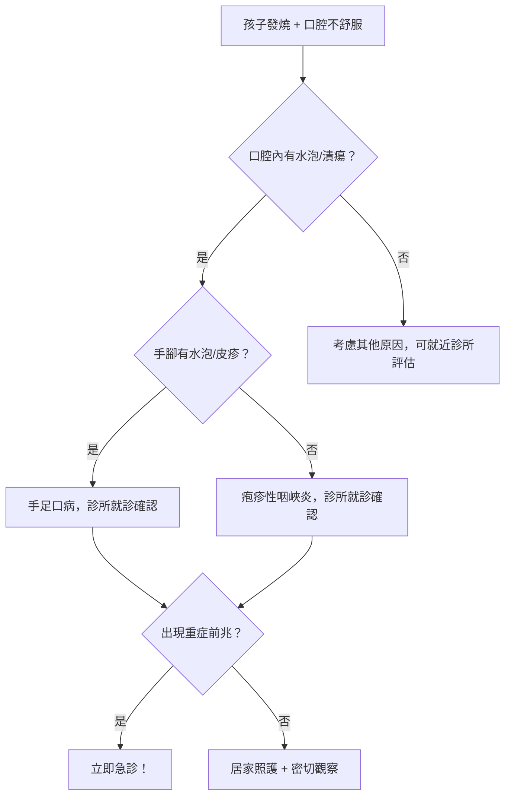
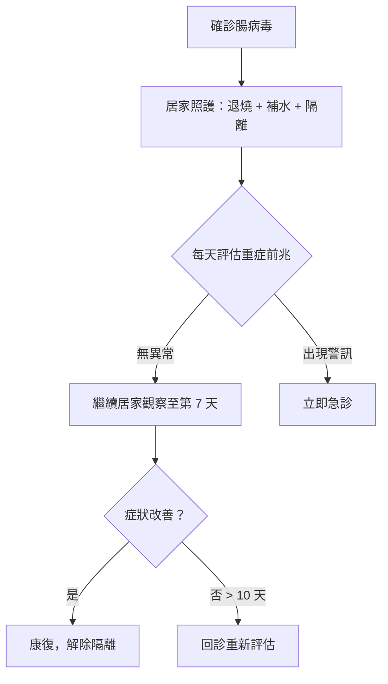

# 爸媽的噩夢：腸病毒重症預防與居家照護

## 簡單說重點 (Overview)

腸病毒是一大家族的病毒，在台灣每年 5-6 月達到流行高峰，幼兒園幾乎無法倖免。大多數孩子感染後只會發燒、口腔破皮、手腳長小水泡，7-10 天就會自行恢復。真正讓父母必須保持警覺的，是少數演變為腦炎或心肌炎的重症病例——而辨識出重症前兆、在對的時機送醫，就是這篇文章最重要的事。

> [!info] 小知識
> 腸病毒家族龐大，包含克沙奇病毒（Coxsackievirus）、伊可病毒（Echovirus）以及腸病毒 71 型（EV-A71）等超過百種型別。其中 EV-A71 是最容易引起重症（腦炎、腦幹炎）的類型，也是台灣疫苗防護的主要目標。

## 症狀 (Symptoms)

腸病毒最常見的兩種表現方式：

**手足口病（Hand-Foot-Mouth Disease, HFMD）**
- 口腔內壁、舌頭出現潰瘍，導致孩子痛到拒食拒水
- 手掌、腳掌、膝蓋出現紅疹或小水泡
- 臀部也可能出現皮疹
- 通常伴隨發燒（38-39°C）

**疱疹性咽峽炎（Herpangina）**
- 只有口腔後半部（軟顎、懸垂顎、扁桃腺）出現水泡和潰瘍
- 手腳通常沒有疹子
- 發燒溫度較高，進食疼痛明顯

> [!caution] 注意
> 兩種表現不容易自己分辨，且孩子因口腔疼痛常拒絕喝水，**脫水**才是多數家長需要積極處理的問題。給冰涼的食物（退燒後可試冰淇淋）可減少疼痛感，幫助補充水分。

## 醫師怎麼幫你檢查 (Diagnosis)

腸病毒診斷主要靠**臨床表現**，不需要抽血或特殊檢查就能判斷。醫師會用壓舌板和光源直接查看口腔有無特徵性水泡與潰瘍，並檢查手腳與臀部皮疹。

若懷疑重症，會安排抽血（看白血球、血糖、心肌酶）、胸部 X 光，以及神經學評估。腦脊髓液檢查（脊椎穿刺）僅在懷疑腦炎時進行。

<!-- IMAGE_PLACEHOLDER: 腸病毒手足口病皮疹示意圖，顯示手掌和口腔潰瘍特徵 -->

## 治療方式 (Treatment)

腸病毒目前**沒有特效藥**，治療以緩解症狀和支持療法為主。

### 1. 居家照護

- **退燒**：依醫囑使用退燒藥（乙醯胺酚或布洛芬），避免不適感
- **補水是第一優先**：發燒和口腔潰瘍會造成水分流失，少量多次給予冷飲、冰棒、布丁等
- **口腔清潔**：飯後輕柔漱口，避免傷口感染
- **充分休息**：讓免疫系統專心對抗病毒
- **隔離**：發病後 7 天內傳染力最強，避免與其他幼兒接觸

> [!recommend] 建議
> 腸病毒的酒精乾洗手效果有限！腸病毒是無套膜病毒（non-enveloped virus），酒精無法有效殺滅。預防傳染必須用**肥皂流水搓洗 20 秒以上**，尤其是換尿布後、接觸孩子口鼻分泌物後。環境消毒建議用漂白水（次氯酸鈉）1:100 稀釋擦拭。

### 2. 藥物治療

- 退燒藥減少發燒不適
- 口腔潰瘍止痛藥膏（含 lidocaine 成分），在醫師評估後使用
- 若進食困難導致脫水，可能需要靜脈輸液補充

### 3. 進階治療（重症）

重症腸病毒病例（腦幹炎、腦炎、心肌炎、肺水腫）需要緊急轉介醫學中心加護病房，治療包括：
- 呼吸器支持
- 心臟功能監測與強心藥
- 靜脈注射免疫球蛋白（部分研究支持使用於特定重症）

**EV-A71 疫苗（自費預防）：**

目前台灣有 EV-A71 疫苗可供接種，建議接種時程：
- 2 個月至未滿 2 歲：接種 3 劑（基礎 2 劑 + 追加 1 劑）
- 2 歲至未滿 6 歲：接種 2 劑
- 保護效力約 99%（針對 EV-A71 重症）
- 目前屬自費疫苗，可至診所詢問庫存與接種建議

## 什麼時候該看醫生 (When to See a Doctor)

一般腸病毒可以先到診所就診。但以下是必須**立刻前往急診**的重症五大前兆：

> [!danger] 警告：出現以下任一症狀，立即急診
> 1. **嗜睡、意識不清**：叫不醒、眼神呆滯、對周圍無反應
> 2. **持續嘔吐**：非因口腔疼痛，而是反覆嘔吐無法進食進水
> 3. **肌躍型抽搐**：類似睡著時抖動，但在清醒狀態發生，手腳不自主抖動
> 4. **呼吸急促、心跳加快**：即使退燒後仍持續，臉色蒼白
> 5. **四肢無力**：突然走不穩、手無法拿東西

**一般就醫時機（診所即可）：**
- 發燒超過 38.5°C 且退燒藥效果不佳
- 因口腔疼痛 8 小時以上無法進食喝水
- 皮疹範圍快速擴大
- 家長心理不安、需要確認診斷

## 常見問題 (FAQ)

### Q: 幼兒園規定要隔離幾天才能回去上課？

A: 疾管署建議**隔離至少 7 天**，且症狀（發燒、口腔水泡、皮疹）明顯消退後方可返校。若同一班級在一週內出現 2 名以上確診，學校通常需要停班（停課 7 天）。各縣市衛生局規定細節可能略有不同，請以學校通知為準。

### Q: 大人也會得腸病毒嗎？

A: 會。大人通常症狀輕微（喉嚨痛、輕微手腳起疹），甚至毫無症狀，但仍具傳染力。因此帶病毒的家長可能在不知情的情況下傳染給家中幼兒。接觸幼兒前徹底洗手是最重要的保護。

### Q: 得過腸病毒就有免疫力了嗎？

A: 對那種特定型別有免疫力，但腸病毒有上百種型別，得過克沙奇病毒不代表對 EV-71 免疫。同一個孩子可能一生中多次感染不同型別的腸病毒。

### Q: EV-A71 疫苗需要接種嗎？

A: 6 歲以下（特別是 5 歲以下）的幼兒是腸病毒重症高危險族群，接種 EV-A71 疫苗可有效預防因 EV-A71 感染所導致的重症（腦幹炎、腦炎）。雖然疫苗不能防範所有型別腸病毒，但能降低最危險那一型的重症風險。建議家長與診所醫師討論接種時機。

### Q: 手足口病的水泡會傳染到大人身上嗎？

A: 腸病毒可以傳染，但皮膚水泡本身不是主要傳播途徑。主要傳染來源是口腔分泌物（唾液、鼻水）和糞便，不是水泡本身。避免讓孩子戳破水泡，水泡通常會自行乾涸結痂。

## 最新治療趨勢 (Latest Updates)

根據 2024 年台灣疾管署腸病毒防治工作指引，EV-A71 重症病例在台灣呈現每 4-5 年一次大流行的周期，2025 年同期重症人數創五年新高，提醒家長對重症警訊需提高警覺。

國際研究方向包括：針對 EV-A71 的抗病毒藥物（如 fluoxetine 的體外研究）與廣效型腸病毒疫苗的開發，但目前均未進入臨床使用階段。靜脈注射免疫球蛋白（IVIG）在台灣重症治療中已廣泛使用，研究顯示對降低腦幹炎的嚴重度有一定幫助。（資訊來源：疾管署腸病毒防治工作指引 2024；UHO 優活健康網 2025）

## 醫療免責聲明 (Disclaimer)

本文章內容僅供衛教參考，不構成專業醫療建議、診斷或治療。每個人的健康狀況不同，實際治療方式需由醫師根據個別情況評估。若你有任何健康疑慮或症狀，請務必諮詢合格醫療專業人員。本診所提供的資訊力求準確，但醫學知識持續更新，我們無法保證內容永久有效。文章中提及的治療方式或設備，其適用性與效果因人而異，需經醫師評估後方可進行。

## 參考資料 (References)

- [腸病毒防治專區](https://www.cdc.gov.tw/Disease/SubIndex/N6XvFgd94jBP8N9EZ_jxXQ) — 衛生福利部疾病管制署, 存取日期 2026-04-07
- [腸病毒 EV71 型疫苗資訊](https://www.cdc.gov.tw/Category/Page/u87VWWvbc8dH6BcgAguctw) — 衛生福利部疾病管制署, 存取日期 2026-04-07
- [腸病毒 71 型來勢洶洶！今年重症創新高](https://www.uho.com.tw/article-66511.html) — UHO 優活健康網, 2025
- [腸病毒併發重症風險與家長應注意的警訊](https://nearbymed.com/enterovirus-warning-signs-severe-complications-children/) — NearbyMed, 存取日期 2026-04-07
- [EV71 疫苗接種資訊](https://helloyishi.com.tw/stomach/gastroenteritis/enterovirus-a71-vaccine/) — Hello 醫師, 存取日期 2026-04-07
- [Enterovirus — Taiwan CDC English](https://www.cdc.gov.tw/En/Category/ListContent/bg0g_VU_Ysrgkes_KRUDgQ?uaid=zRqpJ3zn3lI6Tc0LgD0Clw) — Taiwan Centers for Disease Control, accessed 2026-04-07
- Chang LY et al. "Clinical features and risk factors of pulmonary oedema after enterovirus-71-related hand, foot, and mouth disease." Lancet 1999; 354(9191): 1682-1686. PMID: 10568572
