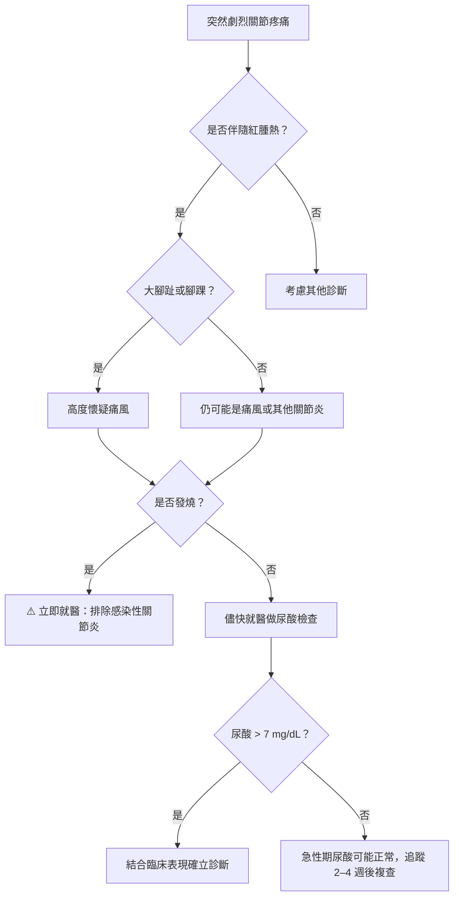
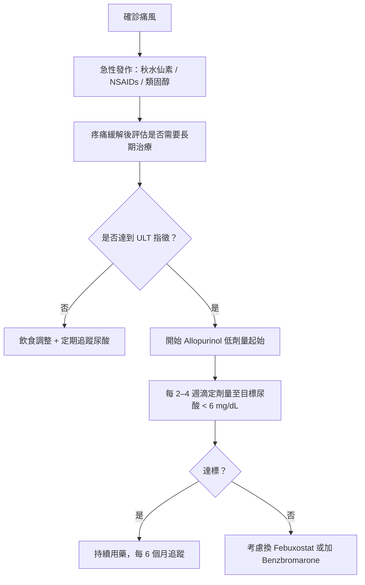

# 腳尖劇痛如火燒：痛風的飲食與用藥完整指南

## 簡單說重點 (Overview)

痛風是血液中尿酸（uric acid）過高，導致尿酸鹽結晶（monosodium urate crystals，像細小的針頭）沉積在關節腔內，引發的急性發炎關節炎。它最常發生在大腳趾根部關節，通常在半夜突然爆發，疼痛劇烈到連棉被的重量都難以承受。痛風不只是「吃太好」的問題，遺傳體質、腎臟功能、特定藥物都會影響尿酸的代謝。

<!-- IMAGE_PLACEHOLDER: 尿酸結晶沉積在關節腔的示意圖，及大腳趾痛風發作的外觀照片 -->

> [!info] 小知識
> 人體內約 2/3 的尿酸來自細胞代謝自然產生，只有約 1/3 來自飲食。這是為什麼單靠飲食控制，往往不足以讓尿酸達標的原因。

---

## 症狀 (Symptoms)

痛風發作有幾個很有特色的表現：

- **劇烈關節疼痛**：在 6–12 小時內達到高峰，嚴重程度有時令人無法走路
- **關節紅腫熱**：患部皮膚呈現明顯紅色，觸摸有熱感，關節腫脹
- **好發部位**：大腳趾根部（約 50% 的第一次發作），其次為腳踝、膝蓋、手腕、手指關節
- **夜間發作**：通常在夜間或清晨突然開始，睡前毫無預兆
- **發作持續時間**：急性發作未治療通常持續 3–10 天自行緩解
- **痛風石（tophi）**：長期控制不良者，尿酸鹽會在皮下形成白色硬結，好發在耳廓、肘關節、手指

> [!caution] 注意
> 痛風緩解後，關節疼痛完全消失，並不代表尿酸恢復正常。無症狀期間尿酸結晶仍在持續沉積，如未積極治療，下次發作往往更嚴重、累及更多關節。

---

## 醫師怎麼幫你檢查 (Diagnosis)

診斷痛風通常包含以下步驟：

1. **病史與理學檢查**：詢問症狀時序、飲食及用藥史，觀察關節紅腫熱痛的分佈
2. **血液尿酸值（serum uric acid）**：正常值男性 < 7.0 mg/dL，女性 < 6.0 mg/dL；注意：急性發作期尿酸值可能暫時正常
3. **腎功能與代謝檢查**：評估腎絲球過濾率（eGFR）、血脂、血糖，排除合併的代謝症候群
4. **關節液抽取（arthrocentesis）**：這是確診的黃金標準——用細針抽取關節液，在偏光顯微鏡下看到負偏光的針狀結晶即可確診，同時可排除感染性關節炎
5. **影像學檢查**：超音波可看到「雙輪廓徵（double-contour sign）」，X 光可評估慢性期骨侵蝕

**就醫決策流程**

---

## 治療方式 (Treatment)

### 1. 居家照護（急性發作期）

- **休息與抬高患肢**：急性發作時應停止活動，將患肢稍微抬高以減輕腫脹
- **冰敷**：以毛巾包覆冰袋，每次 15–20 分鐘，可減輕發炎疼痛（避免直接冰敷皮膚）
- **大量喝水**：每天至少 2,000 mL 以上，促進尿酸從腎臟排出
- **避免按摩患部**：急性期按摩或用力揉捏反而會加重發炎

> [!recommend] 建議
> 急性發作期間暫時避免高普林食物（肉湯、內臟、酒精），同時多喝水；但不要急著在發作當下大幅改變飲食，最重要的是先止痛。

### 2. 藥物治療

**急性發作止痛（前 36 小時內用藥最有效）：**

- **秋水仙素（colchicine）**：為急性痛風的首選，抑制尿酸結晶引發的發炎反應；早期使用效果最佳，但需注意腸胃副作用（腹瀉）
- **非類固醇消炎藥（NSAIDs）**：如吲哚美辛（indomethacin）等，有效止痛消腫，但腎功能不佳者需謹慎
- **類固醇（corticosteroids）**：口服或注射，適用於無法使用上述藥物者

> [!caution] 注意
> 急性發作期間，不要自行服用低劑量阿斯匹林（aspirin）——它會抑制尿酸排泄，反而使症狀惡化。

**長期降尿酸治療（urate-lowering therapy, ULT）：**

| 藥物 | 機轉 | 適用情況 |
|------|------|----------|
| 別嘌呤醇（Allopurinol） | 抑制尿酸生成（黃嘌呤氧化酶抑制劑） | 第一線首選；腎功能需調整劑量 |
| 非布索坦（Febuxostat） | 同上，選擇性更強 | 第二線；心血管疾病患者需謹慎 |
| 苯溴馬隆（Benzbromarone） | 促進尿酸排泄 | 尿酸排泄不足型 |

**開始降尿酸藥物的時機（依 ACR 2020 指引）：**
- 一年內發作 ≥ 2 次
- 合併痛風石（tophi）
- 曾有尿酸腎結石
- 合併慢性腎臟病（CKD）、心血管疾病或高血壓的首次發作

**目標：** 血清尿酸持續 < 6 mg/dL（有痛風石者目標 < 5 mg/dL）

**治療階梯**

> [!caution] 注意
> 降尿酸藥物應在急性發作完全緩解後才開始；若在急性期突然開始降尿酸，反而可能誘發另一次發作（因尿酸急速波動）。開始降尿酸治療的前 6 個月，通常需要同時預防性使用低劑量秋水仙素。

---

## 痛風的飲食原則

### 應避免或大幅限制

| 食物類別 | 舉例 |
|----------|------|
| 內臟類 | 肝、腎、腦、心臟、腸 |
| 高普林海鮮 | 沙丁魚、鯷魚、蛤蜊、牡蠣、鮑魚、干貝 |
| 濃縮肉湯 | 火鍋湯底、骨頭湯、滷汁 |
| 酒精飲料 | 啤酒影響最大，烈酒次之，紅酒相對較低但仍需限制 |
| 果糖飲料 | 含糖飲料、果汁（果糖促進尿酸生成） |

### 可以適量吃

| 食物類別 | 說明 |
|----------|------|
| 低脂乳製品 | 可能有助降低尿酸（牛奶蛋白促進腎臟排尿酸） |
| 雞蛋 | 普林含量低，優質蛋白質來源 |
| 豆腐、豆漿 | 雖含普林，但研究顯示黃豆製品不增加痛風風險 |
| 大多數蔬菜 | 即使高普林蔬菜（菇類、蘆筍、菠菜），研究顯示不增加痛風發作 |
| 咖啡 | 適量咖啡可能有助降低尿酸（非咖啡因機轉）|
| 櫻桃 | 部分研究顯示能降低痛風發作頻率 |

<!-- IMAGE_PLACEHOLDER: 低普林飲食食物分類圖表（紅燈/黃燈/綠燈食物） -->

> [!recommend] 建議
> 減重是控制痛風最有效的非藥物方法之一，但請注意：快速節食減重反而會使尿酸暫時升高、誘發急性發作。建議每月減少體重不超過 1 公斤，循序漸進為宜。

---

## 什麼時候該看醫生 (When to See a Doctor)

下列情況需要儘快就醫：

- 關節劇烈紅腫熱痛，懷疑首次痛風發作
- 疼痛持續超過 10 天未緩解
- **伴隨發燒（超過 38°C）**：需排除感染性關節炎（化膿性關節炎），這是需要緊急處理的狀況
- 發作頻率增加（一年 2 次以上）
- 皮下出現白色硬結（痛風石）
- 血尿、腎結石或腎功能下降

> [!danger] 警告
> 若關節紅腫熱痛同時伴有高燒、或患部皮膚出現明顯蜂窩性組織炎，請當天到急診就醫——感染性關節炎若處理延誤，可能在數天內造成關節永久破壞。

---

## 常見問題 (FAQ)

### Q: 尿酸高就是痛風嗎？
A: 不一定。大多數血尿酸偏高的人（稱為高尿酸血症）終其一生不會發作痛風。但尿酸越高、持續越久，結晶沉積的機率就越大。是否需要藥物治療需由醫師綜合評估，不只看數字。

### Q: 痛風發作時可以泡熱水腳嗎？
A: 不建議。急性發作期局部已有明顯發炎，泡熱水會加速血流、加重腫脹疼痛。此時應以冰敷代替。

### Q: 降尿酸藥要吃一輩子嗎？
A: 多數情況下，若有明確的 ULT 指徵（如頻繁發作、痛風石），通常建議長期甚至終身維持用藥。若尿酸達標且超過 3–5 年無發作，部分患者在醫師評估下可考慮緩慢減量，但應定期追蹤。

### Q: 豆腐和豆漿是高普林食物，痛風患者不能吃？
A: 這是常見的誤解。雖然黃豆普林含量中等，但大型流行病學研究顯示豆製品不增加痛風發作風險，甚至可能有保護作用。痛風患者可以適量攝取豆腐和豆漿。

### Q: 服用利尿劑（水藥）會影響尿酸嗎？
A: 會。噻嗪類利尿劑（thiazide diuretics）和環型利尿劑（loop diuretics）都會抑制腎臟排泄尿酸，使血尿酸上升。若你因高血壓在服用利尿劑，請告知醫師，評估是否需要調整藥物。

---

## 最新治療趨勢 (Latest Updates)

**2025 年的重要更新：** Sage Journals 於 2025 年發表的系統性回顧（*Gout therapy updated*, McCarty et al.）確認，allopurinol 仍為第一線 ULT，建議從低劑量（≤ 100 mg/天）起始並逐步滴定。關於 febuxostat 的心血管安全性，最新的 FAST 研究（歐洲大型 RCT）顯示其心血管風險與 allopurinol 相比並無顯著差異，但對於已有確診動脈硬化性心血管疾病的患者，仍建議優先使用 allopurinol。

**新型藥物動態：** Dotinurad（選擇性 URAT1 抑制劑）和 verinurad 在亞洲患者中顯示出優異的降尿酸效果，已在部分亞洲國家核准，台灣引進的時程仍待觀察。對於嚴重慢性痛風石型患者，pegloticase（靜脈注射用尿酸酶）是新的選擇，但需由風濕免疫科醫師評估適應症（2020 年 ACR 指引建議）。

---

## 醫療免責聲明 (Disclaimer)

本文章內容僅供衛教參考，不構成專業醫療建議、診斷或治療。每個人的健康狀況不同，實際治療方式需由醫師根據個別情況評估。若你有任何健康疑慮或症狀，請務必諮詢合格醫療專業人員。本診所提供的資訊力求準確，但醫學知識持續更新，我們無法保證內容永久有效。文章中提及的治療方式或設備，其適用性與效果因人而異，需經醫師評估後方可進行。

---

## 參考資料 (References)

- [Gout - Symptoms and causes](https://www.mayoclinic.org/diseases-conditions/gout/symptoms-causes/syc-20372897) — Mayo Clinic, 存取日期 2026-04-18
- [Gout - Diagnosis and treatment](https://www.mayoclinic.org/diseases-conditions/gout/diagnosis-treatment/drc-20372903) — Mayo Clinic, 存取日期 2026-04-18
- [Gout Diet: What's allowed, what's not](https://www.mayoclinic.org/healthy-lifestyle/nutrition-and-healthy-eating/in-depth/gout-diet/art-20048524) — Mayo Clinic, 存取日期 2026-04-18
- [Gout: What It Is, Symptoms & Treatment](https://my.clevelandclinic.org/health/diseases/4755-gout) — Cleveland Clinic, 存取日期 2026-04-18
- [Gout (Low Purine) Diet: Best Foods To Eat & What To Avoid](https://my.clevelandclinic.org/health/treatments/22548-gout-low-purine-diet) — Cleveland Clinic, 存取日期 2026-04-18
- [2020 American College of Rheumatology Guideline for the Management of Gout](https://pmc.ncbi.nlm.nih.gov/articles/PMC10563586/) — FitzGerald et al., Arthritis Care & Research, 2020. PMC10563586
- [Gout therapy updated](https://pmc.ncbi.nlm.nih.gov/articles/PMC12553874/) — McCarty KL et al., Therapeutic Advances in Musculoskeletal Disease, 2025. PMC12553874
- [高尿酸血症與痛風](https://hmc.ntuh.gov.tw/disease-symptoms/0m154008091131368560) — 臺大醫院健康管理中心, 存取日期 2026-04-18
- [低普林飲食(高尿酸血症／痛風飲食)](https://www.chimei.org.tw/main/cmh_department/59012/info/5600/A5600211.html) — 奇美醫院營養科, 存取日期 2026-04-18
