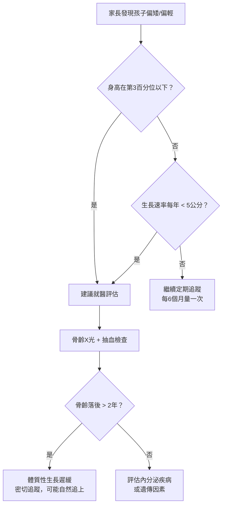
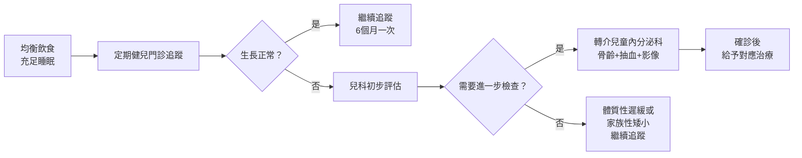

# 成長不落後：如何正確解讀生長曲線圖

## 簡單說重點 (Overview)

生長曲線圖就像孩子發育的「行車記錄器」，記錄的是**成長軌跡**，而不只是某一個時間點的數字。第3到97百分位之間都算正常範圍，更重要的是觀察曲線是否穩定前進，而非糾結於數字高低。

很多家長因為孩子「只有第20百分位」而焦慮，其實完全不需要——有人在第5百分位卻長期穩定成長，比突然從第70跌到第30更值得關注。

<!-- IMAGE_PLACEHOLDER: 兒童生長曲線百分位示意圖，顯示5條曲線（第3、15、50、85、97百分位） -->

## 症狀 (Symptoms)

以下情況可能代表孩子的生長需要進一步評估：

- **身高或體重持續低於第3百分位**
- **生長曲線在短期內穿越兩條主要百分位線**（例如從第50跌到第15，再跌到第3）
- **體重下降先於身高**——這是熱量攝取不足的早期警訊
- **學齡前每年身高增長不足4公分**
- **青春期前（2歲後）每年長高不到5公分**
- **頭圍成長停滯**——嬰兒期尤其重要，可能提示神經發育問題

> [!info] 各年齡正常生長速率
> - 出生第1年：身高增加約 **25公分**，體重增加至 3倍
> - 1–2歲：每年約增高 **10–12公分**
> - 2歲至青春期前：每年穩定增高 **5–7公分**
> - 青春期衝刺期：每年可增高 **8–12公分**

## 醫師怎麼幫你檢查 (Diagnosis)

醫師評估兒童生長，不只看單一次的數值，而是串聯多次記錄後分析整體趨勢。常用的評估方法包括：

**1. 連續生長曲線追蹤**
將每次健兒門診（嬰幼兒定期檢查）的身高、體重、頭圍標記在曲線圖上，觀察孩子是否穩定沿著自己的軌跡前進。

**2. 遺傳身高預測（Mid-Parental Height）**
根據父母身高計算孩子的遺傳潛力目標身高（Target Height）：
- **男孩目標身高** ＝（父親身高 ＋ 母親身高 ＋ 13公分）÷ 2，正常範圍 ±8.5公分
- **女孩目標身高** ＝（父親身高 ＋ 母親身高 − 13公分）÷ 2，正常範圍 ±8.5公分

若孩子的生長曲線遠低於遺傳預測值，需進一步檢查。

**3. 骨齡評估（Bone Age X-ray）**
以左手腕部X光判斷骨頭成熟度，比較骨齡與實際年齡的差距。骨齡落後2年以上，可能是體質性生長遲緩（Constitutional Growth Delay），最終身高仍有機會追上。

**4. 抽血篩查**
包括甲狀腺功能（TSH、T4）、生長激素（GH）刺激測試、IGF-1，以及相關代謝指標，用來排除內分泌疾病。

> [!caution] 常見誤解
> 「孩子的曲線一直在第10百分位，從來沒有掉下去過，就是完全正常的。」——這個理解基本正確，但還要搭配**生長速率**一起看。即使百分位沒有大幅下降，若每年身高增長明顯低於同年齡，仍需評估。

## 治療方式 (Treatment)

### 1. 居家照護

均衡飲食與充足睡眠是促進正常生長最有效的基礎：

- **蛋白質**：每餐確保有優質蛋白質來源（豆蛋魚肉）
- **鈣質**：建議每天1-2杯牛奶或等量乳製品，配合戶外活動促進維生素D合成
- **睡眠**：生長激素主要在深度睡眠中分泌，學齡前兒童應確保10-12小時睡眠，學齡兒童9-11小時
- **規律運動**：跳繩、籃球、游泳等縱向運動有助於骨骼發育

> [!recommend] 居家追蹤建議
> 在家自測身高時，早上起床後（去過廁所、空腹）測量最準確，因為一天之中身高可相差0.5-1公分。同一時間、同一姿勢、同一把尺，記錄比較才有意義。

### 2. 藥物治療

大多數生長偏低的孩子不需要藥物介入，但若診斷確認為以下情況，醫師可能建議藥物治療：

- **甲狀腺功能低下**：補充甲狀腺素後，生長速率通常會顯著改善
- **生長激素缺乏症**：確認缺乏後可申請健保給付生長激素注射治療
- **特納氏症候群（Turner Syndrome）、小於胎齡兒（SGA）**等特定診斷：有相應的生長激素使用適應症

> [!caution] 注意
> 市面上標榜「增高」的保健食品，目前缺乏高品質臨床試驗支持。不建議在未明確診斷的情況下，自行購買任何生長相關產品給孩子使用。

### 3. 進階治療

若懷疑孩子有生長激素相關問題，需轉介至**兒童內分泌科**進行系統性評估。評估流程包含：

1. 骨齡X光（左手腕）
2. 生長激素刺激測試（需住院或半日觀察）
3. 頭部核磁共振（排除腦下垂體腫瘤）
4. 相關遺傳或染色體檢查

## 什麼時候該看醫生 (When to See a Doctor)

以下情況建議**主動就醫**，不要等下一次健兒門診：

- 身高**低於同年齡同性別第3百分位**
- 過去6個月身高**完全沒有增加**
- 體重持續下降，或體重曲線穿越**兩條主要百分位線**以上
- 孩子有**吃不下、吃不夠**的問題，或長期有慢性疾病（腸道、腎臟、心臟問題）
- **家長身高正常，但孩子預測身高遠低於遺傳目標身高**
- 青春期提早出現（女孩8歲前、男孩9歲前出現第二性徵）

> [!danger] 需要盡快就醫
> 若孩子出現**頭圍快速增大、持續頭痛、視力問題**合併生長遲緩，需排除腦下垂體腫瘤或顱內壓增高，應盡快就醫，勿等待觀察。

## 常見問題 (FAQ)

### Q: 第50百分位才是「正常」嗎？只有第20百分位是否代表孩子有問題？

A: 完全不是。只要在第3到97百分位之間，且生長曲線穩定，都屬於正常。第50百分位代表100個同年齡孩子中第50名，不是「標準」或「目標」。父母本身偏矮，孩子在第15-25百分位是完全合理的正常變化。

### Q: 生長曲線圖要用WHO版還是台灣版？

A: 台灣衛福部國民健康署的兒童生長曲線以WHO標準為基礎，0–5歲採用WHO兒童生長標準，5–7歲採用台灣本土研究數據，7歲以上可參考台灣新版生長曲線（2025年建議版）。健兒門診手冊內附的就是這個版本，使用上沒有衝突。

### Q: 孩子2歲的時候百分位掉了，是不是出問題了？

A: 2歲前後換用不同曲線圖（WHO到CDC）時，因為測量方式從「躺著量」改為「站著量」，站高比躺高約少0.8公分，所以百分位可能有輕微下降，這是正常的轉換現象，不是真正的生長下滑。

### Q: 孩子每年長高6公分，但爸媽都很高，這樣有問題嗎？

A: 若父母都超過175公分，孩子的遺傳目標身高也會較高。若孩子實際生長軌跡遠低於遺傳預測，即使每年長高6公分「看起來正常」，仍可能有偏離遺傳潛力的情況，值得請醫師評估骨齡。

### Q: 吃補品或打生長激素可以讓正常孩子長更高嗎？

A: 對於生長激素正常分泌的孩子，補充外源生長激素並不會增加最終身高，且有潛在副作用風險。目前各國指引均不建議在沒有明確診斷缺乏的情況下使用。

## 最新治療趨勢 (Latest Updates)

台灣衛福部國民健康署在2024-2025年持續推動「新版兒童生長曲線」的普及，並將早產兒矯正年齡的生長評估指引納入基層衛教材料，讓早產兒家長得到更準確的成長解讀。

國際小兒內分泌學會（ISPE）於2023年發表的共識聲明指出，體質性生長遲緩（Constitutional Growth Delay）的孩子中，約70-80%最終可追上遺傳目標身高而無需藥物介入，強調密切追蹤與家長衛教的重要性，優先於積極藥物治療。（參考：AAFP 2023年生長遲緩指引）

## 醫療免責聲明 (Disclaimer)

本文章內容僅供衛教參考，不構成專業醫療建議、診斷或治療。每個人的健康狀況不同，實際治療方式需由醫師根據個別情況評估。若你有任何健康疑慮或症狀，請務必諮詢合格醫療專業人員。本診所提供的資訊力求準確，但醫學知識持續更新，我們無法保證內容永久有效。文章中提及的治療方式或設備，其適用性與效果因人而異，需經醫師評估後方可進行。

## 參考資料 (References)

- [0-7歲兒童生長曲線百分位圖](https://www.hpa.gov.tw/Pages/Detail.aspx?nodeid=1140&pid=6576) — 衛生福利部國民健康署, 存取日期 2026-04-12
- [我國兒童生長曲線圖將採用世界衛生組織最新的兒童生長標準](https://www.mohw.gov.tw/cp-3163-28034-1.html) — 衛生福利部, 存取日期 2026-04-12
- [Use and Interpretation of the WHO and CDC Growth Charts](https://www.cdc.gov/growth-chart-training/media/pdfs/2025/03/Use-of-WHO-CDC-Growth-Charts_508.pdf) — CDC, 2025
- [The WHO Child Growth Standards](https://www.who.int/tools/child-growth-standards/standards) — World Health Organization, 存取日期 2026-04-12
- [Infant growth: What's normal?](https://www.mayoclinic.org/healthy-lifestyle/infant-and-toddler-health/expert-answers/infant-growth/faq-20058037) — Mayo Clinic, 存取日期 2026-04-12
- [Failure to Thrive](https://www.hopkinsmedicine.org/health/conditions-and-diseases/failure-to-thrive) — Johns Hopkins Medicine, 存取日期 2026-04-12
- [Growth Faltering and Failure to Thrive in Children](https://www.aafp.org/pubs/afp/issues/2023/0600/growth-faltering-failure-to-thrive.html) — American Academy of Family Physicians (AAFP), 2023
- [Constitutional Growth Delay](https://pedsendo.org/patient-resource/constitutional-growth-delay/) — Pediatric Endocrine Society, 存取日期 2026-04-12
- [Failure to Thrive - StatPearls](https://www.ncbi.nlm.nih.gov/books/NBK459287/) — NIH / NCBI Bookshelf, 存取日期 2026-04-12
- [如何診斷「生長激素缺乏症」？生長激素刺激測驗](https://www.careonline.com.tw/2022/05/growth-hormone.html) — 照護線上, 2022
