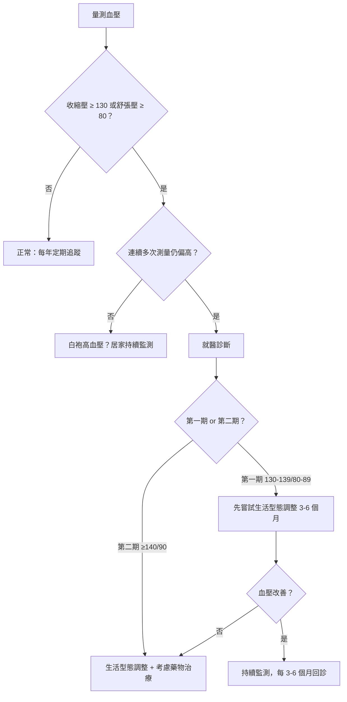
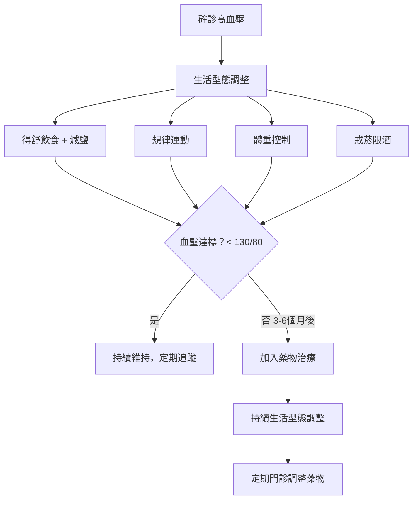

# 隱形殺手：高血壓與「得舒飲食」完整指南

## 簡單說重點 (Overview)

高血壓被稱為「隱形殺手」，因為它幾乎不會讓你感到不適，卻在背後悄悄損傷血管、心臟、腎臟和大腦。根據衛福部國民健康署統計，台灣18歲以上成人高血壓盛行率達26.8%，推估約有529萬人受影響——其中許多人完全不知道自己患病。好消息是：透過飲食調整（尤其是「得舒飲食」）、規律運動與適當用藥，高血壓是可以有效控制的。

<!-- IMAGE_PLACEHOLDER: 血壓計示意圖，顯示正常血壓與高血壓數值對比 -->

## 症狀 (Symptoms)

高血壓最危險的特質，就是「沒有症狀」。大多數人直到做健康檢查或因為其他原因量血壓，才意外發現自己血壓偏高。

少數情況下，血壓極高時可能出現：
- 後頸部頭痛（尤其是清晨起床時）
- 耳鳴或聽力變化
- 頭暈、視力模糊
- 鼻出血（反覆且難以止血）
- 心悸或呼吸費力感

> [!danger] 警告
> 若血壓超過 180/120 mmHg，並出現劇烈頭痛、胸痛、視力突然改變、言語困難或半身無力，這是高血壓危象（Hypertensive Emergency），請立即叫救護車就醫，不要自行開車。

## 醫師怎麼幫你檢查 (Diagnosis)

### 血壓分級

根據2022年台灣高血壓學會與中華民國心臟學會最新指引，血壓分級如下：

| 分級 | 收縮壓 (上壓) | 舒張壓 (下壓) |
|------|-------------|-------------|
| 理想血壓 | < 120 mmHg | < 80 mmHg |
| 正常偏高 | 120-129 mmHg | < 80 mmHg |
| 第一期高血壓 | 130-139 mmHg | 80-89 mmHg |
| 第二期高血壓 | ≥ 140 mmHg | ≥ 90 mmHg |
| 高血壓危象 | > 180 mmHg | > 120 mmHg |

### 正確量測血壓：722原則

量一次血壓不算數。國健署推廣「**722原則**」：
- **7**：連續量 7 天
- **2**：每天早晚各量 1 次（起床後、睡前）
- **2**：每次量 2 遍，取平均值

量測前需靜坐休息 5 分鐘，不喝咖啡、不抽菸、不說話。

### 確診後的常規檢查

確診高血壓後，醫師會安排相關檢查，評估是否已造成器官損傷：
- 抽血（腎功能、血糖、血脂、電解質）
- 尿液分析（蛋白尿是早期腎損傷指標）
- 心電圖（評估心臟）
- 眼底檢查（評估視網膜血管）

## 治療方式 (Treatment)

### 1. 居家照護

生活型態調整是所有高血壓治療的基礎，對第一期高血壓尤其重要：

**減鹽**
- 每日鈉攝取建議低於 2,300 mg（約 1 茶匙食鹽）
- 理想目標：< 1,500 mg/天（對高血壓患者）
- 避免醬油、沙茶醬、加工食品、泡麵、醃製品

**規律運動**
- 每週至少 150 分鐘中等強度有氧運動（快走、游泳、騎腳踏車）
- 規律運動可降低收縮壓 5-8 mmHg

**體重管理**
- 每減輕 1 公斤體重，收縮壓平均可下降約 1 mmHg
- BMI 目標維持在 18.5-24 之間

**戒菸限酒**
- 菸草中的尼古丁會暫時升高血壓，長期吸菸損傷血管內皮
- 酒精攝取：男性每日不超過 2 份、女性不超過 1 份（1 份 ≈ 330ml 啤酒）

**壓力管理**
- 長期壓力會透過交感神經活化使血壓升高
- 可考慮靜坐冥想、腹式呼吸等放鬆技巧

> [!recommend] 建議
> 居家自備血壓計是管理高血壓最有效的工具之一。建議購買經過驗證的上臂式電子血壓計，每天定時記錄，有助醫師準確評估治療效果。

### 2. 藥物治療

當生活型態調整 3-6 個月後效果不足，或第二期高血壓、合併心血管疾病時，需要搭配藥物治療。常見的降壓藥物有多種類型，各有不同適應症：

- ACE 抑制劑 / ARB：對糖尿病腎病變有保護作用
- 鈣離子拮抗劑：適合老年人、黑人族群
- 利尿劑：降低血管中的液體容量
- 乙型阻斷劑：適合合併心臟病或心跳過快者

> [!caution] 注意
> 降壓藥物通常需要**長期甚至終身服用**。不可因血壓「看起來正常」就自行停藥——血壓穩定往往正是藥物發揮效果的結果。停藥前務必諮詢醫師。

### 3. 得舒飲食 (DASH Diet)：有實證的飲食療法

「得舒飲食」（Dietary Approaches to Stop Hypertension，DASH）是目前最有科學實證支持的降壓飲食模式。研究顯示，嚴格執行得舒飲食可使收縮壓降低 5.5-11 mmHg，效果接近一顆降壓藥。

**得舒飲食核心原則**

| 多吃 | 少吃 |
|------|------|
| 蔬菜（每天 4-5 份） | 鈉鹽（< 2300 mg/天） |
| 水果（每天 4-5 份） | 飽和脂肪（肥肉、全脂乳品） |
| 全穀類（每天 7-8 份） | 加工食品、罐頭 |
| 低脂乳品（每天 2-3 份） | 含糖飲料、甜食 |
| 堅果種子（每週 4-5 份） | 紅肉、油炸食物 |
| 豆類、魚肉、禽肉 | 酒精 |

**為什麼有效？** 得舒飲食富含鉀、鎂、鈣和膳食纖維，這些礦物質能幫助血管舒張、促進鈉的排出，綜合效果遠超過單一補充礦物質錠劑。

> [!info] 小知識
> 「得舒」是「DASH」的音譯，帶有「舒緩」的意涵。這個飲食模式在 2025 年美國新聞與世界報導的「最佳飲食排行」中，再度獲得「最佳心臟健康飲食」與「最佳高血壓飲食」雙料冠軍，已連續多年奪冠。

<!-- IMAGE_PLACEHOLDER: 得舒飲食食物金字塔示意圖，標示各類食物每日建議份數 -->

## 什麼時候該看醫生 (When to See a Doctor)

以下情況請盡快就醫，不要等待：

- 血壓單次測量 ≥ 140/90 mmHg，且出現頭痛、胸悶症狀
- 居家連續多日血壓 ≥ 130/80 mmHg
- 已在服藥但血壓仍控制不良
- 出現下肢水腫、呼吸喘、視力模糊等新症狀
- 血壓 > 180/120 mmHg（即使無症狀也應立即就醫）

> [!danger] 緊急警訊
> 突發劇烈頭痛如「雷擊」般、單側臉部/手臂/腿部無力或麻木、說話困難、突然視力喪失——這些是腦中風症狀，請立即撥打 119。

## 常見問題 (FAQ)

### Q: 高血壓一定要吃藥嗎？
A: 不一定。第一期高血壓（130-139/80-89）若無其他心血管危險因子，可先嘗試 3-6 個月的生活型態調整（得舒飲食 + 運動 + 減鹽）。若效果不足，再評估是否需要藥物。第二期高血壓則通常建議同步開始藥物治療，因為等待期間血管持續受損。

### Q: 減鹽很難做到，有什麼技巧？
A: 最有效的方法是「減少外食」，因為外食的鈉含量通常是家常菜的 2-3 倍。在家烹調時，善用天然香料（蔥薑蒜、九層塔、檸檬汁）替代鹽分，並在食物出鍋後才加調味料（而非烹調中），能大幅減少用鹽量。

### Q: 得舒飲食每天要吃那麼多蔬果，費用會不會很高？
A: 當季在地蔬果是最便宜的選擇。豆類（毛豆、黑豆、紅豆）是得舒飲食中鉀的重要來源，也非常平價。重點在於逐步調整飲食結構，而非一次性大幅改變。

### Q: 血壓控制好了，可以停藥嗎？
A: 需要醫師評估才能決定。若透過積極的生活型態調整（減重、得舒飲食、規律運動）使血壓穩定達標超過一年，部分患者可在醫師監督下嘗試逐步減量。但自行停藥有反彈性血壓升高的風險，務必諮詢後執行。

### Q: 年輕人也會高血壓嗎？
A: 是的。國健署統計顯示，18-39歲年輕族群高血壓盛行率為 4.7%，且其中近 24 萬人不知道自己患病。長期壓力、高鹽飲食、缺乏運動、熬夜是年輕族群高血壓的主要危險因子。

## 最新治療趨勢 (Latest Updates)

**2024-2025 年重要更新：**

2024 年歐洲心臟學會（ESC）新版高血壓指引將生活型態調整提升為「A 級強力建議」，明確訂定每日鈉攝取目標低於 2g（換算約為 5g 鹽），並納入腸道微生物與血壓的最新研究作為飲食建議基礎。

2025 年美國 NHLBI 支持的 DASH 飲食連續多年獲評「最佳心臟健康飲食」冠軍，最新統合分析（2024年）確認 DASH 飲食在高血壓患者中平均可降低收縮壓 5.5 mmHg、舒張壓 3 mmHg，在同時限制鈉攝取時效果更顯著（降低約 11 mmHg）。

台灣2022年新版高血壓指引將診斷標準從 140/90 下修至 **130/80 mmHg**，這意味著需要更早介入、更積極管理，才能有效預防心血管併發症（資料來源：台灣高血壓學會，2022年）。

## 醫療免責聲明 (Disclaimer)

本文章內容僅供衛教參考，不構成專業醫療建議、診斷或治療。每個人的健康狀況不同，實際治療方式需由醫師根據個別情況評估。若你有任何健康疑慮或症狀，請務必諮詢合格醫療專業人員。本診所提供的資訊力求準確，但醫學知識持續更新，我們無法保證內容永久有效。文章中提及的治療方式或設備，其適用性與效果因人而異，需經醫師評估後方可進行。

## 參考資料 (References)

- [DASH Eating Plan](https://www.nhlbi.nih.gov/health/dash-eating-plan) — NHLBI, NIH, 存取日期 2026-04-13
- [NIH-supported DASH diet named "Best Heart-Healthy Diet" in 2025](https://www.nhlbi.nih.gov/news/2025/nih-supported-dash-diet-named-best-heart-healthy-diet-and-best-diet-high-blood-pressure) — NHLBI, NIH, 存取日期 2026-04-13
- [DASH diet: Healthy eating to lower your blood pressure](https://www.mayoclinic.org/healthy-lifestyle/nutrition-and-healthy-eating/in-depth/dash-diet/art-20048456) — Mayo Clinic, 存取日期 2026-04-13
- [Understanding Blood Pressure Readings](https://www.heart.org/en/health-topics/high-blood-pressure/understanding-blood-pressure-readings) — American Heart Association, 存取日期 2026-04-13
- [High Blood Pressure Facts](https://www.cdc.gov/high-blood-pressure/data-research/facts-stats/index.html) — CDC, 存取日期 2026-04-13
- [衛生福利部國民健康署－高血壓](https://www.hpa.gov.tw/Pages/List.aspx?nodeid=1463) — 國民健康署, 存取日期 2026-04-13
- [血壓要管理 722在家量 18歲以上國人約有529萬人罹患高血壓](https://www.hpa.gov.tw/Pages/Detail.aspx?nodeid=4705&pid=16550) — 國民健康署, 存取日期 2026-04-13
- [2022年新版高血壓治療概述](https://www.taic.mohw.gov.tw/?aid=509&pid=88&page_name=detail&type=1143&iid=4029) — 衛生福利部台中醫院, 存取日期 2026-04-13
- Carey RM et al. "Dietary Approaches to Stop Hypertension (DASH) Diet and Blood Pressure Reduction." *J Am Heart Assoc.* 2020; 9(12). PMID: 32330233
- Filippou CD et al. "Lifestyle interventions for hypertension management in primary care: a narrative review." *J Hypertens.* 2025. PMID: 41223885
