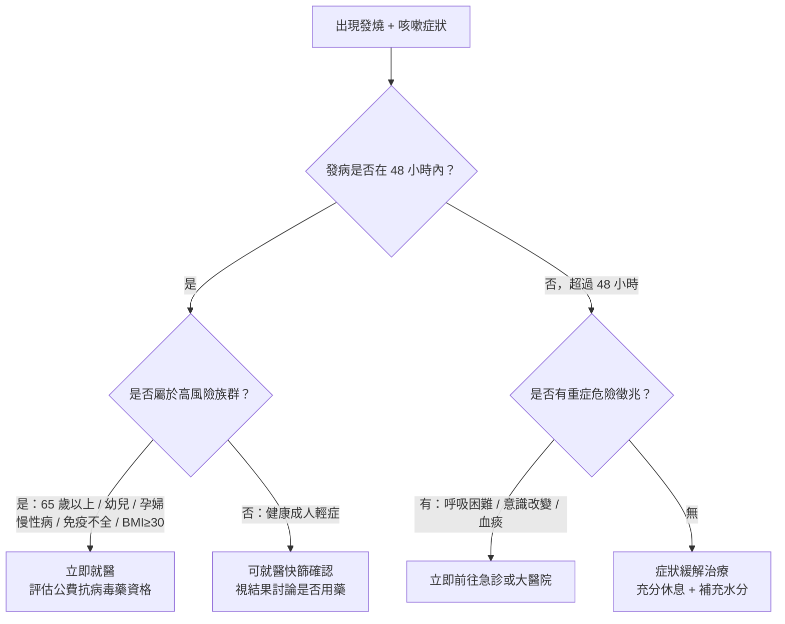
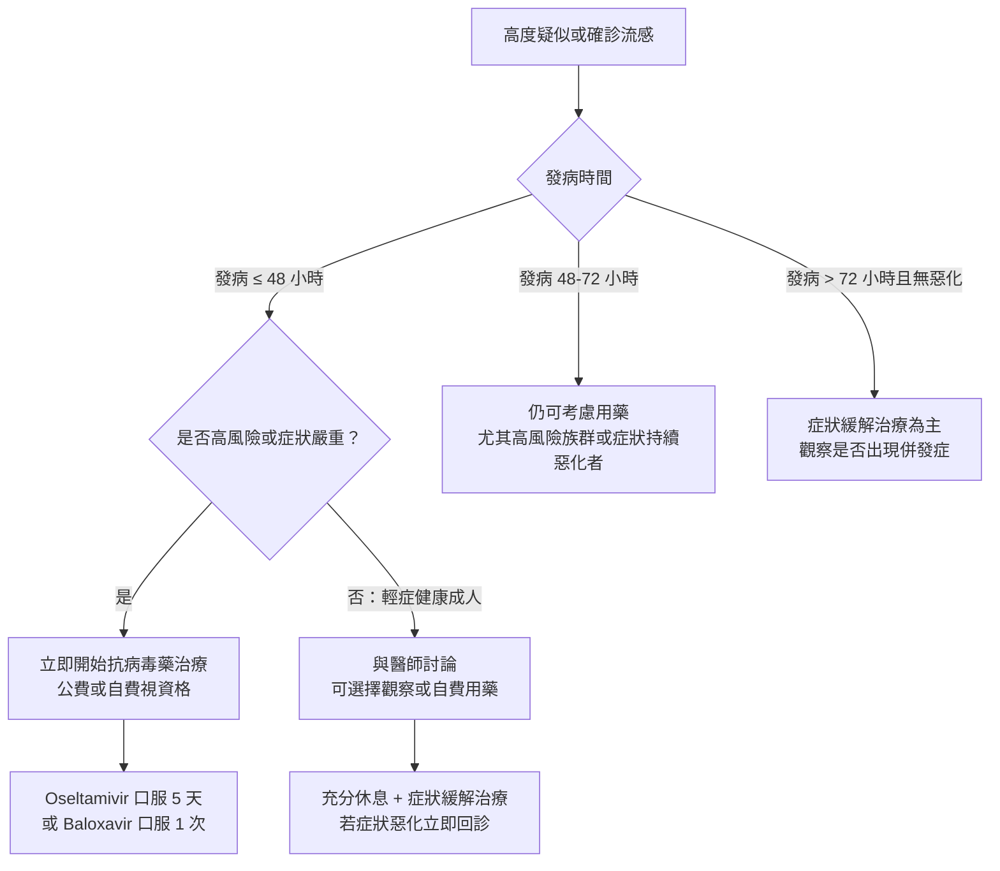

# 流感還是感冒？掌握抗病毒藥的黃金 48 小時

## 簡單說重點 (Overview)

流感（流行性感冒）和一般感冒都是病毒感染，但就像颱風和陣雨的差別——流感來勢洶洶，發病快、症狀猛，而感冒通常只讓你「有點不舒服」。最關鍵的差異在於：流感有「抗病毒藥」可以縮短病程，但必須在發病後 **48 小時內**開始使用，過了這個黃金窗口，效果大打折扣。

提早辨別、提早用藥，是對付流感最重要的策略。

<!-- IMAGE_PLACEHOLDER: 流感與感冒症狀比較對照圖，左右分欄，左側流感：高燒、全身痠痛、突然發病；右側感冒：流鼻水、喉嚨痛、漸進發病 -->

## 症狀 (Symptoms)

### 流感 vs 感冒快速比較

| 症狀 | 流感 | 一般感冒 |
|------|------|---------|
| 發病速度 | 突然，數小時內急遽惡化 | 漸進式，1-2 天慢慢加重 |
| 發燒程度 | 常見，體溫可達 39-40°C | 少見，即使發燒通常較輕微 |
| 全身肌肉痠痛 | 嚴重，像被車撞一樣 | 輕微或無 |
| 疲倦程度 | 極度疲憊，難以起身下床 | 輕微 |
| 頭痛 | 明顯 | 輕微或無 |
| 鼻塞 / 流鼻水 | 較少 | 最主要症狀之一 |
| 喉嚨痛 | 可能出現 | 常見 |
| 咳嗽 | 乾咳，可能較嚴重 | 通常輕微 |
| 腸胃症狀（噁心/嘔吐） | 部分患者有，兒童更常見 | 少見 |
| 病程 | 1-2 週 | 7-10 天 |

**記住口訣：「一燒、二痛、三疲倦」**——高燒＋頭痛及肌肉痠痛＋突然虛脫無力，三個症狀同時出現，高度懷疑流感。

> [!info] 小知識
> 研究顯示，「發燒＋咳嗽」同時出現，診斷為流感的正確率約達 80%。在流感流行期，這個組合是臨床醫師快速判斷的重要依據，有時不需要快篩就可以高度懷疑。

## 醫師怎麼幫你檢查 (Diagnosis)

### 常用診斷工具

**快速流感抗原檢測（Rapid Influenza Diagnostic Test, RIDT）**：用棉棒採取鼻腔或咽喉分泌物，約 15-30 分鐘出結果。優點是快速方便；缺點是敏感度約 50-70%，意思是「真的是流感但驗不出來」的機率不低。特異性高（95-99%），一旦驗出陽性，幾乎可確定是流感。目前也有同時檢測流感和 COVID-19 的複合快篩。

**分子檢測 / PCR**：準確度高（敏感度 90% 以上），但需送至檢驗所，約數小時至隔日取得報告，適用於需確認診斷的重症或特殊情況。

**臨床判斷**：在流感流行期間，醫師會結合症狀、接觸史、當地疫情資訊綜合判斷，不一定每位患者都需要快篩。

<!-- IMAGE_PLACEHOLDER: 鼻咽拭子採檢示意圖，顯示正確採檢位置 -->

## 治療方式 (Treatment)

### 1. 居家照護

不論流感或感冒，居家照護都是基礎：

- **充分休息**：讓免疫系統全力運作，強撐上班只會拉長病程並傳染他人
- **補充水分**：發燒會增加水分流失，每天至少喝 2000 ml 溫熱開水
- **退燒緩症**：體溫超過 38.5°C 或明顯不適，可使用退燒止痛藥緩解不適
- **自我隔離**：流感傳染力強，症狀期間避免上班上課，外出需全程戴口罩
- **注意空氣**：保持室內通風，避免前往密閉人群聚集場所

> [!recommend] 建議
> 流感期間多補充溫熱流質（雞湯、米粥、熱茶），不只補充水分，溫熱液體也能緩解喉嚨不適和黏液阻塞。避免菸酒，以免加重呼吸道發炎，延長病程。

### 2. 藥物治療

**症狀緩解藥物**（流感和感冒皆適用）：
- 退燒止痛：乙醯胺酚（Acetaminophen，俗稱普拿疼成分）
- 緩解鼻塞/流鼻水：抗組織胺、去充血劑
- 止咳化痰：依症狀由醫師選用適合藥物

> [!caution] 注意
> 18 歲以下兒童及青少年罹患流感時，**禁止使用阿斯匹靈（Aspirin）** 退燒，否則可能引發罕見但致命的「瑞氏症候群（Reye's Syndrome）」，會導致嚴重肝臟損害和腦病變。請務必使用乙醯胺酚（Acetaminophen）類退燒藥。

### 3. 抗病毒藥——黃金 48 小時

**重要：抗病毒藥只對流感病毒有效，對感冒病毒完全無效。**

目前台灣常見的流感抗病毒藥：

| 藥物 | 台灣藥名 | 給藥方式 | 療程 | 適用年齡 |
|------|--------|---------|------|---------|
| Oseltamivir | 克流感（Tamiflu）、易剋冒 | 口服膠囊/顆粒 | 每日 2 次，共 5 天 | 所有年齡 |
| Zanamivir | 瑞樂沙 | 吸入 | 每日 2 次，共 5 天 | 7 歲以上 |
| Baloxavir marboxil | 紓伏效（Xofluza） | 口服單次 | 僅服用 1 次 | 5 歲以上 |

**為什麼 48 小時那麼關鍵？** 抗病毒藥透過阻斷病毒複製（神經胺酸酶抑制劑）或抑制病毒 RNA 轉錄（Baloxavir）來發揮效果。發病初期病毒量急速飆升，此時投藥能大幅截斷繁殖；超過 48-72 小時後，病毒已大量複製完成，免疫系統也已全面啟動對抗，藥效顯著降低。研究顯示，48 小時內用藥可縮短病程約 1-2 天，並明顯減少重症併發症風險。

**台灣公費抗病毒藥資格**（2025 年 4 月 1 日起）：
- 65 歲以上長者
- 未滿 5 歲幼兒
- 孕婦（經醫師評估需及時用藥）
- 具重大傷病、免疫不全或流感高風險慢性疾病患者
- BMI ≥ 30 的肥胖患者
- 確診/疑似流感住院患者
- 流感或新型 A 型流感通報病例

> [!info] 小知識
> 不符合公費資格但症狀典型、發病未超過 48 小時的健康成人，也可與醫師討論自費使用抗病毒藥。全國約 4,000 家合約醫療機構配有公費藥劑，就近就醫即可評估。

## 什麼時候該看醫生 (When to See a Doctor)

出現以下任一症狀，請**當天**就醫，不要等待觀望：

- 呼吸困難或呼吸急促，感覺喘不過氣
- 嘴唇或指甲發紫（發紺），代表血氧不足
- 咳出血痰，或痰液突然變濃、變黃綠色
- 持續胸痛、胸悶、心跳異常
- 意識模糊、難以叫醒、出現抽搐
- 高燒持續超過 72 小時不退
- 退燒後又再次高燒（「反彈熱」可能是繼發細菌感染）
- 嚴重嘔吐、完全無法進食或喝水

**以下族群只要出現流感症狀，當天就診（不要等 48 小時看看再說）：**
- 65 歲以上長者
- 嬰幼兒（尤其未滿 2 歲）
- 孕婦及產後 2 週以內的產婦
- 有慢性心肺疾病、糖尿病、腎臟病、免疫抑制狀態者

> [!danger] 警告
> 若出現呼吸困難、意識改變或嘴唇發紫，這是流感重症的危險徵兆。請立即前往大醫院急診，不要在家等待或只掛一般門診。2024-2025 年流感季累計重症病例中，65 歲以上長者占 57%，顯示年長者風險特別高。

## 常見問題 (FAQ)

### Q: 打了流感疫苗還是中鏢，疫苗沒用嗎？

A: 疫苗保護力並非 100%，但接種後即使感染，症狀通常較輕、較少出現重症和住院。流感病毒株每年變異，疫苗需每年更新。2024-2025 年流感季重症死亡病例中，88% 未接種本季疫苗，顯示接種仍有相當保護效果。

### Q: 感冒還是流感，不去診所有辦法判斷嗎？

A: 若你症狀輕微、緩慢發病、以流鼻水為主而沒有高燒，通常是感冒，居家休息即可。若你突然發高燒（>38.5°C）、全身劇烈痠痛、極度疲倦、幾乎無法起床，請當天就醫——這是流感高度可能的症狀組合，也是使用抗病毒藥的黃金時機。

### Q: 克流感（Tamiflu）可以當作預防藥囤著用嗎？

A: 不建議自行囤藥。克流感主要用於確診治療，或特定情況下的「暴露後預防（如家中密切接觸者確診流感）」。應由醫師評估後才使用，不宜自行購買長期預防性服用，以免助長抗藥性，且藥物有效期限也需注意。

### Q: 抗生素對流感有效嗎？

A: 完全無效。流感是病毒感染，抗生素只對細菌有效，對病毒毫無作用。只有在流感引發「繼發性細菌感染」（如細菌性肺炎、中耳炎）時，才需要合併使用抗生素，由醫師判斷決定。

### Q: 流感痊癒後聲音還是啞的，正常嗎？

A: 流感或感冒後短暫聲音沙啞很常見，通常 1-2 週會自行恢復。若聲音沙啞持續超過 2-3 週、出現痰中帶血或持續喉嚨異物感，建議安排內視鏡檢查（用細小鏡頭直接觀察聲帶和喉嚨內部），排除聲帶受損或其他結構性問題，避免延誤處理。

## 最新治療趨勢 (Latest Updates)

**Baloxavir marboxil（紓伏效）** 是近年重要的新選擇。相較於傳統克流感需連服 5 天，紓伏效只需單次口服，大幅提升服藥便利性，適用 5 歲以上患者。2024 年 WHO 更新臨床指引，對高風險非重症患者，推薦以 Baloxavir 作為 48 小時內的治療選項之一（條件性建議）；對重症住院患者，則仍建議以 Oseltamivir 為主。

目前台灣流行的流感病毒株對現有抗病毒藥（神經胺酸酶抑制劑和 Baloxavir）整體仍具良好敏感性，抗藥性問題尚未構成重大臨床挑戰，但疾管署持續進行病毒株基因監測。專家也提醒，未來若出現新型 A 型流感（如禽流感 H5N1 等人畜共通病毒），治療策略可能有所調整，建議平時做好接種習慣、出現症狀即早就醫。（資料更新：WHO 指引 2024，CDC 臨床建議 2025-2026）

## 醫療免責聲明 (Disclaimer)

本文章內容僅供衛教參考，不構成專業醫療建議、診斷或治療。每個人的健康狀況不同，實際治療方式需由醫師根據個別情況評估。若你有任何健康疑慮或症狀，請務必諮詢合格醫療專業人員。本診所提供的資訊力求準確，但醫學知識持續更新，我們無法保證內容永久有效。文章中提及的治療方式或設備，其適用性與效果因人而異，需經醫師評估後方可進行。

## 參考資料 (References)

- [Cold Versus Flu](https://www.cdc.gov/flu/about/coldflu.html) — CDC (U.S. Centers for Disease Control and Prevention), 存取日期 2026-04-25
- [Treating Flu with Antiviral Drugs](https://www.cdc.gov/flu/treatment/antiviral-drugs.html) — CDC, 存取日期 2026-04-25
- [Influenza Antiviral Medications: Summary for Clinicians](https://www.cdc.gov/flu/hcp/antivirals/summary-clinicians.html) — CDC, 存取日期 2026-04-25
- [Executive summary - Clinical practice guidelines for influenza](https://www.ncbi.nlm.nih.gov/books/NBK607909/) — WHO / NCBI Bookshelf, 2024
- [Understanding the symptoms of the common cold and influenza](https://pmc.ncbi.nlm.nih.gov/articles/PMC7185637/) — PMC / NCBI, 2020. PMID: 32302596
- [COVID-19, cold, allergies and the flu: What are the differences?](https://www.mayoclinic.org/diseases-conditions/coronavirus/in-depth/covid-19-cold-flu-and-allergies-differences/art-20503981) — Mayo Clinic, 存取日期 2026-04-25
- [Flu (Influenza)](https://my.clevelandclinic.org/health/diseases/4335-influenza-flu) — Cleveland Clinic, 存取日期 2026-04-25
- [流感抗病毒藥劑](https://www.cdc.gov.tw/Category/QAPage/YgeC_ca-wDJqW2fnH6CLdg) — 衛生福利部疾病管制署, 存取日期 2026-04-25
- [得了流感怎麼辦？掌握黃金治療時機](https://org.vghtpe.gov.tw/vhct/dept/-1/598) — 臺北榮民總醫院, 存取日期 2026-04-25
