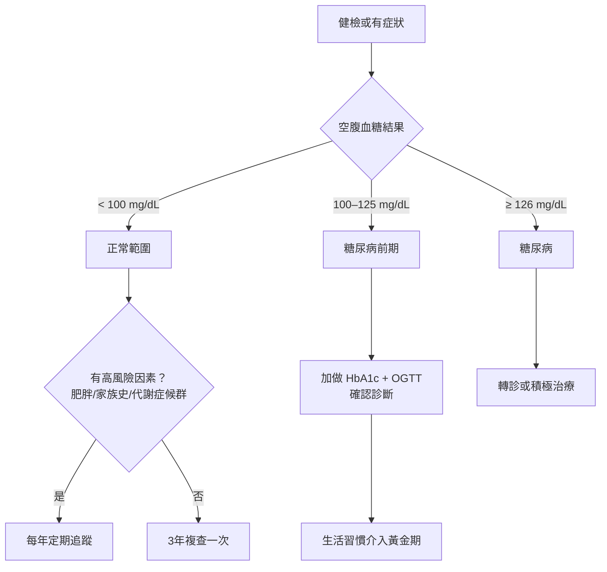
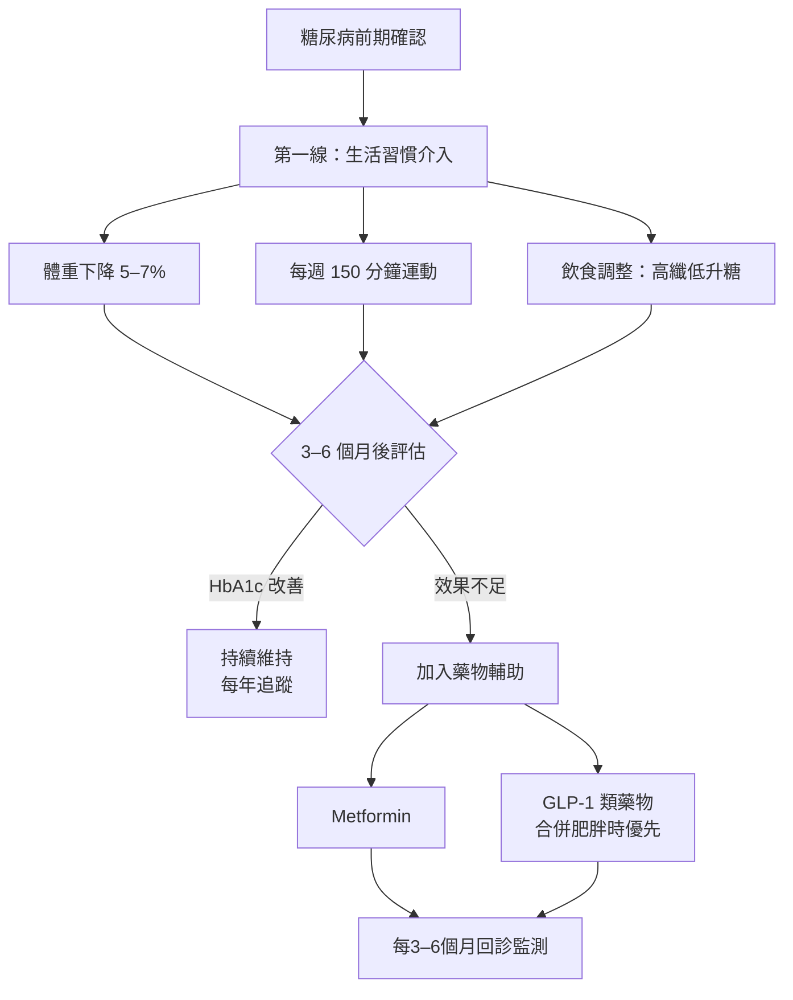

# 胰島素阻抗是什麼？預防第2型糖尿病的黃金期

## 簡單說重點 (Overview)

胰島素（insulin）是胰臟分泌的荷爾蒙，負責把血液中的糖分「送進」細胞作為能量。**胰島素阻抗**（insulin resistance）就像是細胞的門鎖生鏽了——胰島素雖然在門外敲門，細胞就是不開門，血糖因此居高不下。

為了補償這個問題，胰臟只好分泌更多胰島素，長期下來就像引擎過熱，分泌功能逐漸衰竭，最終走向糖尿病前期，甚至第2型糖尿病。好消息是：在這個過程演變成糖尿病**之前**，有一段可以逆轉的「黃金期」，而你需要知道怎麼把握它。

> [!info] 台灣現況
> 根據國民健康署 2017–2020 年調查，18歲以上國人糖尿病前期盛行率約 **25%**，估計全台近 **500 萬人**是糖尿病預備軍。其中有25%的人在3到5年內會進展為糖尿病，10年內比例高達 **70%**。

<!-- IMAGE_PLACEHOLDER: 胰島素將血糖送入細胞的示意圖，對比正常細胞vs胰島素阻抗細胞 -->

## 症狀 (Symptoms)

胰島素阻抗最令人擔心的地方，就是**大多數人完全沒有感覺**。但以下這些線索，可能是身體在發出信號：

- **頸部或腋下有黑色素沉澱**：皮膚出現黑色、天鵝絨般的深色斑塊（黑色棘皮症，acanthosis nigricans），這是胰島素阻抗最具代表性的皮膚信號
- **體重容易增加、難以減輕**：尤其是腹部脂肪堆積（男性腰圍 ≥ 90 cm、女性 ≥ 80 cm）
- **餐後容易疲倦、嗜睡**：細胞無法有效利用血糖作為能量
- **飢餓感強烈、嗜吃甜食或精緻澱粉**：血糖波動劇烈造成假性飢餓
- **皮膚小肉芽（skin tags）**：頸部或腋下出現小突起的軟性皮贅
- **女性月經不規律或多囊卵巢症候群（PCOS）**：胰島素過高會刺激雄性激素分泌，影響排卵
- **健檢三酸甘油酯偏高、HDL（好膽固醇）偏低**：常見的代謝異常組合

> [!caution] 常見誤解
> 「血糖只是稍微偏高，應該沒關係。」——糖尿病前期（空腹血糖 100–125 mg/dL）幾乎沒有症狀，但這正是干預的最佳時機。等到出現口渴、多尿等明顯症狀時，往往已是糖尿病而非前期。

## 醫師怎麼幫你檢查 (Diagnosis)

確認胰島素阻抗與糖尿病前期，主要靠抽血檢查，不需要任何侵入性處置：

- **空腹血糖（FPG, fasting plasma glucose）**：前一晚空腹8小時後採血，正常值 < 100 mg/dL；100–125 mg/dL 為糖尿病前期；≥ 126 mg/dL 診斷糖尿病
- **糖化血色素（HbA1c）**：反映過去2–3個月的平均血糖，< 5.7% 為正常；5.7–6.4% 為糖尿病前期；≥ 6.5% 診斷糖尿病
- **口服葡萄糖耐量試驗（OGTT, oral glucose tolerance test）**：喝下75公克葡萄糖水後2小時，再次測量血糖；140–199 mg/dL 為糖尿病前期；≥ 200 mg/dL 診斷糖尿病
- **HOMA-IR**：計算空腹血糖與空腹胰島素的乘積，用來直接量化胰島素阻抗的程度，屬於進階的功能醫學評估
- **血脂檢查**：三酸甘油酯、HDL膽固醇是代謝症候群評估的一部分

> [!info] 誰需要定期篩檢？
> 45歲以上成年人建議每3年做一次空腹血糖。若有肥胖、高血壓、血脂異常、家族糖尿病史，或曾有妊娠糖尿病，無論幾歲都建議每年追蹤。

## 治療方式 (Treatment)

糖尿病前期不等於宣判，這是身體給你的**最後警告，也是最大機會**。

### 1. 居家照護

美國糖尿病預防計畫（Diabetes Prevention Program, DPP）是迄今最具說服力的研究：透過生活習慣改變，糖尿病發生風險降低高達 **58%**，而且效果在22年後仍然持續。核心目標只有兩個：

- **體重下降 5–7%**：以 70 公斤為例，只需減少 3.5–5 公斤
- **每週至少 150 分鐘中等強度有氧運動**：例如快走、游泳、騎單車

飲食調整重點：
- 增加蔬菜、豆類、全穀類等**高纖食物**，減緩血糖上升速度
- 減少**精緻澱粉**（白飯、白麵包、含糖飲料）
- 控制**飽和脂肪**攝取（油炸、加工肉品）
- 地中海飲食（Mediterranean diet）或低升糖指數飲食均有實證支持

> [!recommend] 簡單起步
> 不需要立刻完美執行——把每天的外食白飯換成半碗加半碗蔬菜，加上每天飯後散步20分鐘，已是有意義的開始。研究顯示，即使只有部分達到目標，也能顯著降低風險。

### 2. 藥物治療

當生活習慣介入效果不足，或風險評估較高時，醫師可能考慮藥物輔助：

- **Metformin**（雙胍類）：ADA 指引建議對高風險糖尿病前期患者，尤其是 BMI ≥ 35、45歲以下、或曾有妊娠糖尿病者，可考慮使用
- **GLP-1 受體促效劑**（如 semaglutide）或 **GIP/GLP-1 雙重促效劑**（如 tirzepatide）：對合併肥胖的患者，除了控血糖外也有顯著的體重管理效果
- 所有藥物需由醫師評估後開立，**不建議自行購買或使用**

> [!caution] 藥物不是萬能
> 藥物輔助效果（約降低31%風險）明顯低於生活習慣介入（58%）。藥物是工具，不是替代生活習慣改變的捷徑。

### 3. 進階評估與個人化管理

若你希望更精準地了解自己的代謝狀況，我們診所提供：

- **Inbody 身體組成分析**：精確測量體脂肪率、內臟脂肪、肌肉量，比單看體重更能追蹤改善成效
- **功能醫學檢驗**：包含 HOMA-IR（胰島素阻抗指數）、詳細血脂分析等，協助找出代謝問題的根源
- **口服/針劑減重藥物**：適合合併肥胖的個案，由醫師評估後搭配飲食衛教共同管理
- **跨科別協作**：醫師、藥師、護理師與營養師團隊，針對代謝症候群提供整合性照護計畫

## 什麼時候該看醫生 (When to See a Doctor)

以下情況請盡快就醫評估，不要等下次健檢：

- 健檢報告出現**空腹血糖 ≥ 100 mg/dL** 或 **HbA1c ≥ 5.7%**
- 頸部或腋下突然出現**黑色、天鵝絨狀色素沉澱**
- **腰圍持續增加**，男性 ≥ 90 cm 或女性 ≥ 80 cm
- 有**糖尿病家族史**（一等親），且尚未做過篩檢
- 曾有**妊娠糖尿病**病史的女性
- 出現不明原因的**口渴、頻尿、視力模糊、傷口不易癒合**（這些可能已是糖尿病，需盡快就醫）

> [!danger] 這些症狀請立即就醫
> 若出現極度口渴、大量排尿、體重急速下降，加上噁心嘔吐或腹痛，可能是糖尿病酮酸中毒（DKA）等緊急狀況，請直接前往急診室。

## 常見問題 (FAQ)

### Q: 胰島素阻抗可以「痊癒」嗎？

A: 在尚未發展成糖尿病之前，胰島素阻抗是**可以逆轉的**。透過減重 5–7%、規律運動與飲食調整，許多人的空腹血糖和 HbA1c 可以回到正常範圍。但如果已進展至第2型糖尿病，目標是「良好控制」而非「根治」。

### Q: 我很瘦，不會有胰島素阻抗吧？

A: 不一定。部分人即使 BMI 正常，但體脂率偏高（又稱「泡芙人」）、有家族病史，或長期久坐、睡眠不足，都可能發生胰島素阻抗。健檢血糖數值才是最客觀的判斷依據。

### Q: 吃低GI（升糖指數）食物就夠了嗎？

A: 低GI飲食有助於穩定血糖，但單靠飲食而不運動效果有限。研究顯示，**飲食加上運動的組合**才能達到最佳的胰島素敏感性改善。

### Q: 健康食品（如肉桂、苦瓜萃取物）能改善胰島素阻抗嗎？

A: 目前這類保健品的臨床實證仍相當薄弱，無法替代飲食控制與運動。若已是糖尿病前期，建議先與醫師討論，而非自行嘗試未經驗證的產品。

### Q: 家人有糖尿病，我一定會得嗎？

A: 第2型糖尿病有遺傳傾向，但**後天的生活習慣影響更大**。有家族史代表你的起跑點不同，但更積極的預防行動可以彌補。許多有家族史的人透過生活習慣改變，成功延緩或避免了糖尿病的發生。

## 最新治療趨勢 (Latest Updates)

**GLP-1 受體促效劑的角色升級（2024–2025）**：ADA 2025 年最新指引大幅強化了 GLP-1 類藥物（semaglutide）與 GIP/GLP-1 雙重促效劑（tirzepatide）在糖尿病預防及代謝症候群管理中的角色。對於合併肥胖的糖尿病前期患者，這類藥物不只改善血糖，還能帶來顯著的持續性減重，是生活習慣介入效果不佳時的重要選項（資料來源：ADA Standards of Care 2025）。

**DPP 長達22年追蹤研究（2024）**：美國糖尿病預防計畫的最新22年追蹤數據確認，當年參與生活習慣介入組的受試者，糖尿病發生風險至今仍比對照組低 25%，再次證明早期介入的長遠價值。即使短暫的生活習慣改變，對胰臟功能的保護效果也具有持久性（資料來源：American Diabetes Association, 2024）。

## 醫療免責聲明 (Disclaimer)

本文章內容僅供衛教參考，不構成專業醫療建議、診斷或治療。每個人的健康狀況不同，實際治療方式需由醫師根據個別情況評估。若你有任何健康疑慮或症狀，請務必諮詢合格醫療專業人員。本診所提供的資訊力求準確，但醫學知識持續更新，我們無法保證內容永久有效。文章中提及的治療方式或設備，其適用性與效果因人而異，需經醫師評估後方可進行。

## 參考資料 (References)

- [Insulin Resistance & Prediabetes](https://www.niddk.nih.gov/health-information/diabetes/overview/what-is-diabetes/prediabetes-insulin-resistance) — National Institute of Diabetes and Digestive and Kidney Diseases (NIDDK), 存取日期 2026-04-15
- [Insulin Resistance: What It Is, Causes, Symptoms & Treatment](https://my.clevelandclinic.org/health/diseases/22206-insulin-resistance) — Cleveland Clinic, 存取日期 2026-04-15
- [Prediabetes - Symptoms and causes](https://www.mayoclinic.org/diseases-conditions/prediabetes/symptoms-causes/syc-20355278) — Mayo Clinic, 存取日期 2026-04-15
- [3. Prevention or Delay of Diabetes and Associated Comorbidities: Standards of Care in Diabetes-2025](https://pubmed.ncbi.nlm.nih.gov/39651971/) — American Diabetes Association, PubMed, 2025
- [Reduction in the Incidence of Type 2 Diabetes with Lifestyle Intervention or Metformin](https://www.nejm.org/doi/full/10.1056/NEJMoa012512) — Knowler WC et al. New England Journal of Medicine 2002; 346(6): 393-403. PMID: 11832527
- [New Data from Diabetes Prevention Program Outcomes Study Shows Persistent Reduction of Type 2 Diabetes Development Over 22-Year Average Follow-Up](https://diabetes.org/newsroom/new-data-from-diabetes-prevention-program-outcomes-study-shows-persistent-reduction-of-t2d-development-over-22-year-average-follow-up) — American Diabetes Association, 存取日期 2026-04-15
- [成人每4人就有1人有罹患糖尿病風險](https://www.hpa.gov.tw/Pages/Detail.aspx?nodeid=4306&pid=14702) — 衛生福利部國民健康署, 存取日期 2026-04-15
- [糖尿病防治手冊](https://www.hpa.gov.tw/Pages/Detail.aspx?nodeid=359&pid=1235) — 衛生福利部國民健康署, 存取日期 2026-04-15
