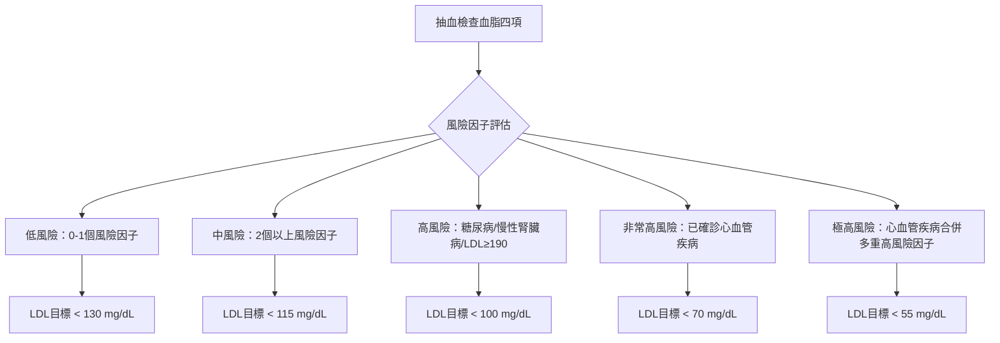
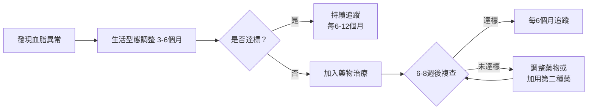

# 血脂正常的隱憂：膽固醇、三酸甘油酯指標怎麼看？

## 簡單說重點 (Overview)

血脂就像血液裡的「油脂」，包含膽固醇和三酸甘油酯兩大家族。健檢報告上那幾個數字，代表的不只是「高不高」，更重要的是「組合對不對」。很多人總膽固醇在標準內，卻有高三酸甘油酯 + 低好膽固醇的危險組合，這種情況在醫學上叫做「致動脈粥狀硬化型血脂異常」（atherogenic dyslipidemia），和代謝症候群、胰島素阻抗關係密切。換句話說，血脂「看起來正常」不代表心血管風險低，讀懂每一格數字，才能真正保護你的血管。

> [!info] 小知識
> 膽固醇本身不是壞東西！它是細胞膜的重要成分，也是荷爾蒙（如性荷爾蒙、腎上腺素）的原料。問題出在「過多且結構錯誤的膽固醇顆粒」沉積在血管壁，才會引發動脈硬化。

<!-- IMAGE_PLACEHOLDER: 血脂顆粒示意圖：LDL、HDL、VLDL顆粒大小與血管沉積的比較 -->

## 血脂報告各項目說明 (What Each Number Means)

健檢的「血脂四項」通常包含：

| 項目 | 別稱 | 理想值（一般成人） | 說明 |
|------|------|-----------------|------|
| **總膽固醇 TC** | Total Cholesterol | < 200 mg/dL | 所有膽固醇的總和，是篩查的入口，但單看不夠 |
| **低密度脂蛋白 LDL-C** | 壞膽固醇 | < 100 mg/dL | 最重要的致動脈硬化指標；高風險族群目標更嚴格 |
| **高密度脂蛋白 HDL-C** | 好膽固醇 | 男≥40、女≥50 mg/dL | 越高越好；它負責把壞膽固醇「送回肝臟回收」 |
| **三酸甘油酯 TG** | Triglycerides | < 150 mg/dL | 飲食攝取的脂肪，偏高常見於澱粉/酒精攝取過多 |

> [!caution] 注意
> 以上是「一般成人」的參考值。如果你有糖尿病、慢性腎臟病、或已有心臟病、中風病史，LDL目標需更嚴格（<70 甚至 <55 mg/dL）。不要用同一把尺衡量所有人。

### 進階指標（一般健檢不一定有，但更精準）

- **非HDL膽固醇（Non-HDL-C）**：= 總膽固醇 − HDL-C，目標 < 130 mg/dL，能捕捉到LDL以外的「壞脂蛋白」
- **載脂蛋白B（ApoB）**：每一顆壞膽固醇顆粒上都有一個ApoB，是目前公認最能預測心血管風險的指標
- **脂蛋白(a) Lp(a)**：遺傳決定，高值者即使膽固醇正常也有較高風險，建議一生至少檢查一次

## 症狀 (Symptoms)

**血脂異常幾乎沒有明顯症狀**，這正是它危險的地方。少數極嚴重的高三酸甘油酯（>1000 mg/dL）可能出現：

- 黃色瘤（xanthomas）：皮膚或肌腱上出現黃色脂肪結節
- 眼瞼黃斑瘤（xanthelasma）：眼皮內側出現黃色斑塊
- 角膜弓（arcus corneae）：眼球黑眼珠外圍的灰白色環圈（多見於老年人）
- 急性胰臟炎：TG 極高時可能引發，表現為劇烈腹痛、噁心嘔吐

**大多數人沒有任何感覺，直到心肌梗塞或中風才發現。** 這就是為什麼定期血脂篩查這麼重要。

> [!danger] 警告
> 出現劇烈胸痛、呼吸困難、單側手腳無力、突然說話不清楚——這些可能是心肌梗塞或中風的緊急症狀，請立即撥打 119，不要等待。

## 醫師怎麼幫你檢查 (Diagnosis)

### 基本血脂篩查

醫師會安排空腹（禁食 9-12 小時）抽血，測量「血脂四項」。

- **衛福部成人健檢**：40-65 歲每 3 年一次、65 歲以上每年一次，免費包含血脂檢查
- **高風險族群**：應每年追蹤，若有多重風險因子，醫師可能建議縮短間隔

### 風險分層評估（重要！）

醫師不只看數字，還會整合你的「心血管風險因子」評分：

- 年齡（男≥45 歲、女≥55 歲）
- 抽菸
- 高血壓
- 糖尿病
- 肥胖（BMI ≥ 27、腰圍男>90公分、女>80公分）
- 家族性早發心血管疾病史

根據 2025 年台灣血脂管理共識，風險越高，LDL 控制目標越嚴格：



> 若對自己的風險等級不確定，可至診所進行血脂評估，醫師會根據你的整體健康狀況幫你定目標，而非只看單一數字。

## 血脂正常的「隱形陷阱」：致動脈硬化型血脂異常

這是本文最重要的段落。以下這個組合，**在總膽固醇正常的情況下仍可能讓心血管風險大幅升高**：

```
三酸甘油酯 TG ↑ + 好膽固醇 HDL ↓ + 小而密的LDL粒子 ↑
```

### 為什麼「小而密LDL」比「大顆LDL」更危險？

LDL 顆粒分大小，健檢通常只報告「LDL-C 濃度」，但不告訴你顆粒大小。**小而密的 LDL**：

- 更容易穿透動脈壁
- 更容易被氧化（氧化LDL是動脈硬化斑塊的主成分）
- 與LDL受體的結合力較差，在血液中停留更久

小而密 LDL 常見於：肥胖、代謝症候群、糖尿病前期、非酒精性脂肪肝的族群。

> [!info] 小知識
> 如果你的三酸甘油酯偏高（TG > 150）、HDL 偏低（男 < 40、女 < 50），這種組合強烈暗示你的 LDL 中小而密顆粒比例偏高，即使 LDL-C 數值在標準內，心血管風險仍可能被低估。

## 治療方式 (Treatment)

### 1. 居家照護與生活型態調整

這是任何血脂問題的第一步，低至中風險者建議先嘗試 3-6 個月的生活調整：

**降低 LDL 的飲食策略：**
- 減少飽和脂肪（肥肉、奶油、椰子油、棕櫚油）
- 避免反式脂肪（部分氫化植物油、酥油）
- 增加膳食纖維（燕麥、豆類、蔬菜）和植物固醇（深色蔬菜、堅果）
- 地中海飲食模式：多橄欖油、魚類、蔬菜水果、全穀物

**降低三酸甘油酯的重點：**
- 減少精製澱粉和糖（白飯、含糖飲料）——這比少吃油更有效！
- 戒酒（酒精是最強的三酸甘油酯推手）
- 增加 Omega-3 攝取（深海魚每週2次）

**提高 HDL 的方法：**
- 規律有氧運動（每週150分鐘中等強度）
- 戒菸（抽菸會直接降低 HDL）

> [!recommend] 建議
> 改善三酸甘油酯最有效的飲食介入，是**減少精製澱粉和含糖飲料**，而不只是少吃油。一瓶700 ml的手搖飲，可能讓三酸甘油酯在隔天健檢時高出 30-50 mg/dL 以上。

### 2. 藥物治療（不列具體藥名劑量）

生活型態調整未達標，或本身屬於高/非常高/極高風險族群，醫師會評估藥物治療：

- **Statin 類降脂藥**：第一線選擇，最大幅度降低 LDL，也有一定的心血管保護效果
- **Ezetimibe（腸道膽固醇吸收抑制劑）**：常與 statin 合併使用，進一步降低 LDL
- **Fibrate 類**：主要用於降低三酸甘油酯、提高 HDL
- **PCSK9 抑制劑**：注射型生物製劑，用於 statin 無法耐受或極高風險未達標者（健保有條件給付）
- **高濃度魚油製劑（EPA）**：大劑量 EPA 可降低三酸甘油酯、減少心血管事件（需醫師評估）

### 3. 進階治療與監測



對於高風險族群（如代謝症候群、脂肪肝），有時還需要評估：

- **超音波**：評估頸動脈內膜厚度（動脈硬化早期指標）、甲狀腺（甲狀腺功能低下會影響血脂）、肝臟（脂肪肝程度）
- **ApoB 或非HDL-C**：更精準評估致動脈粥狀硬化的顆粒負荷

## 什麼時候該看醫生 (When to See a Doctor)

以下情況建議盡快就醫評估血脂狀況：

- **健檢報告**任一項超出正常值（不要等下次健檢）
- **家族史**：父或母在55歲以前（男）或65歲以前（女）曾有心肌梗塞、中風
- **糖尿病、高血壓、慢性腎臟病**患者——這些疾病與血脂密切相關
- **腰圍過大**（男>90公分、女>80公分）——代謝症候群的警訊
- **三酸甘油酯 > 500 mg/dL**——急性胰臟炎的風險，需積極治療
- **40歲以上從未做過血脂檢查**

> [!danger] 警告
> 若皮膚突然出現**黃色瘤（黃色結節）**，或眼瞼出現**黃斑瘤**，這些是嚴重高血脂的體表警訊，應立即就醫，因為可能是遺傳性家族性高膽固醇血症（FH），需要更積極的治療。

## 常見問題 (FAQ)

### Q: 健檢膽固醇正常，三酸甘油酯偏高，需要擔心嗎？

A: 需要重視。三酸甘油酯偏高（150-499 mg/dL）在台灣成人中非常常見，尤其是有代謝症候群、非酒精性脂肪肝、或飲食含糖量高的人。單純TG偏高若無其他風險因子，可先調整飲食（減少精製澱粉、戒酒）觀察；若合併HDL偏低，則需要醫師評估是否進一步治療。

### Q: 「好膽固醇」越高越好嗎？有沒有上限？

A: HDL 在正常範圍偏高確實是好事，理想值為 60 mg/dL 以上。但研究顯示，HDL 過高（> 80-100 mg/dL 以上）並不一定帶來額外保護，甚至某些遺傳性超高 HDL 的人心血管風險也未必更低。重點是 HDL 的「功能」正常，而不只是數字高。

### Q: 吃素的人膽固醇也會高？

A: 可以。膽固醇有兩個來源：飲食攝取（約 20-30%）和**肝臟自行合成**（約 70-80%）。肝臟合成受遺傳影響很大，有些人即使飲食清淡仍然膽固醇偏高，這種情況往往需要藥物輔助。

### Q: 我媽媽在吃降血脂藥，我是不是也要吃？

A: 不一定，但家族史是重要風險因子。家族性高膽固醇血症（FH）有基因遺傳性，若直系親屬有早發心血管疾病，建議主動抽血篩查，讓醫師根據你自己的血脂數值和風險因子評估。

### Q: 降血脂藥需要吃一輩子嗎？

A: 對高風險或極高風險族群（如已確診心臟病）通常需要長期服用，因為停藥後膽固醇會回升。對低至中風險的人，若生活型態改善後達標，醫師可能評估減藥或停藥的可行性。請不要自行停藥，應和醫師討論。

## 最新治療趨勢 (Latest Updates)

**2026 年 ACC/AHA 血脂管理指引**（2026 年 3 月發布）更新了幾個重要觀念：

1. **不只看 LDL**：指引納入 ApoB、非 HDL-C、以及「三酸甘油酯豐富殘粒」作為評估指標，反映現代醫學對小而密 LDL 的重視
2. **Lp(a) 終身一次篩查**：脂蛋白(a)高值是獨立心血管風險因子，建議每人一生至少檢測一次
3. **冠狀動脈鈣化分數（CAC）**：對於「是否要開始藥物治療」有疑慮的中風險族群，CAC 評分可以幫助更精準的決策
4. **台灣 2025 共識**同步對齊歐美指引，依風險分層設定 LDL 目標，並強調 statin 的基礎地位與 PCSK9 抑制劑在高風險族群的角色

（資訊來源：2026 ACC/AHA Guideline on the Management of Dyslipidemia；2025 台灣血脂管理臨床路徑共識）

## 醫療免責聲明 (Disclaimer)

本文章內容僅供衛教參考，不構成專業醫療建議、診斷或治療。每個人的健康狀況不同，實際治療方式需由醫師根據個別情況評估。若你有任何健康疑慮或症狀，請務必諮詢合格醫療專業人員。本診所提供的資訊力求準確，但醫學知識持續更新，我們無法保證內容永久有效。文章中提及的治療方式或設備，其適用性與效果因人而異，需經醫師評估後方可進行。

## 參考資料 (References)

- [What Your Cholesterol Levels Mean](https://www.heart.org/en/health-topics/cholesterol/about-cholesterol/what-your-cholesterol-levels-mean) — American Heart Association, 存取日期 2026-04-16
- [2026 Guideline on the Management of Dyslipidemia](https://professional.heart.org/en/science-news/2026-guideline-on-the-management-of-dyslipidemia) — ACC/AHA Joint Committee, 2026
- [Cholesterol Numbers: What Do They Mean](https://my.clevelandclinic.org/health/articles/11920-cholesterol-numbers-what-do-they-mean) — Cleveland Clinic, 存取日期 2026-04-16
- [2026 ACC/AHA Guideline on the Management of Dyslipidemia](https://pubmed.ncbi.nlm.nih.gov/41824590/) — PubMed, 2026
- [Atherogenic dyslipidemia: cardiovascular risk and dietary intervention](https://pubmed.ncbi.nlm.nih.gov/20524075/) — Garg A & Grundy SM, Lipids 2010. PMID: 20524075
- [Lipoproteins and Cardiovascular Disease: Atherogenic Small, Dense LDL](https://pubmed.ncbi.nlm.nih.gov/34829807/) — PubMed 2021. PMID: 34829807
- [AACE Consensus Statement: Algorithm for Management of Adults with Dyslipidemia 2025 Update](https://pubmed.ncbi.nlm.nih.gov/40938233/) — PubMed 2025. PMID: 40938233
- [2025 台灣血脂管理臨床路徑共識](https://www.ahnzclinic.tw/news463) — 台灣內科醫學會, 內科學誌 2024;35:426-430
- [衛生福利部：避免國人健康的慢性隱形殺手](https://www.mohw.gov.tw/cp-6565-74371-1.html) — 衛福部, 存取日期 2026-04-16
