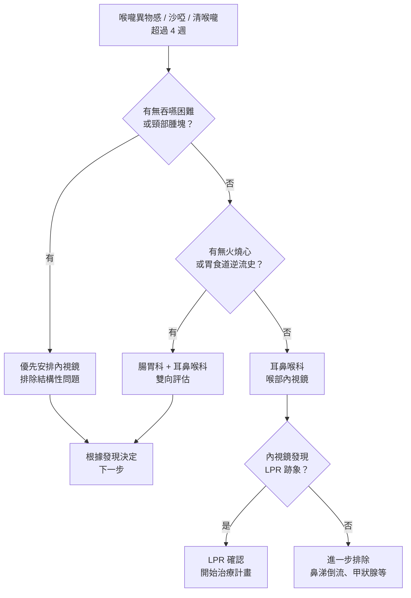
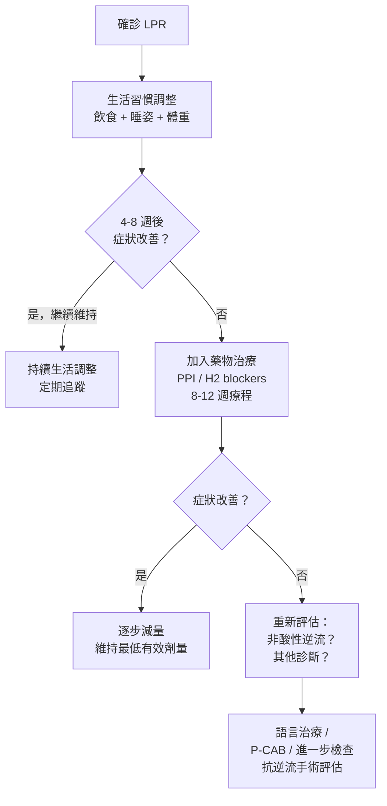

# 喉嚨老是有東西卡著？可能是胃酸往上跑了

## 簡單說重點 (Overview)

喉嚨長期有「卡卡」的異物感、不斷想清喉嚨、說話容易沙啞——這些症狀讓人很困擾，卻又照了喉嚨「看起來沒什麼大問題」。大多數情況下，這是**逆流性咽喉炎（LPR，Laryngopharyngeal Reflux）**在作怪：胃酸或消化液往上逆流，越過食道、到達咽喉，刺激脆弱的喉嚨黏膜。

LPR 和大家熟知的「胃食道逆流（GERD）」是親戚，但不完全一樣。GERD 的主角是「火燒心」；LPR 的主要症狀卻在喉嚨，有些人完全沒有胸口灼熱感，這讓很多人遲遲找不到真正的原因。

> [!info] 小知識
> 研究顯示，逆流物中有相當比例是「非酸性」的消化液（如胃蛋白酶、膽汁），所以即便胃酸不多，LPR 的症狀照樣可能出現。這也解釋了為什麼單靠制酸劑有時效果有限。

<!-- IMAGE_PLACEHOLDER: 人體側面圖，標示食道下括約肌（LES）與食道上括約肌（UES），箭頭顯示逆流路徑從胃到咽喉 -->

---

## 症狀 (Symptoms)

LPR 最常出現的症狀包括：

- **喉嚨異物感（癔球症，Globus sensation）**：感覺喉嚨有顆球或痰卡著，吞口水吞不下去，但吃東西反而沒問題
- **頻繁清喉嚨（throat clearing）**：不自覺地「嗯哼」，清完馬上又想清
- **慢性乾咳**：尤其在飯後、睡前或躺下時加劇
- **聲音沙啞**：早上起床後特別明顯，說話久了就疲乏
- **吞嚥有點卡**：食物通過時偶爾有輕微阻滯感（注意：若吞嚥困難明顯，需盡快就醫排除其他原因）
- **黏液感增加**：覺得鼻涕倒流、痰很多，但又抽不出來
- **口臭**：消化液逆流帶來的氣味

> [!caution] 注意
> LPR 與「鼻涕倒流（Post-nasal drip）」症狀高度重疊，有時甚至同時存在。如果你同時有過敏、鼻竇炎等問題，需要一起評估，才能找到真正的來源。

---

## 醫師怎麼幫你檢查 (Diagnosis)

### 病史詢問

醫師會先問你症狀出現多久、有沒有火燒心、飲食習慣、生活作息、是否吸菸等。LPR 的診斷大量依賴臨床判斷。

### 喉部內視鏡檢查

這是診斷 LPR 最重要的工具。醫師用**軟式內視鏡（flexible laryngoscope）**——一根鉛筆粗的細鏡頭——經由鼻腔進入，直接觀察聲帶、杓狀軟骨（arytenoids，聲帶後方的軟骨）、下咽部是否有紅腫、水腫或黏膜增厚等 LPR 特有的變化。

整個過程約 3–5 分鐘，多數人不需要麻醉，輕微不適感多在幾秒內結束。

### 其他進階評估

- **24 小時喉咽 pH 監測**：最標準的客觀診斷工具，記錄咽喉酸鹼值變化，確認逆流的時間與頻率。適合症狀複雜或治療反應不佳時使用。
- **內視鏡評分（RSI / RFS）**：「反流症狀指數（RSI）」問卷與「反流發現評分（RFS）」是臨床常用的半定量工具，幫助醫師評估嚴重程度與治療效果。

> **診所說明：** 本診所備有軟式與硬式喉鏡，可於門診當天完成喉部檢查，直觀確認咽喉狀況、減少不必要的焦慮。

---

## 治療方式 (Treatment)

### 1. 生活習慣調整（最重要的第一步）

生活習慣是 LPR 治療的核心，許多輕中度患者光靠調整就能大幅改善：

- **飲食調整**
  - 減少：高脂食物、咖啡因、酒精、碳酸飲料、辛辣食物、柑橘類、番茄製品
  - 餐後至少等 **2–3 小時**再躺下
  - 少量多餐，避免撐飽後立刻活動

- **睡眠姿勢**
  - 睡覺時抬高床頭 **15–20 公分**（整塊床板傾斜，不是只墊高枕頭）
  - 建議**左側臥**：左側臥時胃的位置較高，可減少逆流機會

- **其他**
  - 維持健康體重（腹部脂肪會增加腹壓，加重逆流）
  - 戒菸（菸草會削弱食道下括約肌的功能）
  - 避免穿著過緊的腰帶或衣物

> [!recommend] 建議
> 「飯後散步 15 分鐘」是簡單又有效的習慣：直立姿勢幫助胃排空，減少逆流機會。研究顯示，規律輕度運動對改善 LPR 症狀有顯著幫助。

### 2. 藥物治療

- **質子幫浦抑制劑（PPI，proton pump inhibitors）**：是 LPR 藥物治療的主力，需連續服用 **8–12 週**才能評估效果，比 GERD 所需療程更長。注意：由於 LPR 常有非酸性逆流，部分患者 PPI 效果有限。
- **H₂ 受體拮抗劑（H2 blockers）**：適合症狀較輕或作為 PPI 的輔助用藥。
- **海藻酸鹽（alginic acid）製劑**：在食道形成保護層，適合飯後症狀明顯者。
- **促動力藥（prokinetics）**：幫助胃更快排空，減少逆流機會。

> [!caution] 注意
> 請勿自行長期服用制酸劑。PPI 雖然有效，但長期使用需注意鎂、維生素 B12 等營養素的吸收，並定期回診評估是否繼續用藥。

### 3. 進階治療

對於症狀持續、藥物效果不佳的患者，可考慮：

- **語言治療（Speech therapy）**：專業語言治療師可以指導喉嚨放鬆技巧、呼吸訓練，有效減少清喉嚨的習慣，改善聲音品質。
- **P-CAB（鉀離子競爭型酸阻斷劑）**：較新一代的胃酸抑制藥物，起效更快、抑酸更完全，部分對 PPI 反應不佳的患者有更好的效果。
- **手術治療（抗逆流手術）**：適用於食道括約肌功能嚴重受損、保守治療無效的少數患者，需由外科醫師評估。

---

## 什麼時候該看醫生 (When to See a Doctor)

多數 LPR 是慢性但良性的問題，不過以下症狀出現時，**請盡快就醫**，需要排除更嚴重的原因：

- **吞嚥困難或吞嚥疼痛**（食物卡住感明顯，不只是輕微的「卡卡」）
- **體重在短期內不明原因下降**
- **聲音沙啞持續超過 3 週未改善**
- **頸部摸到腫塊**
- **咳出血絲或痰中帶血**
- **喉嚨痛持續超過 2 週，且排除感冒原因**
- **呼吸有異常聲音（喘鳴）**

> [!danger] 警告
> 若同時出現吞嚥困難 + 體重減輕 + 聲音長期沙啞，請**盡快安排喉部內視鏡**，這些組合症狀需要排除咽喉部腫瘤。

> [!recommend] 建議
> 喉嚨異物感雖然令人焦慮，但大多數情況下是良性的 LPR 或功能性問題。**做一次喉部內視鏡**可以在幾分鐘內確認喉嚨結構正常，有效消除不必要的擔心，讓你安心配合治療。

---

## 常見問題 (FAQ)

### Q：我沒有火燒心，怎麼可能是胃酸逆流？

A：這正是 LPR 最常被誤解的地方。LPR 的逆流物是往上到咽喉，而不是只停在食道；加上咽喉黏膜比食道敏感得多，即使少量逆流就會造成明顯症狀，卻不一定引起胸口的灼熱感。

### Q：吃了制酸劑好幾週，喉嚨還是一樣卡，是不是藥沒效？

A：LPR 對 PPI 的反應比 GERD 慢得多，通常需要**持續 8–12 週**才能評估療效，且必須配合生活習慣調整。如果效果仍不理想，可能是以下原因：非酸性逆流（膽汁、胃蛋白酶）佔多數、用藥時間點不對、或者診斷需要重新確認。

### Q：喉嚨異物感是癌症的前兆嗎？

A：大多數情況下不是。「癔球症（globus sensation）」——喉嚨有球或痰卡著的感覺——是非常常見的症狀，多數是 LPR、鼻涕倒流或焦慮壓力造成的。但如果合併吞嚥困難、體重減輕或頸部腫塊，就需要盡快做內視鏡排除腫瘤。

### Q：LPR 需要治療多久？

A：輕度患者配合生活習慣調整，通常 4–8 週就會有感覺改善。藥物療程建議完整走 8–12 週。LPR 有容易復發的特性，停藥後仍需維持飲食習慣，約 40–60% 的患者在 1–2 年內可能需要再次治療。

### Q：什麼是「左側臥可以減少逆流」？

A：這和胃的解剖位置有關。胃在腹腔偏左，胃食道接合處（賁門）位於左上方。左側臥時，賁門位置相對高於胃內液體，胃酸不容易倒流；右側臥則相反，賁門位置較低，更容易逆流。

---

## 最新治療趨勢 (Latest Updates)

根據 2024 年發表的系統性回顧（PMC, 2024），LPR 的治療研究有幾個新進展值得關注：

**非酸性逆流的認識更深入**：研究顯示，LPR 患者中有約 25% 以非酸性逆流為主，另有約 36% 為混合型。這解釋了為什麼部分患者 PPI 效果不佳——海藻酸鹽製劑與飲食調整在這類患者中可能更重要。

**語言治療的量化效果**：越來越多研究支持語言治療（包括放鬆喉嚨技巧、改善發聲習慣）作為 LPR 多模式治療的一部分，尤其對「清喉嚨」和聲音沙啞的改善效果明顯。P-CAB 等新一代抑酸藥物也在臨床研究中展現出比傳統 PPI 更快速、更完全的抑酸效果（資料來源：PMC 2024）。

---

## 醫療免責聲明 (Disclaimer)

本文章內容僅供衛教參考，不構成專業醫療建議、診斷或治療。每個人的健康狀況不同，實際治療方式需由醫師根據個別情況評估。若你有任何健康疑慮或症狀，請務必諮詢合格醫療專業人員。本診所提供的資訊力求準確，但醫學知識持續更新，我們無法保證內容永久有效。文章中提及的治療方式或設備，其適用性與效果因人而異，需經醫師評估後方可進行。

---

## 參考資料 (References)

- [Laryngopharyngeal Reflux (LPR)](https://my.clevelandclinic.org/health/diseases/15024-laryngopharyngeal-reflux-lpr) — Cleveland Clinic, 存取日期 2026-04-06
- [Position Statement: Laryngopharyngeal Reflux](https://www.entnet.org/resource/position-statement-laryngopharyngeal-reflux/) — American Academy of Otolaryngology–Head and Neck Surgery (AAO-HNS), 存取日期 2026-04-06
- [For Patients: What Is Laryngopharyngeal Reflux?](https://bulletin.entnet.org/home/article/21246797/for-patients-what-is-laryngopharyngeal-reflux) — AAO-HNS Bulletin, 存取日期 2026-04-06
- Lechien JR, et al. "Diagnosis and Management of Laryngopharyngeal Reflux: An Updated Review." *Int J Environ Res Public Health* 2024. PMC10997336
- Yadlapati R, et al. "Current Advances in the Management of Laryngopharyngeal Reflux." *J Clin Gastroenterol* 2024. PMC11056915
- [Laryngopharyngeal Reflux – StatPearls](https://www.ncbi.nlm.nih.gov/books/NBK519548/) — NIH / NCBI, 存取日期 2026-04-06
- [慢性咽喉炎（逆流性咽喉炎、癔球症）懶人包](https://www.careonline.com.tw/2020/12/laryngopharyngeal-reflux.html) — 照護線上, 存取日期 2026-04-06
