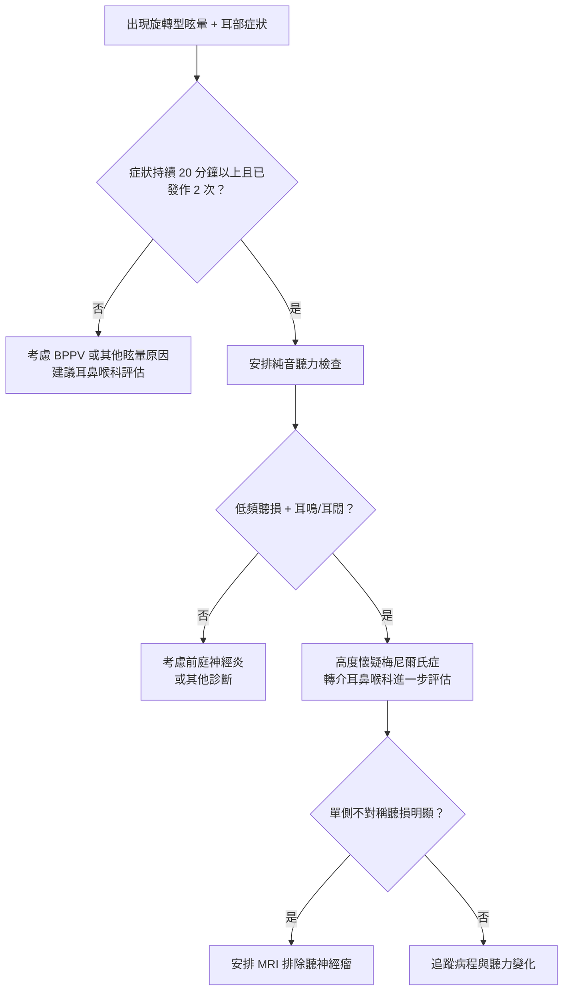
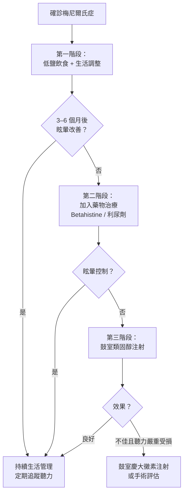

# 天旋地轉的恐懼：認識梅尼爾氏症

## 簡單說重點 (Overview)

梅尼爾氏症是內耳裡面的液體（內淋巴液）異常積聚，造成內耳壓力過高的疾病。你可以想像成「內耳積水」——就像眼壓過高會影響視力，內耳水壓失衡就會影響聽覺與平衡感。它的核心特徵是四種症狀成群出現：突發性的旋轉型眩暈、耳鳴、單側聽力忽好忽壞，以及耳朵悶脹感。目前無法根治，但透過適當管理，大多數病患可以大幅減少發作頻率。

> [!info] 小知識
> 梅尼爾氏症以 19 世紀法國醫師 Prosper Ménière 命名，他是第一位將內耳病變與眩暈連結起來的醫師。全球盛行率約每千人 0.5–1.5 人，好發於 40–60 歲成人，男女比例相近。

<!-- IMAGE_PLACEHOLDER: 內耳構造示意圖，標示耳蝸、半規管、內淋巴囊與外淋巴液/內淋巴液分布 -->

## 症狀 (Symptoms)

梅尼爾氏症的四大核心症狀通常一起出現，但每次發作的嚴重程度不同：

- **旋轉型眩暈（天旋地轉）**：突然發作，持續 20 分鐘到 12 小時，常伴隨噁心嘔吐，躺著不動也不會停止
- **耳鳴**：低沉的嗡嗡聲或嘶嘶聲，發作前後常加劇
- **波動性聽力障礙**：低頻聽力下降（初期可自行恢復），反覆多年後聽力逐漸永久損失
- **耳悶脹感**：患側耳朵有壓迫或充水感，常在眩暈發作前出現，如同警訊

**伴隨症狀（非必要條件）：**
- 眩暈後強烈噁心嘔吐
- 站立或走路不穩，恐慌感
- 少數人眩暈前有視覺模糊或頭痛

> [!caution] 注意
> 梅尼爾氏症的「眩暈」是感覺周圍在旋轉，而不是一般的「頭暈眼花」。若你的不適只有輕微頭昏而無旋轉感，需考慮其他診斷（例如貧血、低血壓或良性陣發性姿勢性眩暈 BPPV）。

## 醫師怎麼幫你檢查 (Diagnosis)

梅尼爾氏症目前沒有單一決定性的檢驗，診斷依賴**病史 + 客觀聽力測試**的組合。

根據 2020 年 AAO-HNS 臨床實踐指引，確診梅尼爾氏症需同時符合：
1. 至少 2 次自發性旋轉型眩暈，每次持續 20 分鐘–12 小時
2. 聽力圖（純音聽力檢查）記錄到患側低頻至中頻感音神經性聽力損失
3. 患側耳鳴、耳悶或聽力波動等耳部症狀
4. 無法用其他診斷解釋上述症狀

**常用檢查：**
- **純音聽力檢查（Audiogram）**：必做，確認低頻聽損——這是診斷的基石
- **耳鏡檢查**：排除中耳病變，內視鏡可更清晰觀察鼓膜（用一根細軟鏡頭觀察耳道及鼓膜）
- **MRI 內耳造影**：患側有不對稱聽損時，用來排除聽神經瘤等佔位性病變
- **前庭功能檢查**（溫差試驗、VEMP 等）：評估半規管功能，不常規用於初診
- **甘油試驗**：口服甘油後測量聽力，陽性（聽力暫時改善）支持內淋巴水腫診斷

## 治療方式 (Treatment)

梅尼爾氏症治療目標有二：**減少急性發作頻率**與**保護長期聽力**。採分階段策略，從最保守的生活調整開始。

### 1. 居家照護

生活方式調整是所有治療的基礎，研究顯示約 60–70% 患者可靠此改善症狀：

- **低鹽飲食**：每日鈉攝取 < 1,500 mg（約 4 g 食鹽），減少內淋巴液積聚
- **避免觸發物**：咖啡因、酒精、菸草會加重症狀
- **規律作息與壓力管理**：情緒壓力和睡眠不足是常見的誘發因素
- **充足水分**：每日 1.5–2 公升白開水，維持體內滲透壓穩定
- **記錄發作日誌**：記錄發作時間、持續時間、飲食與睡眠，找出個人誘發因素

> [!recommend] 建議
> 從今天起試著減少外食（外食含鹽量通常是建議量的 2–3 倍），並記錄每次眩暈發作的前一天吃了什麼、睡了幾小時。這份日誌在回診時對醫師非常有幫助。

### 2. 藥物治療

**急性發作期（症狀緩解為主）：**
- 前庭抑制劑：用於緩解急性眩暈發作，不可長期使用以免依賴
- 止吐藥：控制嘔吐，保持水分

**長期預防（降低發作頻率）：**
- **Betahistine（倍他組胺）**：改善內耳微循環、降低內淋巴壓，台灣常用的長期預防藥物
- **利尿劑**：減少體內積液，進而降低內淋巴液生成，需定期監測電解質

> [!caution] 注意
> 前庭抑制藥物只適合急性發作時短期使用。長期服用反而會妨礙大腦進行「前庭代償」——即大腦自我學習適應平衡問題的自然能力，延誤恢復。

### 3. 進階治療

當藥物和生活調整仍無法有效控制眩暈（每年仍有頻繁嚴重發作），可考慮：

**鼓室注射（Intratympanic Injection）：**
- **類固醇注射**（Dexamethasone 或 Methylprednisolone）：透過鼓膜將藥物注入中耳，減輕內耳發炎反應，保留聽力。研究顯示 Methylprednisolone 效果略優於 Dexamethasone。
- **慶大黴素注射**（Gentamicin）：破壞患側前庭感覺細胞以控制眩暈，有效率高但有不可逆的聽力損失風險，適用於聽力已嚴重受損且保守治療無效者。

**前庭復健訓練（Vestibular Rehabilitation）：**
適用於慢性平衡障礙期，透過特定頭眼協調運動幫助大腦重新建立平衡補償機制。

**手術（最後選擇）：**
- 內淋巴囊減壓術：降低內耳液壓，保留聽力
- 迷路切除術：破壞患側內耳，完全控制眩暈，聽力完全喪失，僅在其他方法失敗後考慮

## 什麼時候該看醫生 (When to See a Doctor)

以下狀況**請儘速就醫**，不要等待觀察：

- 突發旋轉型眩暈且持續超過 1 小時，伴隨嚴重嘔吐無法緩解
- 眩暈合併一側臉部麻木、說話困難、複視、手腳無力——這可能是腦中風，需要急診
- 突發單側完全聽力喪失（突發性耳聾，48 小時內需積極治療）
- 耳鳴或耳悶持續兩週以上未改善
- 梅尼爾氏症患者發作頻率突然明顯增加（每週超過 2 次）

> [!danger] 警告
> 眩暈合併「頭痛劇烈、意識不清、言語困難、肢體無力」是腦中風的警訊，請立即撥打 119，不可自行就醫。梅尼爾氏症不會造成這類神經症狀。

## 常見問題 (FAQ)

### Q: 梅尼爾氏症會痊癒嗎？
A: 目前無根治方式，但研究顯示約 50% 患者在 10 年後眩暈發作自然減少甚至停止。然而，聽力損失可能持續累積。早期良好管理可以延緩聽力惡化，維持生活品質。

### Q: 梅尼爾氏症的眩暈多久發作一次？
A: 個體差異很大。有人每天發作，有人一年才一兩次。每次發作持續 20 分鐘到 12 小時（通常 2–4 小時），多數人在發作後仍有一整天的不穩感。

### Q: 發作時應該怎麼做？
A: 立刻停下手邊動作，找安全的地方躺下，固定視線看一個靜止目標。避免突然轉頭。不要強迫自己活動，讓身體休息。若有醫師開立的急性期藥物，依指示使用。

### Q: 梅尼爾氏症和 BPPV 有什麼不同？
A: BPPV（良性陣發性姿勢性眩暈）的眩暈通常在改變頭部姿勢（如起床、低頭）時發作，持續時間很短（30–60 秒），且不會有聽力問題。梅尼爾氏症的眩暈可以在任何時間無預警發作，持續時間長且有耳部症狀。這兩者的治療完全不同，需要醫師鑑別診斷。

### Q: 壓力大會讓梅尼爾氏症變嚴重嗎？
A: 是的。自律神經系統（autonomic nervous system）的失調被認為與梅尼爾氏症的誘發有關，情緒壓力、睡眠不足會影響自律神經平衡，進而影響內耳的體液調節。針對自律神經功能的客觀評估，診所提供 **HRV 心率變異檢測**，可作為壓力管理的參考工具。

## 最新治療趨勢 (Latest Updates)

2025 年一項發表於 *European Archives of Oto-Rhino-Laryngology* 的系統性回顧（Scoping Review）分析了 34 項隨機對照試驗，涵蓋飲食介入、藥物、鼓室注射、正壓治療、低能量雷射等各種療法。結論指出，鼓室類固醇注射的效果已有相對穩定的支持，其中 Methylprednisolone 在眩暈控制與聽力保護上略優於 Dexamethasone；但整體而言，現有研究品質仍參差不齊，需要更多高品質試驗。

2020 年 AAO-HNS 臨床實踐指引重申，**鼓室慶大黴素注射**是對非破壞性療法（藥物＋注射類固醇）反應不佳時的有效進階選項，但應與患者充分討論不可逆聽損風險後再進行。

## 醫療免責聲明 (Disclaimer)

本文章內容僅供衛教參考，不構成專業醫療建議、診斷或治療。每個人的健康狀況不同，實際治療方式需由醫師根據個別情況評估。若你有任何健康疑慮或症狀，請務必諮詢合格醫療專業人員。本診所提供的資訊力求準確，但醫學知識持續更新，我們無法保證內容永久有效。文章中提及的治療方式或設備，其適用性與效果因人而異，需經醫師評估後方可進行。

## 參考資料 (References)

- [Clinical Practice Guideline: Ménière's Disease](https://www.entnet.org/quality-practice/quality-products/clinical-practice-guidelines/menieres-disease/) — AAO-HNS, 存取日期 2026-04-06
- [Meniere's disease - Symptoms and causes](https://www.mayoclinic.org/diseases-conditions/menieres-disease/symptoms-causes/syc-20374910) — Mayo Clinic, 更新日期 2024-01-03, 存取日期 2026-04-06
- [Meniere's disease - Diagnosis and treatment](https://www.mayoclinic.org/diseases-conditions/menieres-disease/diagnosis-treatment/drc-20374916) — Mayo Clinic, 存取日期 2026-04-06
- [Meniere's Disease: Symptoms, Causes & Treatment](https://my.clevelandclinic.org/health/diseases/15167-menieres-disease) — Cleveland Clinic, 存取日期 2026-04-06
- [What Is Ménière's Disease?](https://www.nidcd.nih.gov/health/menieres-disease) — NIDCD/NIH, 存取日期 2026-04-06
- [惱人的梅尼爾氏症](https://epaper.ntuh.gov.tw/health/202409/project_1.html) — 臺大醫院健康電子報（楊庭華醫師）, 2024年09月, 存取日期 2026-04-06
- [經常天旋地轉、耳鳴、聽力差 - 梅尼爾氏症](https://www.cmuh.cmu.edu.tw/HealthEdus/Detail?no=5106) — 中國醫藥大學附設醫院衛教單張, 存取日期 2026-04-06
- [美尼爾氏症衛教單張](https://www.mmh.org.tw/know_health_view.php?docid=261) — 馬偕紀念醫院, 存取日期 2026-04-06
- [Treatment of Menière's disease: a scoping review of the current evidence](https://link.springer.com/article/10.1007/s00405-025-09329-5) — European Archives of Oto-Rhino-Laryngology, 2025
- Lopez-Escamez et al. "Diagnostic criteria for Menière's disease." J Vestib Res 2015; 25(1): 1-7. PMID: 25882471
