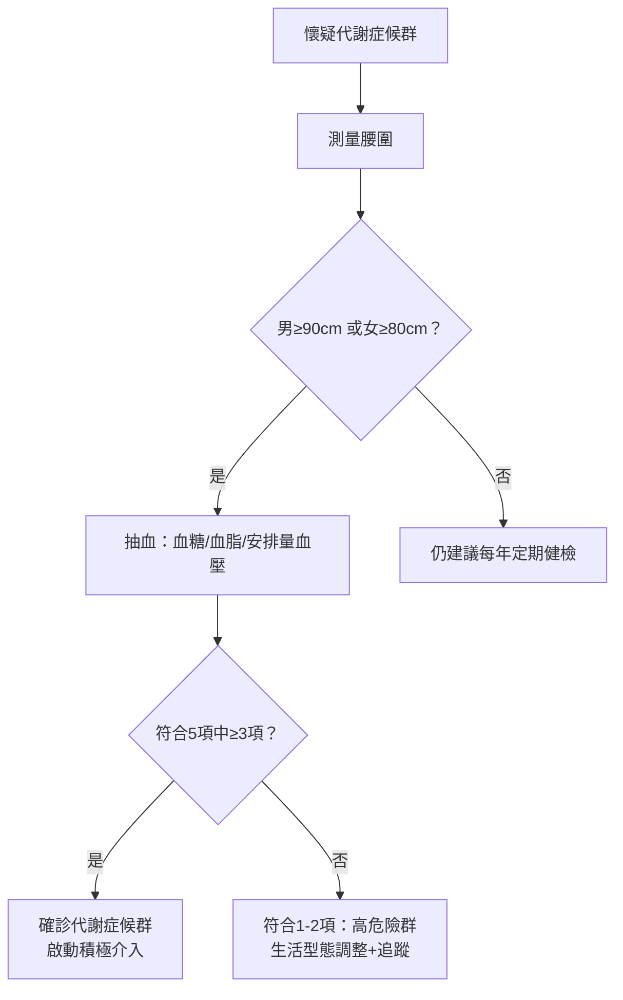
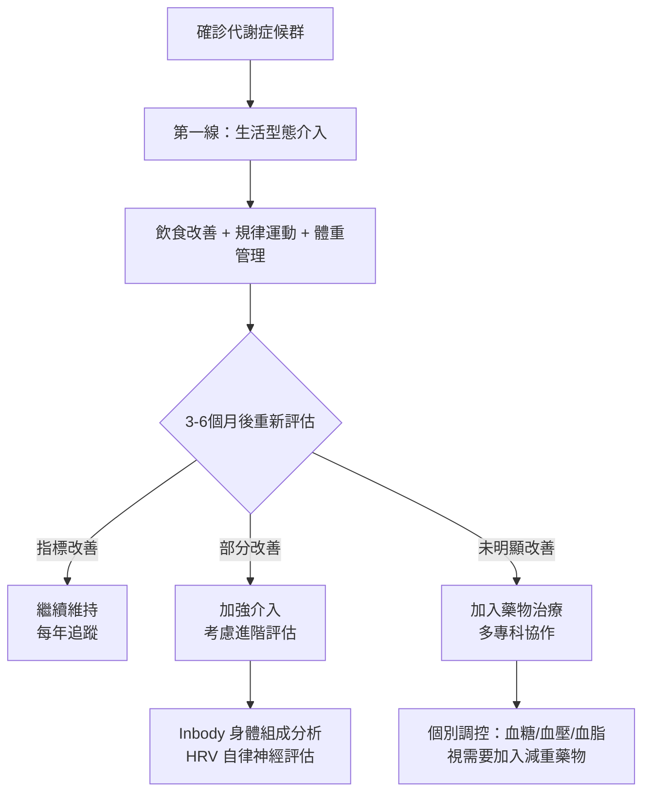

# 大肚腩的危機：代謝症候群的診斷標準與逆轉指南

## 簡單說重點 (Overview)

代謝症候群不是一種單一的病，而是五個危險因子同時聚集在一個人身上的狀態——腰圍太粗、血壓偏高、血糖偏高、三酸甘油酯過高、好膽固醇偏低，符合三項就算。在台灣，每四個成年人就有一人有代謝症候群，多數人渾然不覺，等到心臟病或糖尿病上身才後悔。好消息是，這個狀況是可以逆轉的，而且愈早處理效果愈好。

<!-- IMAGE_PLACEHOLDER: 代謝症候群五項指標示意圖，腰圍/血壓/血糖/三酸甘油酯/HDL五個圓形圖示 -->

## 症狀 (Symptoms)

代謝症候群本身幾乎沒有明顯症狀，這正是它危險的地方。下面這些可能是身體發出的隱性訊號：

- **腰圍愈來愈大**：褲子變緊、肚子圓凸，尤其脂肪集中在腹部
- **飯後特別想睡**：血糖調控出問題，吃完飯後昏昏欲睡
- **常常口渴、頻尿**：血糖偏高的早期表現
- **容易疲倦、精神不佳**：細胞無法有效利用葡萄糖供應能量
- **頸部、腋下皮膚變深色**（黑棘皮症）：胰島素阻抗（身體對胰島素反應變差）的外在表現

> [!info] 小知識
> 代謝症候群本身不會「痛」，它是一個風險組合，長期下來讓血管持續受損，等到心肌梗塞或腦中風發生才意識到問題。這也是為什麼定期健檢這麼重要。

## 醫師怎麼幫你檢查 (Diagnosis)

### 台灣官方診斷標準（符合 3 項以上即為代謝症候群）

| 項目 | 男性標準 | 女性標準 |
|------|---------|---------|
| 腹部肥胖（腰圍） | ≥ 90 cm（35吋） | ≥ 80 cm（31吋） |
| 血壓偏高 | 收縮壓 ≥ 130 mmHg 或舒張壓 ≥ 85 mmHg | 同左 |
| 空腹血糖偏高 | ≥ 100 mg/dL | 同左 |
| 三酸甘油酯偏高 | ≥ 150 mg/dL | 同左 |
| 好膽固醇（HDL-C）偏低 | < 40 mg/dL | < 50 mg/dL |

*資料來源：衛福部國民健康署 2007 年台灣成人標準*

### 檢查流程

醫師通常會安排以下檢查：

- **身體測量**：腰圍、BMI、血壓
- **抽血檢查**：空腹血糖、血脂四項（總膽固醇、三酸甘油酯、HDL-C、LDL-C）
- **進一步評估**：胰島素阻抗指數（HOMA-IR）、空腹胰島素、糖化血色素（HbA1c）

> [!caution] 注意
> 「血糖正常」不代表沒問題。空腹血糖 100-125 mg/dL 屬於「糖尿病前期」，已是代謝症候群的危險訊號，需要積極介入，而非只是追蹤觀察。

## 治療方式 (Treatment)

### 1. 居家照護

生活型態的改變是最有效的第一線治療，也是唯一能真正「逆轉」代謝症候群的方法。

**飲食調整：**
- 減少精緻澱粉（白飯、白麵包、含糖飲料）
- 增加蔬菜、豆類、全穀類、堅果、橄欖油
- 地中海飲食模式（Mediterranean Diet）有強力的實證支持
- 減少加工食品和反式脂肪

**規律運動：**
- 目標：每週 150 分鐘以上的中強度有氧運動（快走、游泳、騎車）
- 加上每週 2 次阻力訓練（重量訓練、深蹲）可顯著改善胰島素敏感性

**體重管理：**
- 減少 5-10% 的體重，就能有效改善多項代謝指標
- 腰圍每減少 1 公分，心血管風險就下降

> [!recommend] 建議
> 不需要追求「六塊肌」，只要腰圍減少 3-5 公分，就能明顯改善血壓、血糖和血脂。從每天 30 分鐘快走開始，是最簡單可執行的第一步。

### 2. 藥物治療

當生活改變不足以控制各項指標時，醫師會針對個別異常項目開立藥物：

- **血壓藥**：視血壓控制狀況決定
- **降血糖藥**：血糖持續偏高或進入糖尿病前期時使用
- **調血脂藥（Statin）**：三酸甘油酯或壞膽固醇（LDL-C）明顯偏高時
- **減重藥物**：BMI ≥ 27 合併代謝異常者可考慮

> [!caution] 注意
> 藥物是輔助工具，不是取代生活改變的理由。停止生活型態調整後，藥物效果也會大打折扣。

### 3. 進階治療

**身體組成分析（Inbody）：**
體重計無法區分脂肪和肌肉。透過 Inbody 分析，可以精確了解內臟脂肪量（VAT）、肌肉量和基礎代謝率，讓減重方向更精準——不是單純減重，而是減脂增肌。

**自律神經檢測（HRV）：**
代謝症候群和自律神經失調高度相關。心率變異分析（HRV）可以客觀評估自律神經功能，作為整體代謝健康的評估工具，協助判斷壓力管理和睡眠品質的改善方向。

**口服或針劑減重藥物：**
適合 BMI ≥ 27 合併代謝異常的族群，需由醫師評估後開立，配合飲食和運動使用。

## 什麼時候該看醫生 (When to See a Doctor)

以下情況請盡快就醫，不要等到下次健檢：

- **腰圍超標**：男性 ≥ 90 cm、女性 ≥ 80 cm，且合併其他症狀
- **血壓持續 ≥ 140/90 mmHg**，居家自測多次皆如此
- **飯前血糖曾測到 ≥ 100 mg/dL**，即使只是一次
- **頸部、腋下出現深色、絨毛狀的皮膚變化**（黑棘皮症）
- **家族中有糖尿病或早發性心臟病**（父母或兄弟姊妹 55 歲前發病）
- **年度健檢報告紅字 ≥ 2 項**（血脂、血糖、血壓任何組合）

> [!danger] 警告
> 出現胸悶、胸痛、突然頭暈或單側無力，請立刻就醫或撥打 119，不要等待觀察。這些可能是心肌梗塞或腦中風的前兆，代謝症候群患者的風險是常人的 2 倍以上。

## 常見問題 (FAQ)

### Q: 我沒有「三高」，只是腰圍大，也算代謝症候群嗎？
A: 不算。代謝症候群需要同時符合 5 項指標中的 3 項以上。但腰圍超標是最重要的啟動因子，代表內臟脂肪過多，強烈建議抽血確認其他指標是否也出問題。

### Q: 代謝症候群可以完全逆轉嗎？
A: 可以。研究顯示，透過飲食調整和規律運動，配合 7-10% 的體重減輕，大多數人可以在 3-6 個月內讓各項指標恢復正常範圍。關鍵在於持續執行，而非短期衝刺。

### Q: 我很瘦，但健檢血糖和血脂都偏高，有可能嗎？
A: 完全有可能，這叫做「隱性肥胖」（體脂率高但體重正常）。BMI 正常甚至偏低的人，若有高腰臀比或內臟脂肪堆積，也可能有代謝症候群。Inbody 身體組成分析可以幫助釐清這個問題。

### Q: 代謝症候群需要長期吃藥嗎？
A: 不一定。藥物通常是短期輔助，等生活型態改善後，許多人可以在醫師評估下減量甚至停藥。目標是讓身體恢復自我調控的能力，而非依賴藥物維持。

### Q: 健檢報告上沒有寫「代謝症候群」，是不是就代表沒問題？
A: 需要看各項數值，不能只看有沒有這個診斷。如果報告上血糖、血壓、血脂各有一兩項在邊界值，但沒達到三項，醫師可能沒有特別標示，但這仍是高危險狀態，值得積極介入。

## 最新治療趨勢 (Latest Updates)

**地中海飲食的強力實證（2024-2025）：** 多項統合分析（meta-analysis）持續確認地中海飲食在改善代謝症候群各項指標上的效果——不只改善血脂，還能降低全身慢性發炎指標（如 CRP），並調節腸道菌群。與規律運動結合時，效果更為顯著（來源：MDPI Nutrients, 2025; Journal of Clinical Nutrition, 2024）。

**GLP-1 受體促效劑的新角色：** 原本用於第二型糖尿病的 GLP-1 類藥物（如 semaglutide）近年發現對代謝症候群有多重益處，包含減重、降血壓、改善胰島素敏感性，成為部分難以單靠生活型態改善患者的新選項。此類藥物需由醫師評估適應症後才能使用（來源：NEJM 2024; Lancet Diabetes & Endocrinology 2023）。

## 醫療免責聲明 (Disclaimer)

本文章內容僅供衛教參考，不構成專業醫療建議、診斷或治療。每個人的健康狀況不同，實際治療方式需由醫師根據個別情況評估。若你有任何健康疑慮或症狀，請務必諮詢合格醫療專業人員。本診所提供的資訊力求準確，但醫學知識持續更新，我們無法保證內容永久有效。文章中提及的治療方式或設備，其適用性與效果因人而異，需經醫師評估後方可進行。

## 參考資料 (References)

- [成人（20歲以上）代謝症候群之判定標準(2007 台灣)](https://www.hpa.gov.tw/Pages/Detail.aspx?nodeid=639&pid=1219) — 衛生福利部國民健康署, 存取日期 2026-04-17
- [「三高＋二害」，您有代謝症候群嗎？](https://www.hpa.gov.tw/Pages/Detail.aspx?nodeid=4576&pid=16426) — 衛生福利部國民健康署, 存取日期 2026-04-17
- [Metabolic Syndrome: What It Is, Causes, Symptoms & Treatment](https://my.clevelandclinic.org/health/diseases/10783-metabolic-syndrome) — Cleveland Clinic, 存取日期 2026-04-17
- [Metabolic Syndrome – Diagnosis & Treatment](https://www.mayoclinic.org/diseases-conditions/metabolic-syndrome/diagnosis-treatment/drc-20351921) — Mayo Clinic, 存取日期 2026-04-17
- [Metabolic Syndrome - StatPearls](https://www.ncbi.nlm.nih.gov/books/NBK459248/) — NIH / NCBI Bookshelf, 存取日期 2026-04-17
- [A Comprehensive Review of Metabolic Syndrome and Its Role in Cardiovascular Disease and Type 2 Diabetes Mellitus](https://pmc.ncbi.nlm.nih.gov/articles/PMC11416200/) — PMC / NCBI, 2024
- [Harmonizing the Metabolic Syndrome](https://www.ahajournals.org/doi/10.1161/circulationaha.109.192644) — Circulation / AHA, 2009
- [Effects of the Mediterranean Diet on the Components of Metabolic Syndrome](https://www.mdpi.com/2072-6643/17/2/358) — MDPI Nutrients, 2025
