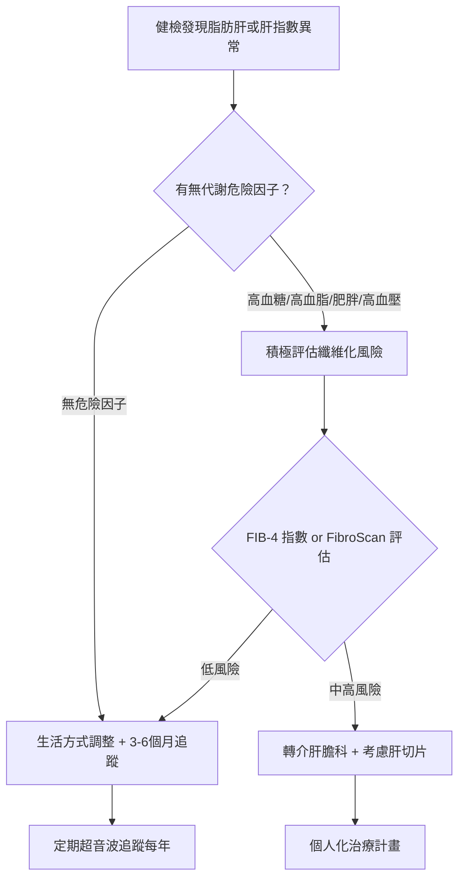
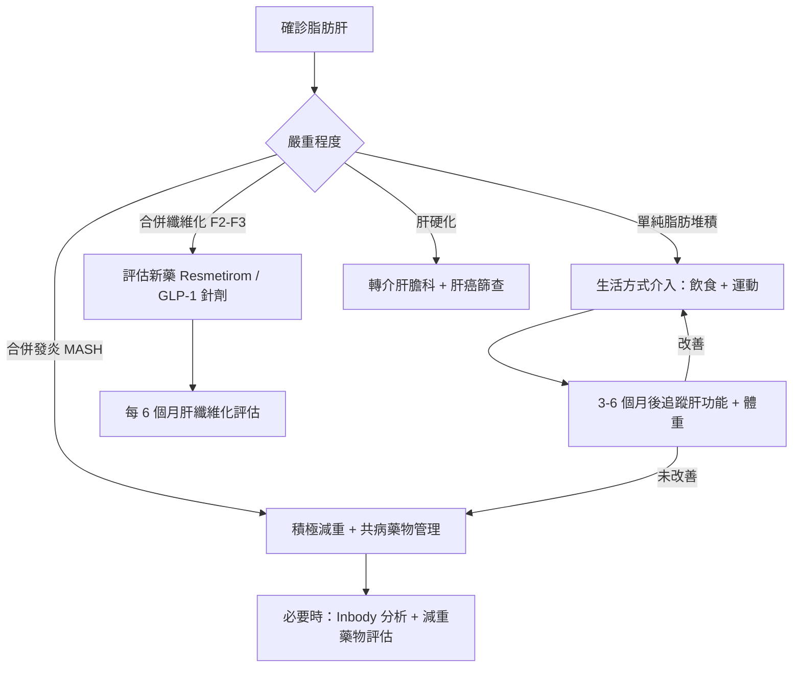

# 肝包油會變肝癌嗎？非酒精性脂肪肝的逆轉指南

## 簡單說重點 (Overview)

「脂肪肝」是指肝臟細胞內堆積過多脂肪，就像你的肝臟也跟著你一起「肥胖」了。台灣有超過一半的成人有不同程度的脂肪肝，大多數人完全沒有感覺，卻在健檢報告上看到「肝功能異常」或「超音波發現脂肪肝」才嚇一跳。脂肪肝不等於立刻危險，但也不代表可以放著不管——它有一條清楚的惡化路徑，你的選擇決定走到哪一站。

<!-- IMAGE_PLACEHOLDER: 脂肪肝疾病進展示意圖：正常肝臟 → 脂肪堆積 → 脂肪肝炎 → 肝纖維化 → 肝硬化 → 肝癌 -->

> [!info] 名稱更新小知識
> 你可能同時看到「NAFLD」（非酒精性脂肪肝病）和「MASLD」（代謝功能障礙相關脂肪肝病）兩個名稱。2023 年國際醫學界統一改用 MASLD，強調此病與代謝異常密切相關。本文兩個名稱皆沿用，指的是同一件事。

---

## 症狀 (Symptoms)

脂肪肝最大的特色就是「沉默」——大多數人完全沒有症狀，直到健檢才發現。少數人可能出現：

- 右上腹部悶脹或不適（肝臟位置）
- 持續疲倦感，休息後仍未改善
- 食慾下降、容易脹氣
- 健檢顯示 ALT（肝功能指數）偏高
- 超音波報告出現「echogenic liver」或「高回音肝臟」的字眼

進展到肝炎或纖維化時，可能出現：
- 更明顯的右上腹疼痛
- 皮膚或眼白泛黃（黃疸）
- 腿部或腹部水腫
- 體重莫名下降

> [!danger] 警告
> 若出現黃疸、腹水、吐血或解黑便，請立即就醫——這些是肝硬化失代償的警訊，不要觀望。

---

## 醫師怎麼幫你檢查 (Diagnosis)

### 抽血檢查
肝功能指數（ALT、AST）可以反映肝臟是否有發炎，但脂肪肝早期數值可能完全正常。血糖、血脂、胰島素阻抗指標（HOMA-IR）有助於評估代謝風險。

### 腹部超音波
最常用的初步工具。超音波可以偵測肝臟脂肪堆積，顯示「明亮肝」（bright liver）的影像，但無法判斷是否已有發炎或纖維化程度。

### 肝彈性測定 FibroScan（非侵入性肝纖維化評估）
使用超音波波動原理評估肝臟的「硬度」——肝臟越硬，纖維化越嚴重。同時可估算肝臟脂肪含量（CAP 值），是目前判斷纖維化程度最重要的非侵入性工具。

### 肝臟切片（Liver Biopsy）
目前仍是診斷脂肪肝炎（MASH）的黃金標準（gold standard），但因為是侵入性檢查，通常只在需要確定診斷或評估臨床試驗資格時使用。

> 本診所提供腹部超音波檢查，可作為脂肪肝的初步篩查與追蹤工具，方便快速。進階纖維化評估建議轉介肝膽科進行 FibroScan。

---

## 治療方式 (Treatment)

### 1. 居家照護

飲食與運動是逆轉脂肪肝最有效的方式，減重幅度決定了改善程度：

| 減重幅度 | 預期改善效果 |
|---------|------------|
| 減少體重 3% | 降低肝臟脂肪量 |
| 減少體重 5% | 明顯改善脂肪堆積 |
| 減少體重 7–10% | 改善肝臟發炎、可逆轉早期纖維化 |
| 減少體重 >10% | 約 60% 機率逆轉肝纖維化 |

**飲食建議：**
- 地中海飲食（Mediterranean diet）：富含橄欖油、魚類、蔬菜、全穀類，已有多項研究證實可降低肝臟脂肪
- 減少精緻碳水化合物（白飯、白麵、含糖飲料）
- 嚴格限制果糖攝取（含糖飲料、加工食品是最大來源）
- 禁酒或極度減少飲酒

**運動建議：**
- 每週 3–5 天，每次 30–60 分鐘中等強度有氧運動（快走、游泳、騎腳踏車）
- 加入阻力訓練（重量訓練）可額外改善胰島素敏感性
- 研究顯示：規律運動即使在體重尚未減輕前，就已能減少肝臟脂肪

> [!recommend] 建議
> 從「每天少吃 500 大卡 + 每週運動 3 次」開始，不必追求完美——持續 6 個月就能看到明顯的肝指數改善。每週體重下降 0.5–1 公斤是安全又有效的節奏。

### 2. 藥物治療

目前沒有針對脂肪肝的特效藥物被台灣健保核准，治療主要針對共病：
- **糖尿病藥物**（GLP-1 促效劑、SGLT2 抑制劑）：除了控血糖，這類藥物有助於減重並改善脂肪肝
- **血脂藥**（Statin）：降低心血管風險，不直接治療脂肪肝但可減少共病死亡率
- **維生素 E**：部分指引建議用於無糖尿病的脂肪肝炎患者，但長期使用需評估風險

> [!caution] 注意
> 坊間宣稱「保肝」的保健食品、草藥，有些反而可能造成藥物性肝炎或加重肝臟負擔。在使用任何非處方補充品前，請先諮詢醫師。

### 3. 進階治療

**2024 年 FDA 核准新藥 Resmetirom（Rezdiffra）：**
這是第一個針對「脂肪肝炎合併中度至重度纖維化（F2–F3）」的 FDA 核准藥物。作用機制是活化甲狀腺素受體（THR-β），特異性改善肝臟代謝。台灣目前尚在審核中，但代表脂肪肝治療進入了有藥可用的新時代。

**GLP-1 注射針劑（如 Semaglutide）：**
除了減重，GLP-1 促效劑在臨床試驗中已證實可顯著改善脂肪肝炎，部分指引已將其列為優先選擇之一。

**體重管理計畫：**
對於 BMI 過高合併代謝症候群的患者，系統性減重計畫（包含飲食衛教、身體組成分析與必要時的減重藥物）是最有效的介入方式。本診所提供 Inbody 身體組成分析，可精確評估體脂肪量，並由醫師評估是否適合口服或針劑減重藥物輔助。

> 減重達到 7–10% 是改善脂肪肝炎的關鍵目標。若飲食運動效果有限，建議與醫師討論藥物輔助選項。

---

## 什麼時候該看醫生 (When to See a Doctor)

以下狀況建議盡快就醫評估：

- 健檢超音波報告顯示「脂肪肝」
- 肝功能指數 ALT 或 AST 持續偏高（超過正常上限 2 倍以上）
- 合併代謝症候群（高血壓、高血糖、高血脂、腹部肥胖）
- BMI ≥ 27 或腰圍男性 ≥ 90 cm、女性 ≥ 80 cm
- 有第 2 型糖尿病或胰島素阻抗
- 長期疲勞合併右上腹不適

**立即就醫警訊（急診或盡速就醫）：**
- 皮膚或眼白發黃（黃疸）
- 腹部明顯脹大（腹水）
- 嘔吐咖啡色物質或解黑色糞便（消化道出血）
- 精神混亂或意識不清（肝性腦病變）

---

## 常見問題 (FAQ)

### Q: 我不喝酒，怎麼也會得脂肪肝？

A: 脂肪肝不是喝酒喝出來的，而是代謝失衡的結果。高糖飲食、缺乏運動、肥胖、胰島素阻抗是最主要的原因。果糖（含糖飲料、果汁）在代謝上特別容易轉為肝臟脂肪。

### Q: 脂肪肝一定會變成肝癌嗎？

A: 不一定，但風險確實比一般人高出約 16 倍。發展路徑是：脂肪堆積 → 發炎（脂肪肝炎）→ 纖維化 → 肝硬化 → 肝癌。大多數脂肪肝患者不會走到肝癌，但如果同時有糖尿病或肝纖維化，就需要更積極追蹤。

### Q: 瘦子也會有脂肪肝嗎？

A: 會。大約 10–20% 的脂肪肝患者體重正常，稱為「瘦型脂肪肝」（lean NAFLD），通常與胰島素阻抗、腹部脂肪分布異常有關，不應因為體重正常就忽略。

### Q: 脂肪肝能完全治好嗎？

A: 在纖維化嚴重之前介入，大多數脂肪肝可以逆轉。單純脂肪堆積（無發炎）透過減重 3–5% 就有明顯改善；即使已有早期纖維化，減重 10% 以上也有約 60% 的逆轉機率。

### Q: 需要多久追蹤一次？

A: 無危險因子的輕度脂肪肝：每年一次腹部超音波 + 肝功能抽血。有代謝症候群或肝功能異常者：3–6 個月追蹤一次，由醫師根據狀況調整。

> [!info] 小知識
> 台灣人的脂肪肝有個特色：「隱性肥胖」（體型不胖但體脂率偏高）的比例高，健康成人若每年健檢含腹部超音波，可以在早期就發現脂肪肝並即時介入。

---

## 最新治療趨勢 (Latest Updates)

**MASLD 新命名共識（2023）：** 國際肝臟學會在 2023 年達成共識，將 NAFLD 改名為 MASLD（代謝功能障礙相關脂肪肝病），強調此病是全身代謝異常的表現，而非單純「不喝酒」的定義。此改名有助於消除對患者的汙名化，並促使更積極的代謝危險因子管理。

**首個 FDA 核准脂肪肝炎藥物（2024）：** 2024 年 3 月，Resmetirom（Rezdiffra）通過 FDA 核准，成為第一個專門治療非酒精性脂肪肝炎合併纖維化（F2–F3）的藥物。臨床試驗顯示可改善纖維化、降低 NASH 解組學評分，為長期以來缺乏特效藥的脂肪肝治療帶來重要突破（資訊來源：FDA 2024、KASL Clinical Practice Guidelines 2025）。

**GLP-1 促效劑的新地位（2024–2025）：** EASL-EASD-EASO 最新指引將 GLP-1 促效劑（如 Semaglutide）列為合併肥胖或糖尿病的脂肪肝炎患者的優先推薦選項之一，顯示減重藥物在肝臟治療的角色越來越重要。

---

## 醫療免責聲明 (Disclaimer)

本文章內容僅供衛教參考，不構成專業醫療建議、診斷或治療。每個人的健康狀況不同，實際治療方式需由醫師根據個別情況評估。若你有任何健康疑慮或症狀，請務必諮詢合格醫療專業人員。本診所提供的資訊力求準確，但醫學知識持續更新，我們無法保證內容永久有效。文章中提及的治療方式或設備，其適用性與效果因人而異，需經醫師評估後方可進行。

---

## 參考資料 (References)

- [Fatty liver disease (MASLD) - Symptoms and causes](https://www.mayoclinic.org/diseases-conditions/fatty-liver-disease-masld/symptoms-causes/syc-20354567) — Mayo Clinic, 存取日期 2026-04-19
- [Fatty liver disease (MASLD) - Diagnosis and treatment](https://www.mayoclinic.org/diseases-conditions/nonalcoholic-fatty-liver-disease/diagnosis-treatment/drc-20354573) — Mayo Clinic, 存取日期 2026-04-19
- [MASLD (Nonalcoholic Fatty Liver Disease)](https://my.clevelandclinic.org/health/diseases/22437-non-alcoholic-fatty-liver-disease) — Cleveland Clinic, 存取日期 2026-04-19
- [Nonalcoholic Fatty Liver Disease](https://www.hopkinsmedicine.org/health/conditions-and-diseases/nonalcoholic-fatty-liver-disease) — Johns Hopkins Medicine, 存取日期 2026-04-19
- [Guideline for the Prevention and Treatment of Metabolic Dysfunction-associated Fatty Liver Disease (Version 2024)](https://pmc.ncbi.nlm.nih.gov/articles/PMC11557364/) — PMC / PubMed, 2024
- [KASL clinical practice guidelines for the management of metabolic dysfunction-associated steatotic liver disease 2025](https://pmc.ncbi.nlm.nih.gov/articles/PMC11925433/) — PMC / KASL, 2025
- [AASLD Practice Guidance on the clinical assessment and management of nonalcoholic fatty liver disease](https://pmc.ncbi.nlm.nih.gov/articles/PMC10735173/) — PMC / AASLD, 存取日期 2026-04-19
- [逾半國人有脂肪肝！應定期追蹤 提防是否有肝纖維化、肝硬化](https://liver.org.tw/journalView.php?cat=80&sid=1230&page=1) — 肝病防治學術基金會（好心肝）, 存取日期 2026-04-19
- [肝癌的警訊～脂肪肝](https://health.ntuh.gov.tw/health/new/6554.html) — 台大醫院健康教育中心, 存取日期 2026-04-19
- [代謝功能障礙相關的脂肪肝病 (MASLD)](https://liverfoundation.org/zh-TW/%E8%82%9D%E7%97%85/%E8%84%82%E8%82%AA%E8%82%9D%E7%96%BE%E7%97%85/%E9%9D%9E%E9%85%92%E7%B2%BE%E6%80%A7%E8%84%82%E8%82%AA%E8%82%9D/) — 美國肝臟基金會（中文版）, 存取日期 2026-04-19
