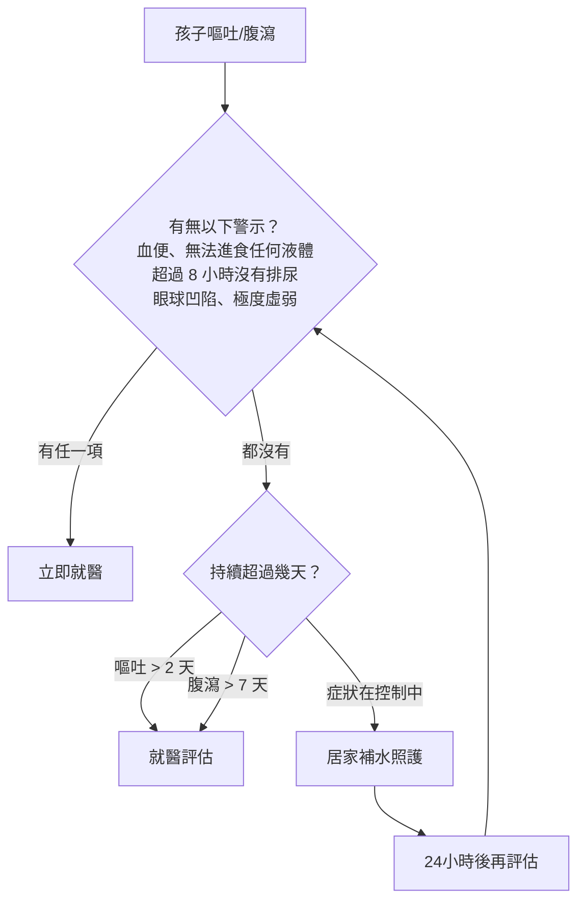
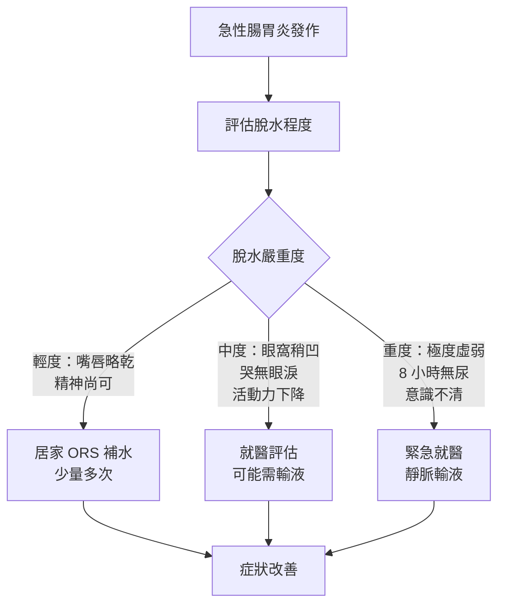

# 吐不停、拉不停：諾羅病毒與輪狀病毒的補水建議

## 簡單說重點 (Overview)

孩子突然嘔吐、腹瀉，很多時候兇手是諾羅病毒或輪狀病毒。這兩種病毒都不需要抗生素，因為它們是病毒，抗生素對病毒完全無效。最重要的事情只有一件：**補充足夠的水分和電解質**，避免脫水。

<!-- IMAGE_PLACEHOLDER: 諾羅病毒與輪狀病毒示意圖，標示兩者差異 -->

> [!info] 小知識
> 諾羅病毒是全球急性腸胃炎最常見的病因，每年感染約 6 億 8 千萬人；輪狀病毒則是 5 歲以下嬰幼兒重症腸胃炎的頭號病因。兩者一年四季都可能出現，但輪狀病毒好發於秋冬至春季。

## 症狀 (Symptoms)

### 諾羅病毒（Norovirus）
- **嘔吐**：通常突然發作，兒童嘔吐情形比腹瀉更明顯
- **水瀉**：大量水狀腹瀉，每天可達數次至十數次
- **噁心、腹部絞痛**：進食後容易加重
- **輕度發燒**：體溫通常不超過 38.5°C
- **頭痛與全身痠痛**：部分患者會出現類似感冒的肌肉痠痛
- **潛伏期**：接觸病毒後 **12 至 48 小時**發病
- **病程**：多數人 **1 至 3 天**內自然痊癒

### 輪狀病毒（Rotavirus）
- **嚴重水瀉**：通常比諾羅更大量、持續更久
- **嘔吐**：常與腹瀉同時出現
- **發燒**：通常較明顯，可超過 38.5°C
- **腹痛**：嬰幼兒常以哭鬧表現
- **食慾不振**
- **潛伏期**：接觸後約 **2 天**發病
- **病程**：症狀持續 **3 至 8 天**，比諾羅更長

> [!caution] 注意
> 輪狀病毒造成的脫水程度通常比諾羅病毒更嚴重，5 歲以下嬰幼兒風險最高。病程若超過 5 天仍未好轉，務必就醫評估。

## 醫師怎麼幫你檢查 (Diagnosis)

大多數急性腸胃炎不需要特別的實驗室檢查，醫師會透過**問診與身體評估**來判斷病情嚴重度，重點在於評估脫水程度：

- **問診**：發病時間、嘔吐和腹瀉次數、最後一次排尿時間、有無血便或黑便
- **身體評估**：黏膜是否乾燥、眼球是否下陷、皮膚彈性（捏起皮膚放開後回彈速度）
- **體重比較**：若有近期體重記錄，可評估急性水分流失量

若懷疑細菌性感染（高燒、血便、症狀超過 7 天），醫師可能會安排**糞便培養**；若需排除其他原因，可搭配**血液生化檢查**評估電解質異常。

## 治療方式 (Treatment)

### 1. 居家照護

最核心的治療就是讓腸胃道休息，同時持續補充流失的水分。

**補水原則：**
- 嘔吐剛停的 30 分鐘內，先讓腸胃「休兵」，不要立刻大量喝水
- 之後採「少量多次」方式，每 5 至 10 分鐘喝 5-10 毫升（約一小匙），逐漸增加
- 嬰兒應繼續哺乳（母乳或配方奶），不需要稀釋配方奶

**飲食策略：**
- 急性期（前 24 小時）：以電解質液為主，不強迫進食
- 症狀緩解後：從清淡好消化的食物開始，例如白稀飯、白吐司、香蕉、蘋果泥（BRAT 飲食原則可作為參考）
- 避免油膩、高糖、高纖的食物，以免刺激腸道

> [!recommend] 建議
> 口服電解質液（Oral Rehydration Solution, ORS）是目前最有效的居家補水工具。藥局有現成的電解質補充粉劑或飲品（如運動飲料需稀釋至半濃度）。**不建議用白開水或果汁單獨補水**，因為缺乏鈉離子，大量飲用可能造成低血鈉，反而危險。

**WHO 標準口服電解質液（緊急自製）：**
- 1 公升煮沸冷卻飲用水
- 6 茶匙糖（約 30 毫升）
- 半茶匙鹽（約 2.5 毫升）

### 2. 藥物治療

- **退燒藥**：發燒或腹痛不適時可使用乙醯胺酚（acetaminophen）或布洛芬（ibuprofen，6 個月以上兒童）
- **益生菌**：部分研究顯示可縮短腹瀉時程，可考慮在醫師建議下使用
- **鋅補充**：WHO 建議 6 個月以上兒童在急性腹瀉期間補充鋅，可縮短病程約 25%
- **止瀉藥**：**12 歲以下不建議使用止瀉藥**（如 loperamide），這類藥物可能掩蓋症狀，甚至在嬰幼兒造成危險

> [!caution] 注意
> 不要自行使用抗生素！諾羅病毒和輪狀病毒都是病毒，抗生素對病毒無效，反而可能破壞腸道菌叢，延長病程。果汁、汽水和運動飲料不適合用來補水，糖分過高可能加重腹瀉。

### 3. 進階治療

若孩子出現中、重度脫水，無法口服補水，需至診所或醫院接受：

- **點滴靜脈輸液（Intravenous Fluid Therapy）**：快速補充流失的水分與電解質，適用於嚴重嘔吐無法進食或意識改變的患者
- 醫師將根據脫水程度和體重計算補液量，並監測血液電解質恢復情形

## 什麼時候該看醫生 (When to See a Doctor)

以下情況請立即帶孩子就醫，不要等待：

- **超過 8 小時沒有排尿**，嬰兒尿布超過 6 小時沒有濕
- **眼球明顯凹陷**、嘴唇黏膜極度乾燥
- **哭泣沒有眼淚**
- **大便帶血或黑色糞便**（可能是腸黏膜受損或其他嚴重原因）
- **嘔吐超過 24 小時**仍無法進食任何液體
- **腹瀉超過 7 天**未改善
- **高燒超過 39°C**且退燒藥效果不佳
- **精神狀態異常**：極度嗜睡、意識不清、無法喚醒
- **3 個月以下嬰兒**出現嘔吐或腹瀉（即使症狀看起來輕微，都建議盡快就醫）

> [!danger] 警告
> 脫水在嬰幼兒進展迅速，可在數小時內從輕度惡化至重度。若孩子出現極度虛弱、眼睛無神、超過 8 小時沒有排尿，請立即就醫，不要在家等待觀察。

## 常見問題 (FAQ)

### Q: 孩子吐完可以馬上喝水嗎？
A: 建議嘔吐停止後等 15 至 30 分鐘，再從每次 5-10 毫升的小量開始。若一次喝太多，容易觸發再次嘔吐，形成惡性循環。

### Q: 電解質液和白開水有什麼差別？不能喝白開水嗎？
A: 嘔吐腹瀉流失的不只是水，還有鈉、鉀、氯等電解質。單喝白開水只補充了水分，缺乏電解質的情況下大量補水反而可能稀釋血鈉，造成低血鈉症，尤其嬰幼兒風險更高。

### Q: 輪狀病毒有疫苗嗎？台灣可以打嗎？
A: 有，台灣目前有輪狀病毒口服疫苗可以自費接種。接種後可大幅降低重症腸胃炎和住院的風險，但無法 100% 預防感染；接種後若仍感染，症狀通常較輕微。建議在寶寶 2 個月大時就諮詢醫師接種時程。

### Q: 我的孩子腹瀉，需要「禁食」讓腸胃休息嗎？
A: 這是常見的誤解。過度禁食反而會影響腸黏膜的修復。急性期（嘔吐劇烈時）可以短暫減少固體食物，但應持續補充電解質液；症狀稍穩定後就要恢復清淡飲食，幫助腸道更快恢復。

### Q: 諾羅病毒傳染性很強？家人都要隔離嗎？
A: 諾羅病毒傳染力極強，極少量病毒（18 個病毒顆粒）就能造成感染。患者症狀結束後仍能在糞便中排毒長達 2 週以上。照顧患者後務必用肥皂洗手至少 20 秒（**酒精乾洗手對諾羅無效**）；患者的衣物和寢具用 60°C 以上熱水清洗；嘔吐物和排泄物用含氯漂白水（約 1000 ppm）消毒。

## 最新治療趨勢 (Latest Updates)

目前針對諾羅病毒和輪狀病毒均**無特效抗病毒藥物**，治療焦點仍集中在支持性療法。根據 WHO 2023 年建議，強調「繼續餵食 + 口服補水鹽液」的策略，已取代舊觀念中的禁食或限制飲食。

輪狀病毒疫苗的全球推廣是近十年來最重要的進展。多項研究顯示，全面接種輪狀病毒疫苗後，5 歲以下兒童的重症腸胃炎住院率下降達 40-80%（來源：Lancet, 2022）。台灣目前輪狀病毒疫苗屬自費項目，建議於出生後 2 個月起依時程完成接種，可大幅降低嬰幼兒重症風險。

## 醫療免責聲明 (Disclaimer)

本文章內容僅供衛教參考，不構成專業醫療建議、診斷或治療。每個人的健康狀況不同，實際治療方式需由醫師根據個別情況評估。若你有任何健康疑慮或症狀，請務必諮詢合格醫療專業人員。本診所提供的資訊力求準確，但醫學知識持續更新，我們無法保證內容永久有效。文章中提及的治療方式或設備，其適用性與效果因人而異，需經醫師評估後方可進行。

## 參考資料 (References)

- [Norovirus: About Norovirus](https://www.cdc.gov/norovirus/index.html) — CDC (Centers for Disease Control and Prevention), 存取日期 2026-04-11
- [Norovirus Prevention](https://www.cdc.gov/norovirus/prevention/index.html) — CDC, 存取日期 2026-04-11
- [Rotavirus: About Rotavirus](https://www.cdc.gov/rotavirus/about/index.html) — CDC, 存取日期 2026-04-11
- [Norovirus](https://www.nhs.uk/conditions/norovirus/) — NHS (National Health Service, UK), 存取日期 2026-04-11
- [Diarrhoeal Disease Fact Sheet](https://www.who.int/news-room/fact-sheets/detail/diarrhoeal-disease) — WHO (World Health Organization), 存取日期 2026-04-11
- [諾羅病毒健康資訊](https://www.chp.gov.hk/tc/healthtopics/content/24/10.html) — 香港衞生防護中心, 存取日期 2026-04-11
- Tate JE et al. "2008 estimate of worldwide rotavirus-associated mortality in children younger than 5 years before the introduction of universal rotavirus vaccination programmes." Lancet Infect Dis 2012; 12(2): 136-141. PMID: 22030330
