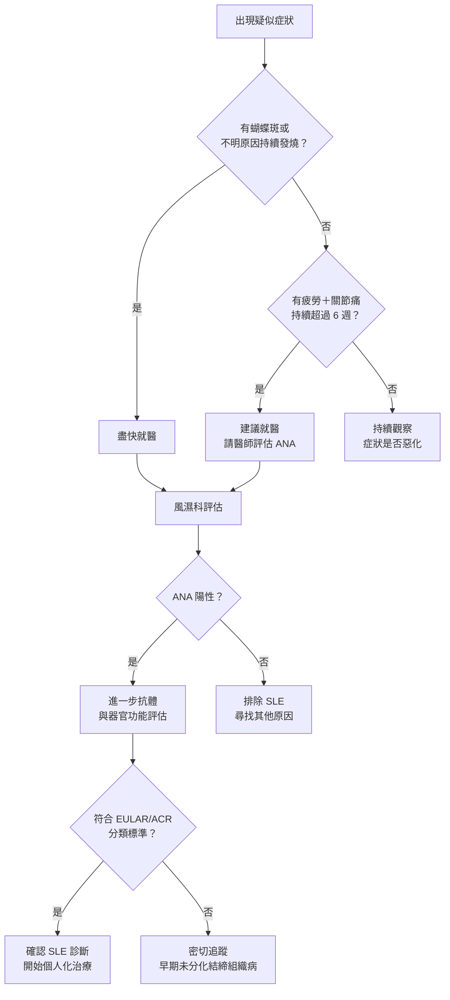
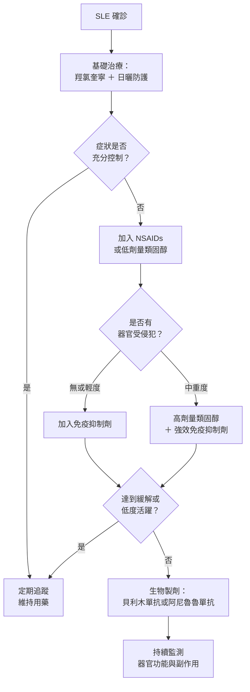

# 臉上紅成蝴蝶斑？你可能需要認識紅斑性狼瘡

## 簡單說重點 (Overview)

紅斑性狼瘡（全名：全身性紅斑性狼瘡，Systemic Lupus Erythematosus，簡稱 SLE）是一種慢性自體免疫疾病——簡單說，就是你的免疫系統「認錯敵人」，開始攻擊自己的關節、皮膚、腎臟、心臟甚至大腦。它好發於 20～40 歲的年輕女性，男女比例約為 1:9，但男性和孩童也可能罹患。雖然目前無法根治，但現代醫學已能有效控制病情，許多患者可以維持接近正常的生活品質。

<!-- IMAGE_PLACEHOLDER: 蝴蝶斑（malar rash）示意圖，顯示臉頰至鼻樑呈蝴蝶形紅斑，鼻唇溝不受影響 -->

## 症狀 (Symptoms)

SLE 的症狀千變萬化，幾乎可以影響全身任何器官，因此有時被稱為「千面女郎」。常見症狀依系統分類如下：

**皮膚與外表**
- 蝴蝶斑（malar rash）：橫跨兩側臉頰和鼻樑的紅斑，形狀像蝴蝶展翅，是最具代表性的特徵，約半數患者有此表現
- 光敏感：曬太陽後症狀明顯加重，約 40～70% 的患者有此問題
- 圓形盤狀紅斑（discoid rash）：略帶鱗屑的圓形皮膚病灶，可能留下疤痕
- 掉髮（可能成塊或整體稀疏）
- 口腔或鼻腔無痛性潰瘍

**關節與肌肉**
- 多關節疼痛、腫脹，常見於手指、手腕、膝蓋等小關節
- 肌肉酸痛無力，晨起僵硬感明顯

**全身性症狀**
- 持續性疲勞（常是最早且最困擾的症狀）
- 不明原因發燒（低燒或中度發燒）
- 體重減輕、食慾不振

**器官受累**
- 腎臟：泡泡尿（蛋白尿）、血尿、腿部水腫——最需警惕的併發症
- 肺臟：胸痛、呼吸困難（胸膜炎，即肺臟外膜發炎）
- 心臟：心包炎（心臟外膜發炎），感覺心跳不適或胸口悶痛
- 神經系統：頭痛、思考混亂、記憶力下降、癲癇發作

> [!info] 小知識
> 並不是每個 SLE 患者都會出現蝴蝶斑——只有約一半的患者有此典型表現。很多患者的症狀較不典型，初期可能僅有疲勞和關節痛，因此診斷常需要數個月甚至數年。SLE 也有「緩解期」和「發作期」交替的特性，症狀時好時壞。

## 醫師怎麼幫你檢查 (Diagnosis)

SLE 沒有單一「確診驗血」，診斷需要綜合臨床症狀和多項實驗室數據。醫師通常會安排：

**血液抗體檢查**
- 抗核抗體（ANA，antinuclear antibody）：SLE 最重要的篩查指標，超過 95% 的患者呈陽性；但 ANA 陽性不代表一定是 SLE
- 抗雙股 DNA 抗體（anti-dsDNA）：SLE 特異性較高，且與疾病活躍度相關
- 抗 Smith 抗體（anti-Sm）：特異性最高的 SLE 抗體之一
- 補體值（C3、C4）：SLE 活躍期間這些「免疫守衛蛋白」會被大量消耗而下降

**器官功能評估**
- 全血球計數（CBC）：確認是否有貧血（紅血球過低）、白血球減少或血小板過低
- 尿液分析：偵測腎臟受損的早期警訊（蛋白尿、血尿、紅血球管型）
- 腎功能（肌酐酸、腎絲球過濾率）、肝功能

**影像與其他**
- 胸部 X 光或心臟超音波（懷疑肺臟或心臟受累時）
- 皮膚切片（懷疑盤狀狼瘡時，用一小塊皮膚組織在顯微鏡下確認）

> [!info] 小知識
> 目前國際上最常用的是 **2019 年 EULAR/ACR 分類標準**：首先需要 ANA 篩查陽性（≥1:80），再依各器官的受累程度計算加權分數，總分達 10 分以上方可分類為 SLE。這套標準比舊版更靈敏、更準確，有助早期診斷。

**就醫決策流程**

## 治療方式 (Treatment)

SLE 的治療目標是讓疾病保持穩定（達到緩解或低度活躍），保護器官功能，並盡量減少藥物副作用。治療策略會依症狀嚴重程度個人化調整。

### 1. 居家照護

日常生活的自我管理對 SLE 控制至關重要：

- **防曬第一**：每天出門前塗抹 SPF 50+ 廣效型防曬乳（同時阻擋 UVA 和 UVB），撐遮陽傘、戴帽子，避免上午 10 點至下午 4 點的強烈日照
- **規律輕度運動**：有助減緩關節僵硬、改善慢性疲勞，但在疾病急性發作期應適度休息
- **充足睡眠**：疲勞是 SLE 最常見的困擾，良好睡眠習慣對穩定病情有實質幫助
- **戒菸**：吸菸會加重 SLE 發炎程度，且顯著增加心血管疾病風險
- **壓力管理**：精神壓力常是疾病復發的觸發因素，冥想、瑜珈、規律作息都有助穩定免疫功能
- **感染預防**：SLE 本身及免疫抑制藥物都會降低免疫力，應按時接種疫苗並避免接觸感染源

> [!recommend] 建議
> 每天出門都要做好防曬，即使是陰天也不例外。紫外線（UV）能穿透雲層，觸發 SLE 皮膚發炎甚至全身復發。建議選用廣效型防曬乳（SPF 50+），且每 2 小時補擦一次，尤其在戶外活動時。

### 2. 藥物治療

醫師會依症狀嚴重度選擇適合的藥物組合（具體藥物和劑量需由醫師評估後決定）：

- **抗瘧藥（羥氯奎寧）**：幾乎所有 SLE 患者的基礎用藥，能減少發作頻率、保護腎臟、降低心血管風險，且相對安全。長期服用時須每年接受眼科追蹤（視網膜毒性雖罕見，仍需監測）
- **非類固醇消炎止痛藥（NSAIDs）**：用於緩解輕度關節痛和發燒，適合症狀較輕者短期使用
- **類固醇**：快速壓制急性發炎的利器，但目標是儘量降低維持劑量並縮短使用時間，以減少長期副作用
- **免疫抑制劑**：用於器官受累（如腎炎、嚴重皮膚炎）或類固醇無法單獨控制時

> [!caution] 注意
> SLE 用藥需長期規律服用，**不可自行停藥**。即使症狀改善，擅自停藥往往導致疾病反彈，有時發作程度比原本更嚴重。若有任何副作用疑慮，請先告知醫師再調整，切勿自行減量或停藥。

### 3. 進階治療

對於傳統藥物控制不佳的患者，目前有生物製劑（靶向療法）可以選擇：

- **貝利木單抗（belimumab）**：靶向 B 淋巴細胞刺激因子（BAFF），減少自體抗體的產生。適用於整體疾病活躍或合併腎炎的患者，2023 年 EULAR 指引和 2025 年 ACR 指引均推薦
- **阿尼魯魯單抗（anifrolumab）**：阻斷第一型干擾素（interferon，一種重要的發炎訊號）的訊號傳遞，對皮膚和關節的表現特別有效，且 EULAR 2023 已將其列為非腎型 SLE 的一線生物製劑選項

若你同時有明顯的慢性疲勞症狀，靜脈雷射（ILIB，靜脈內低能量雷射照射）作為輔助性療法，有助改善細胞能量代謝與整體活力，可在定期回診時與醫師討論是否適合納入整合照護計畫。

**治療階梯流程**

## 什麼時候該看醫生 (When to See a Doctor)

出現以下任何症狀，請盡快就醫：

- **蝴蝶形臉部紅斑**持續超過幾天，尤其在曬太陽後加重
- **關節疼痛腫脹**持續超過 6 週，且無明顯外傷原因
- **不明原因發燒**持續超過 3 天
- **泡泡尿、血尿、腿部水腫**——這些是腎臟受損的警訊，不可輕忽
- **胸痛或呼吸困難**（可能是心包炎或胸膜炎的表現）
- **嚴重頭痛、意識混亂、肢體抽搐**（可能是神經系統受累）
- 已確診 SLE 的患者若出現任何**突然的症狀變化或新器官不適**，也應盡早回診

> [!danger] 警告
> 若出現**意識改變、癲癇發作、突發性胸痛或嚴重呼吸困難**，請立刻前往急診，不要等待門診預約時間。這些可能是 SLE 造成嚴重器官損傷的緊急表現，需立即處置。

## 常見問題 (FAQ)

### Q: 紅斑性狼瘡會遺傳給下一代嗎？
A: SLE 有一定的遺傳傾向，但並非單基因遺傳。若一等親中有 SLE 患者，罹病風險略高，但大多數患者的子女並不會發病。環境因素（如紫外線暴露、感染、女性荷爾蒙）對疾病是否發作的影響往往大於遺傳。

### Q: 確診後一輩子都要吃藥嗎？
A: 多數患者需要長期用藥，特別是抗瘧藥。但劑量可以隨疾病穩定而逐步調整。少數患者在長期緩解後可由醫師評估是否減藥，但通常不建議完全停藥，因為這容易引起復發，有時反彈的發作比原來更嚴重。

### Q: 紅斑性狼瘡患者可以懷孕嗎？
A: 可以，但需要仔細計劃與監測。建議在疾病至少穩定 6 個月後再考慮懷孕，且需要在風濕科和婦產科共同照護下進行。SLE 患者懷孕時有較高的早產、子癲前症等風險，部分藥物也需在孕前調整，請務必提前與醫師討論。

### Q: 我還能去海邊曬太陽嗎？
A: 仍然可以，但必須做好萬全防護。使用 SPF 50+ 廣效型防曬乳、穿著長袖衣物、戴帽子和撐傘，並避開太陽最強烈的時段（早上 10 點至下午 4 點）。在這些防護措施下，適度戶外活動對身心都有益。

### Q: ANA 陽性是不是就確定得了 SLE？
A: 不一定。ANA 陽性只是一個重要的篩查結果，健康人和多種其他疾病（如甲狀腺疾病、其他自體免疫疾病）也可能出現低度 ANA 陽性。確診 SLE 需要結合臨床症狀、其他特異性抗體和器官受累程度，由風濕科醫師綜合判斷。

## 最新治療趨勢 (Latest Updates)

**生物製劑成為標準選項（2023－2025）**

美國風濕病醫學會（ACR）2025 年發布了最新 SLE 治療指引，明確將生物製劑納入治療選項，不再要求先嘗試所有傳統藥物失敗後才能使用。2023 年 EULAR 建議也指出，阿尼魯魯單抗可作為非腎型 SLE 的一線生物製劑，尤其對皮膚和關節病變的控制效果顯著（PMID: 37827694）。真實世界數據顯示，兩種生物製劑在降低疾病活躍度和減少類固醇劑量方面的效果相近。

**CAR-T 細胞治療的突破（2024－2025）**

對傳統療法完全無效的重症難治型 SLE 患者，近年出現了令人振奮的新進展：CD19 標靶 CAR-T 細胞療法（嵌合抗原受體 T 細胞治療，一種對免疫系統進行「重設」的先進細胞治療）在早期臨床研究中顯示出顯著療效，部分患者達到長期緩解，且安全性優於癌症適應症中的 CAR-T 應用（PMC 2025）。目前此療法仍在研究階段，尚未成為常規選項，但為難治型患者帶來了新希望。

## 醫療免責聲明 (Disclaimer)

本文章內容僅供衛教參考，不構成專業醫療建議、診斷或治療。每個人的健康狀況不同，實際治療方式需由醫師根據個別情況評估。若你有任何健康疑慮或症狀，請務必諮詢合格醫療專業人員。本診所提供的資訊力求準確，但醫學知識持續更新，我們無法保證內容永久有效。文章中提及的治療方式或設備，其適用性與效果因人而異，需經醫師評估後方可進行。

## 參考資料 (References)

- [Lupus - Symptoms & causes](https://www.mayoclinic.org/diseases-conditions/lupus/symptoms-causes/syc-20365789) — Mayo Clinic, 存取日期 2026-04-24
- [Lupus: What It Is, Symptoms, Causes & Treatment](https://my.clevelandclinic.org/health/diseases/4875-lupus) — Cleveland Clinic, 存取日期 2026-04-24
- [Lupus Diagnosis](https://www.hopkinsmedicine.org/health/conditions-and-diseases/lupus/lupus-diagnosis) — Johns Hopkins Medicine, 存取日期 2026-04-24
- [2023 Updates to EULAR Recommendations for Management of SLE](https://www.lupus.org/news/2023-updates-to-eular-recommendations-for-management-of-systemic-lupus-erythematosus) — Lupus Foundation of America, 存取日期 2026-04-24
- [ACR New Lupus SLE Clinical Practice Guidelines 2025](https://rheumatology.org/press-releases/new-lupus-sle-clinical-practice-guidelines-released) — American College of Rheumatology, 存取日期 2026-04-24
- Fanouriakis A et al. "2023 EULAR recommendations for the management of systemic lupus erythematosus." Ann Rheum Dis 2024; 83(1): 15-29. PMID: 37827694
- [全身性紅斑性狼瘡之照護](https://ihealth.vghtpe.gov.tw/media/312) — 臺北榮民總醫院護理部健康e點通, 存取日期 2026-04-24
- [如何面對全身型紅斑性狼瘡](https://epaper.ntuh.gov.tw/health/201811/child_1.html) — 臺大醫院健康電子報, 存取日期 2026-04-24
- [Advances in Targeted Therapy for Systemic Lupus Erythematosus: Current Treatments and Novel Approaches](https://pmc.ncbi.nlm.nih.gov/articles/PMC11816971/) — PMC/PubMed Central, 2025, 存取日期 2026-04-24
- [CAR-T Cell Therapy in SLE: Mechanisms, Clinical Advances, and Future Directions](https://pmc.ncbi.nlm.nih.gov/articles/PMC12660391/) — PMC/PubMed Central, 2025, 存取日期 2026-04-24
