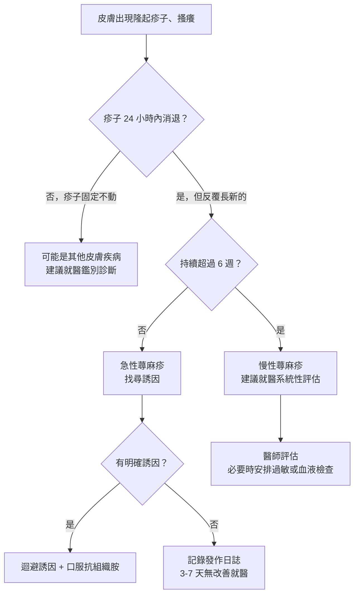
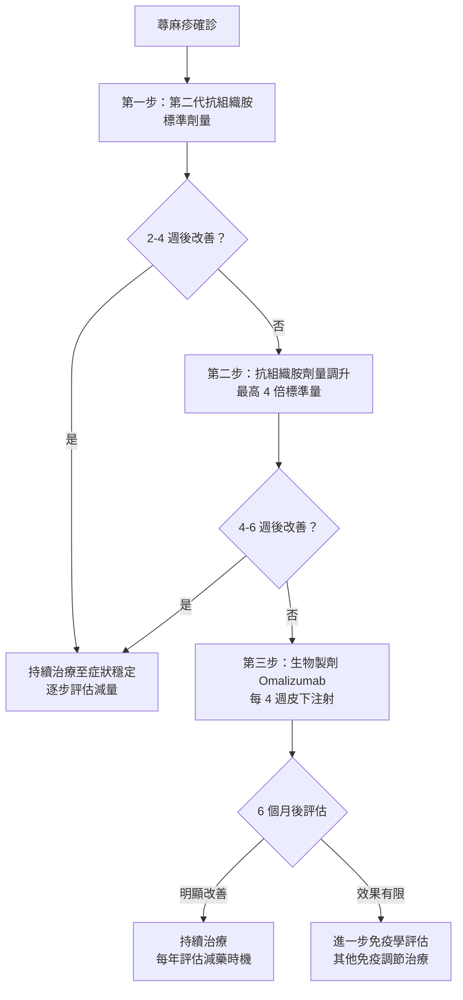

# 滿身風疹塊怎麼辦？認識急性與慢性蕁麻疹

## 簡單說重點 (Overview)

蕁麻疹（俗稱「風疹塊」）是皮膚對刺激產生的免疫反應，突然冒出紅色或膚色隆起的疹子，奇癢無比，通常在 24 小時內消退，卻會不斷在新位置長出來。持續不到六週稱為**急性蕁麻疹**，超過六週且每週至少發作兩次，則進入**慢性蕁麻疹**。後者有時找不到明確誘因，像是皮膚的「自發性警報系統」被卡住，持續鳴響。

<!-- IMAGE_PLACEHOLDER: 蕁麻疹皮膚外觀，顯示多個紅色隆起風疹塊與周圍正常皮膚的對比 -->

## 症狀 (Symptoms)

- 皮膚突然出現**隆起的紅色或粉紅色疹子**，邊界清楚，略高於皮膚表面
- **劇烈搔癢**，有時伴隨灼熱感或刺痛
- 疹子大小不一，可以是小點，也可以融合成一大片不規則形狀
- 單個疹子通常在 **24 小時內消退**，但會在其他位置出現新的
- 部分患者合併**血管性水腫（angioedema，血管神經性水腫）**：嘴唇、眼皮、舌頭或喉嚨等深層組織腫脹

> [!info] 什麼是血管性水腫？
> 血管性水腫是比蕁麻疹更深層的腫脹，發生在皮下組織或黏膜，外觀像「腫起來」而非「癢起來」。若腫脹發生在喉嚨，可能影響呼吸，屬於緊急狀況。約 40% 的慢性蕁麻疹患者曾同時出現血管性水腫。

## 醫師怎麼幫你檢查 (Diagnosis)

蕁麻疹主要靠**臨床外觀**診斷——醫師看疹子的形態、詢問發作時間和誘因，通常就能確定診斷，不需要每個人都做特殊檢查。

**急性蕁麻疹**多能找到明確誘因：
- 食物（花生、海鮮、牛奶、堅果等）
- 藥物（NSAIDs 非類固醇消炎藥、抗生素）
- 感染（感冒病毒、腸胃炎）
- 接觸過敏原（昆蟲叮咬、乳膠手套）

**慢性蕁麻疹**約 50% 找不到外部誘因，稱為**慢性自發性蕁麻疹（CSU, chronic spontaneous urticaria）**，其餘與物理性刺激（壓力、冷、熱、日曬）有關。

進一步檢查（視情況安排）：
- 血液常規 + 發炎指數（排除感染、自體免疫疾病）
- 甲狀腺功能及抗體（部分慢性蕁麻疹與甲狀腺自體免疫相關）
- **自費過敏原特異性 IgE 檢測**：食物及環境過敏原，協助找出誘因
- 物理刺激誘發試驗（physical challenge test）：確認誘發型蕁麻疹

## 治療方式 (Treatment)

### 1. 居家照護

- **找出並迴避誘因**：食物日誌是最有效的工具，記錄發作前 24 小時的飲食、藥物和活動
- 穿著**寬鬆透氣**衣物，避免悶熱或摩擦皮膚
- 洗澡使用**溫水**，過冷或過熱均會刺激皮膚
- 搔癢時以**冰敷**代替抓，避免皮膚破損繼發感染
- 注意壓力管理：情緒壓力是慢性蕁麻疹常見的惡化因子

> [!recommend] 發作日誌記錄法
> 用手機備忘錄記下每次發作的時間、部位、嚴重程度，以及前 24 小時吃了什麼、用了哪些藥物、運動量、睡眠和壓力狀況。這份日誌能讓醫師大幅縮短找到誘因的時間。

### 2. 藥物治療

**第一線：第二代抗組織胺（H1 antihistamines）**

第二代抗組織胺是治療蕁麻疹的主力藥物，嗜睡副作用遠低於第一代，適合白天使用，不影響學習和工作。

- 標準劑量效果不佳時，EAACI 2022 國際指引允許**增加劑量至標準量的 4 倍**
- 急性蕁麻疹通常療程較短；慢性蕁麻疹需持續服藥數個月至數年

> [!caution] 關於口服類固醇的使用
> 類固醇適用於急性嚴重發作的**短期**緩解，但不建議作為慢性蕁麻疹的長期治療。若持續依賴類固醇，骨質疏鬆、血糖升高等副作用風險會逐漸累積，應與醫師討論升階治療計畫。

**第二線：調整藥物組合**

- 在醫師指導下調升抗組織胺劑量（最高 4 倍標準量）
- 視情況加入孟魯司特（leukotriene 受體阻斷劑）或 H2 阻斷劑輔助

### 3. 進階治療

**生物製劑：Omalizumab（奧馬珠單抗）**

對多次調整抗組織胺仍無法控制的**慢性自發性蕁麻疹**，Omalizumab 是目前臨床證據最充分的生物製劑。它透過阻斷免疫球蛋白 E（IgE，過敏反應的關鍵分子），從根源減少皮膚肥大細胞的異常活化。台灣已取得健保給付條件（需符合資格審核）。

**自費過敏原特異性 IgE 檢測**

對於反覆蕁麻疹卻始終找不到誘因的患者，完整的過敏原檢測（含食物及吸入性環境過敏原）有助於制定個人化的飲食調整與環境控制計畫，讓治療更有方向。

> 本診所提供**自費過敏原特異性 IgE 檢測**（食物 + 環境過敏原套組），適合反覆蕁麻疹卻找不到誘因、想精確了解過敏體質的患者。

## 什麼時候該看醫生 (When to See a Doctor)

輕度急性蕁麻疹可先服用抗組織胺觀察，但出現以下任一狀況，**請立即就醫或撥打 119**：

> [!danger] 這些症狀要立即急診
> - 嘴唇、舌頭、喉嚨明顯腫脹
> - 呼吸困難、聲音突然變沙啞
> - 吞嚥困難
> - 頭暈、臉色蒼白、血壓下降、意識不清
>
> 以上可能是**過敏性休克（anaphylaxis）**的前兆，屬醫療緊急狀況，延誤就醫有生命危險。

**建議盡快門診就醫的情況：**
- 疹子持續超過 3-7 天、未見改善
- 反覆發作，嚴重影響睡眠或日常生活
- 合併發燒、關節痛、尿液呈茶色等全身症狀
- 症狀持續超過六週（進入慢性定義）
- 現有藥物無法控制的嚴重搔癢

## 常見問題 (FAQ)

### Q: 蕁麻疹會傳染嗎？
A: 不會。蕁麻疹是自身免疫系統過度反應的結果，不是感染性疾病，不會傳染給他人。

### Q: 吃海鮮起疹子，以後是不是永遠不能吃？
A: 不一定。食物誘發的急性蕁麻疹，部分患者數年後可能恢復耐受性，尤其是兒童。建議透過過敏原檢測確認，由醫師評估是否需要長期迴避或進行口服免疫治療（oral immunotherapy）。

### Q: 慢性蕁麻疹能自己好嗎？
A: 有機會，但需要時間。研究顯示，慢性蕁麻疹患者約 50% 在發病 1-2 年內達到緩解，但部分患者症狀可持續 5 年以上。規律治療能顯著縮短病程並改善生活品質。

### Q: 抗組織胺藥要吃多久？
A: 急性蕁麻疹控制後可逐步減量停藥；慢性蕁麻疹通常需持續服藥 6-12 個月，症狀穩定後才在醫師指導下緩慢減量。「症狀消失就自行停藥」是慢性蕁麻疹反覆惡化的主因之一。

### Q: 慢性蕁麻疹跟壓力有關係嗎？
A: 有。壓力本身不會直接引發蕁麻疹，但情緒壓力會加重皮膚免疫反應的活化程度，使症狀更難控制。改善睡眠品質、適度運動和壓力管理對慢性蕁麻疹都有輔助效果。

## 最新治療趨勢 (Latest Updates)

2025 年，美國 FDA 批准口服 **Remibrutinib**（一種選擇性 Bruton tyrosine kinase / BTK 抑制劑）用於抗組織胺控制不佳的慢性自發性蕁麻疹。臨床試驗（NEJM 2024）顯示其能顯著降低蕁麻疹活動性評分，且口服方式更便於長期使用。此外，**Dupilumab**（原核准用於異位性皮膚炎和氣喘的生物製劑）與 **Barzolvolimab**（抗 KIT 抗體）也在臨床試驗中展現良好潛力，預示慢性蕁麻疹的治療選擇將大幅增加。（資料來源：AAD 2026 年會更新）

目前台灣核準的生物製劑治療仍以 Omalizumab 為主，上述新藥需等候台灣衛福部食藥署（TFDA）審查核准後方可使用。

## 醫療免責聲明 (Disclaimer)

本文章內容僅供衛教參考，不構成專業醫療建議、診斷或治療。每個人的健康狀況不同，實際治療方式需由醫師根據個別情況評估。若你有任何健康疑慮或症狀，請務必諮詢合格醫療專業人員。本診所提供的資訊力求準確，但醫學知識持續更新，我們無法保證內容永久有效。文章中提及的治療方式或設備，其適用性與效果因人而異，需經醫師評估後方可進行。

## 參考資料 (References)

- [The international EAACI/GA²LEN/EuroGuiDerm/APAAACI guideline for the definition, classification, diagnosis, and management of urticaria](https://onlinelibrary.wiley.com/doi/10.1111/all.15090) — EAACI/Allergy, 存取日期 2026-04-21
- [Chronic Hives: Symptoms and Causes](https://www.mayoclinic.org/diseases-conditions/chronic-hives/symptoms-causes/syc-20352719) — Mayo Clinic, 存取日期 2026-04-21
- [Hives (Urticaria): Causes, Symptoms & Treatment](https://my.clevelandclinic.org/health/diseases/8630-hives) — Cleveland Clinic, 存取日期 2026-04-21
- [Acute Urticaria: Guidelines Summary](https://emedicine.medscape.com/article/137362-guidelines) — Medscape/eMedicine, 存取日期 2026-04-21
- [Chronic Urticaria: Clinical Guidelines](https://emedicine.medscape.com/article/1050052-guidelines) — Medscape/eMedicine, 存取日期 2026-04-21
- [Remibrutinib in Chronic Spontaneous Urticaria](https://www.nejm.org/doi/full/10.1056/NEJMoa2408792) — New England Journal of Medicine, 2024
- Zuberbier T et al. "The EAACI/GA²LEN/EuroGuiDerm/APAAACI guideline for the definition, classification, diagnosis, and management of urticaria." Allergy 2022; 77(3): 734-766. PMID 34536239
- [慢性蕁麻疹的藥物治療及衛教資訊](https://epaper.ntuh.gov.tw/health/201709/project_3.html) — 臺大醫院健康電子報（藥劑部賴彥廷藥師）, 存取日期 2026-04-21
